# CFG Group: src/000_cluster_001.rs

## Function: `analyze_file_ordering`

- File: src/000_cluster_001.rs
- Branches: 0
- Loops: 0
- Nodes: 16
- Edges: 15

```mermaid
flowchart TD
    analyze_file_ordering_0["ENTRY"]
    analyze_file_ordering_1["let step = step . unwrap_or (10)"]
    analyze_file_ordering_2["let file_set : HashSet < PathBuf > = files . iter () . cloned () . collect ()"]
    analyze_file_ordering_3["let module_map = crate :: cluster_011 :: build_module_map (files)"]
    analyze_file_ordering_4["let dep_map = crate :: cluster_010 :: build_dependency_map (files , & file_set , & module_m..."]
    analyze_file_ordering_5["let file_layers = build_file_layers (files)"]
    analyze_file_ordering_6["let ordered_directories = crate :: layer_core :: order_directories (files , & dep_map)"]
    analyze_file_ordering_7["let (graph , node_map) = crate :: cluster_011 :: build_file_dag (files , & dep_map)"]
    analyze_file_ordering_8["let layer_violations = crate :: cluster_008 :: detect_layer_violations (& graph , & file_layers)"]
    analyze_file_ordering_9["let cycles = detect_cycles (& graph , files)"]
    analyze_file_ordering_10["let ordered_nodes = if cycles . is_empty () { crate :: layer_core :: layer_constrained_sort (& gr..."]
    analyze_file_ordering_11["let ordered_files = ordered_nodes . into_iter () . map (| idx | graph [idx] . clone ()) . collect..."]
    analyze_file_ordering_12["let file_entries = build_entries (& ordered_files , step)"]
    analyze_file_ordering_13["let violations = detect_violations (& file_entries , & dep_map)"]
    analyze_file_ordering_14["Ok (crate :: types :: FileOrderingResult { ordered_files : file_entries , vio..."]
    analyze_file_ordering_15["EXIT"]
    analyze_file_ordering_0 --> analyze_file_ordering_1
    analyze_file_ordering_1 --> analyze_file_ordering_2
    analyze_file_ordering_2 --> analyze_file_ordering_3
    analyze_file_ordering_3 --> analyze_file_ordering_4
    analyze_file_ordering_4 --> analyze_file_ordering_5
    analyze_file_ordering_5 --> analyze_file_ordering_6
    analyze_file_ordering_6 --> analyze_file_ordering_7
    analyze_file_ordering_7 --> analyze_file_ordering_8
    analyze_file_ordering_8 --> analyze_file_ordering_9
    analyze_file_ordering_9 --> analyze_file_ordering_10
    analyze_file_ordering_10 --> analyze_file_ordering_11
    analyze_file_ordering_11 --> analyze_file_ordering_12
    analyze_file_ordering_12 --> analyze_file_ordering_13
    analyze_file_ordering_13 --> analyze_file_ordering_14
    analyze_file_ordering_14 --> analyze_file_ordering_15
```

## Function: `build_directory_entry_map`

- File: src/000_cluster_001.rs
- Branches: 1
- Loops: 0
- Nodes: 25
- Edges: 25

```mermaid
flowchart TD
    build_directory_entry_map_0["ENTRY"]
    build_directory_entry_map_1["use"]
    build_directory_entry_map_2["use"]
    build_directory_entry_map_3["use"]
    build_directory_entry_map_4["use"]
    build_directory_entry_map_5["use"]
    build_directory_entry_map_6["item"]
    build_directory_entry_map_7["if files . is_empty ()"]
    build_directory_entry_map_8["THEN BB"]
    build_directory_entry_map_9["return Ok (HashMap :: new ())"]
    build_directory_entry_map_10["EMPTY ELSE"]
    build_directory_entry_map_11["IF JOIN"]
    build_directory_entry_map_12["let file_set : HashSet < PathBuf > = files . iter () . cloned () . collect ()"]
    build_directory_entry_map_13["let module_map = crate :: cluster_011 :: build_module_map (files)"]
    build_directory_entry_map_14["let dep_map = build_dependency_map (files , & file_set , & module_map) ?"]
    build_directory_entry_map_15["let file_layers = build_file_layers (files)"]
    build_directory_entry_map_16["let (graph , node_map) = build_file_dag (files , & dep_map)"]
    build_directory_entry_map_17["let cycles = detect_cycles (& graph , files)"]
    build_directory_entry_map_18["let ordered_nodes = if cycles . is_empty () { layer_constrained_sort (& graph , & file_layers) . ..."]
    build_directory_entry_map_19["let ordered_files = ordered_nodes . into_iter () . map (| idx | graph [idx] . clone ()) . collect..."]
    build_directory_entry_map_20["let ordering = FileOrderingResult { ordered_files : build_entries (& ordered_files , DEFAULT..."]
    build_directory_entry_map_21["let mut map = HashMap :: new ()"]
    build_directory_entry_map_22["for entry in ordering . ordered_files { map . insert (entry . current_path . ..."]
    build_directory_entry_map_23["Ok (map)"]
    build_directory_entry_map_24["EXIT"]
    build_directory_entry_map_0 --> build_directory_entry_map_1
    build_directory_entry_map_1 --> build_directory_entry_map_2
    build_directory_entry_map_2 --> build_directory_entry_map_3
    build_directory_entry_map_3 --> build_directory_entry_map_4
    build_directory_entry_map_4 --> build_directory_entry_map_5
    build_directory_entry_map_5 --> build_directory_entry_map_6
    build_directory_entry_map_6 --> build_directory_entry_map_7
    build_directory_entry_map_7 --> build_directory_entry_map_8
    build_directory_entry_map_8 --> build_directory_entry_map_9
    build_directory_entry_map_7 --> build_directory_entry_map_10
    build_directory_entry_map_9 --> build_directory_entry_map_11
    build_directory_entry_map_10 --> build_directory_entry_map_11
    build_directory_entry_map_11 --> build_directory_entry_map_12
    build_directory_entry_map_12 --> build_directory_entry_map_13
    build_directory_entry_map_13 --> build_directory_entry_map_14
    build_directory_entry_map_14 --> build_directory_entry_map_15
    build_directory_entry_map_15 --> build_directory_entry_map_16
    build_directory_entry_map_16 --> build_directory_entry_map_17
    build_directory_entry_map_17 --> build_directory_entry_map_18
    build_directory_entry_map_18 --> build_directory_entry_map_19
    build_directory_entry_map_19 --> build_directory_entry_map_20
    build_directory_entry_map_20 --> build_directory_entry_map_21
    build_directory_entry_map_21 --> build_directory_entry_map_22
    build_directory_entry_map_22 --> build_directory_entry_map_23
    build_directory_entry_map_23 --> build_directory_entry_map_24
```

## Function: `build_entries`

- File: src/000_cluster_001.rs
- Branches: 0
- Loops: 0
- Nodes: 3
- Edges: 2

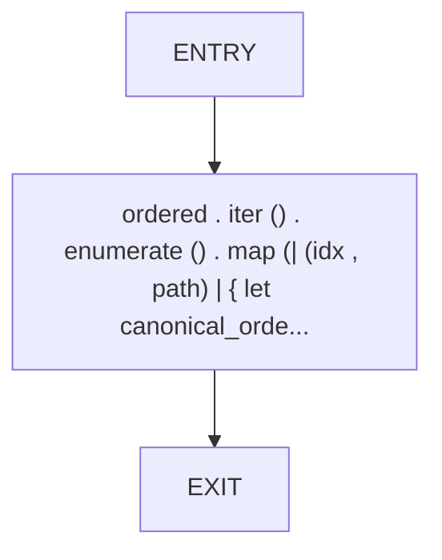

## Function: `build_file_layers`

- File: src/000_cluster_001.rs
- Branches: 0
- Loops: 0
- Nodes: 5
- Edges: 4

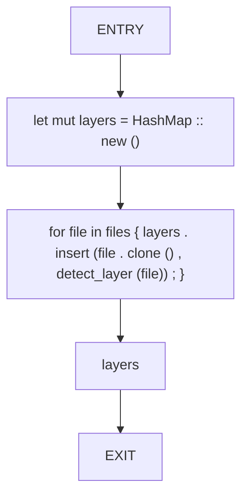

## Function: `collect_julia_dependencies`

- File: src/000_cluster_001.rs
- Branches: 0
- Loops: 0
- Nodes: 9
- Edges: 8

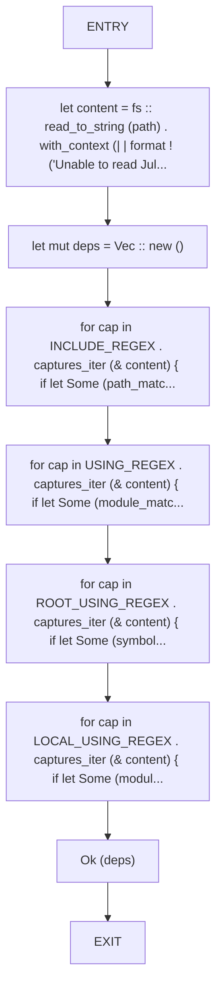

## Function: `collect_naming_warnings`

- File: src/000_cluster_001.rs
- Branches: 1
- Loops: 0
- Nodes: 13
- Edges: 13

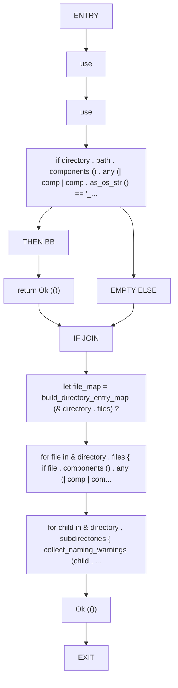

## Function: `collect_roots_from_crate`

- File: src/000_cluster_001.rs
- Branches: 0
- Loops: 0
- Nodes: 3
- Edges: 2

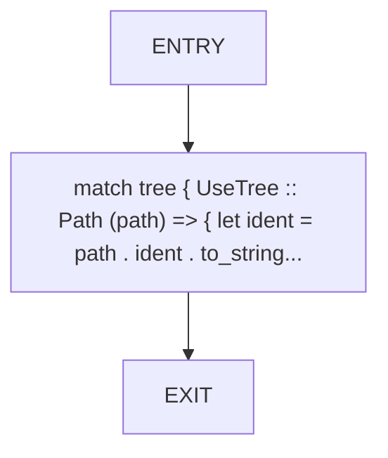

## Function: `collect_rust_dependencies`

- File: src/000_cluster_001.rs
- Branches: 0
- Loops: 0
- Nodes: 7
- Edges: 6

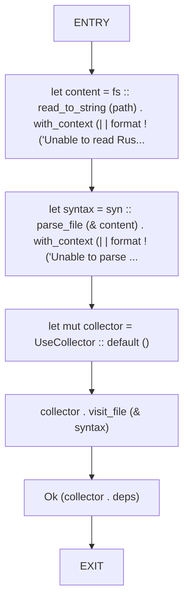

## Function: `detect_cycles`

- File: src/000_cluster_001.rs
- Branches: 2
- Loops: 0
- Nodes: 18
- Edges: 19

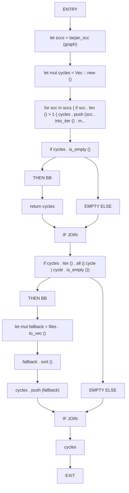

## Function: `detect_layer`

- File: src/000_cluster_001.rs
- Branches: 0
- Loops: 0
- Nodes: 4
- Edges: 3

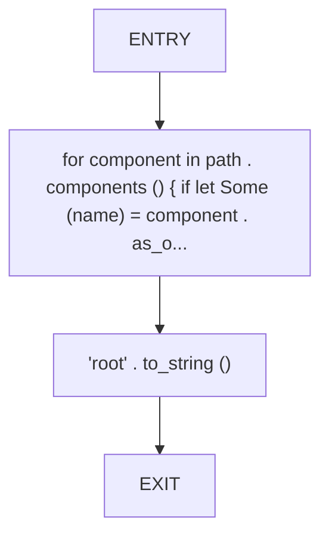

## Function: `detect_violations`

- File: src/000_cluster_001.rs
- Branches: 0
- Loops: 0
- Nodes: 9
- Edges: 8

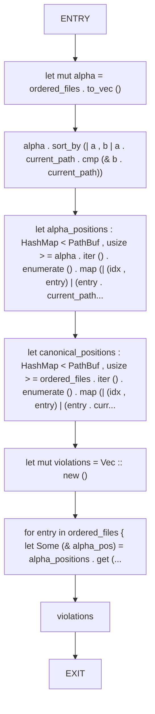

## Function: `detects_cycles`

- File: src/000_cluster_001.rs
- Branches: 0
- Loops: 0
- Nodes: 13
- Edges: 12

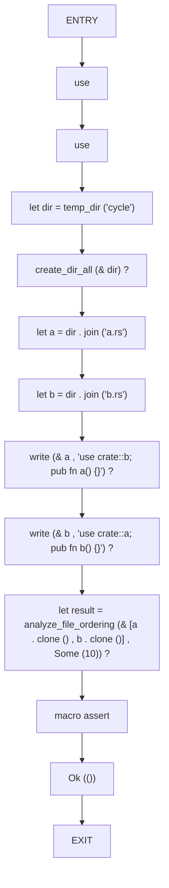

## Function: `escape_dot`

- File: src/000_cluster_001.rs
- Branches: 0
- Loops: 0
- Nodes: 3
- Edges: 2

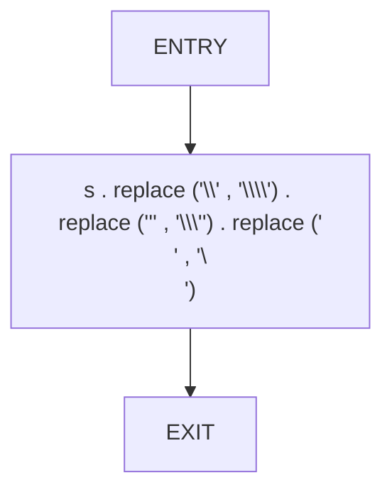

## Function: `export_complete_program_dot`

- File: src/000_cluster_001.rs
- Branches: 0
- Loops: 0
- Nodes: 26
- Edges: 25

```mermaid
flowchart TD
    export_complete_program_dot_0["ENTRY"]
    export_complete_program_dot_1["use"]
    export_complete_program_dot_2["use"]
    export_complete_program_dot_3["item"]
    export_complete_program_dot_4["let mut dot = String :: new ()"]
    export_complete_program_dot_5["writeln ! (dot , 'digraph ProgramCFG {{') . unwrap ()"]
    export_complete_program_dot_6["writeln ! (dot , ' rankdir=TB;') . unwrap ()"]
    export_complete_program_dot_7["writeln ! (dot , ' compound=true;') . unwrap ()"]
    export_complete_program_dot_8["writeln ! (dot , ' newrank=true;') . unwrap ()"]
    export_complete_program_dot_9["writeln ! (dot , ' label=\'Complete Program CFG - {} functions\';' , program ..."]
    export_complete_program_dot_10["writeln ! (dot , ' labelloc=t;') . unwrap ()"]
    export_complete_program_dot_11["writeln ! (dot , ' fontsize=16;') . unwrap ()"]
    export_complete_program_dot_12["writeln ! (dot , '') . unwrap ()"]
    export_complete_program_dot_13["let mut funcs : Vec < _ > = program . functions . iter () . collect ()"]
    export_complete_program_dot_14["funcs . sort_by_key (| (fid , _) | fid . as_str ())"]
    export_complete_program_dot_15["let mut func_to_cluster : HashMap < & String , usize > = HashMap :: new ()"]
    export_complete_program_dot_16["for (cluster_idx , (func_id , cfg)) in funcs . iter () . enumerate () { let s..."]
    export_complete_program_dot_17["writeln ! (dot , ' // Inter-function calls') . unwrap ()"]
    export_complete_program_dot_18["writeln ! (dot , ' edge [style=dashed, color=blue, penwidth=2];') . unwrap ()"]
    export_complete_program_dot_19["writeln ! (dot , '') . unwrap ()"]
    export_complete_program_dot_20["for (caller , callee) in & program . call_edges { if let (Some (& caller_idx)..."]
    export_complete_program_dot_21["writeln ! (dot , '}}') . unwrap ()"]
    export_complete_program_dot_22["std :: fs :: write (path , dot) ?"]
    export_complete_program_dot_23["macro println"]
    export_complete_program_dot_24["Ok (())"]
    export_complete_program_dot_25["EXIT"]
    export_complete_program_dot_0 --> export_complete_program_dot_1
    export_complete_program_dot_1 --> export_complete_program_dot_2
    export_complete_program_dot_2 --> export_complete_program_dot_3
    export_complete_program_dot_3 --> export_complete_program_dot_4
    export_complete_program_dot_4 --> export_complete_program_dot_5
    export_complete_program_dot_5 --> export_complete_program_dot_6
    export_complete_program_dot_6 --> export_complete_program_dot_7
    export_complete_program_dot_7 --> export_complete_program_dot_8
    export_complete_program_dot_8 --> export_complete_program_dot_9
    export_complete_program_dot_9 --> export_complete_program_dot_10
    export_complete_program_dot_10 --> export_complete_program_dot_11
    export_complete_program_dot_11 --> export_complete_program_dot_12
    export_complete_program_dot_12 --> export_complete_program_dot_13
    export_complete_program_dot_13 --> export_complete_program_dot_14
    export_complete_program_dot_14 --> export_complete_program_dot_15
    export_complete_program_dot_15 --> export_complete_program_dot_16
    export_complete_program_dot_16 --> export_complete_program_dot_17
    export_complete_program_dot_17 --> export_complete_program_dot_18
    export_complete_program_dot_18 --> export_complete_program_dot_19
    export_complete_program_dot_19 --> export_complete_program_dot_20
    export_complete_program_dot_20 --> export_complete_program_dot_21
    export_complete_program_dot_21 --> export_complete_program_dot_22
    export_complete_program_dot_22 --> export_complete_program_dot_23
    export_complete_program_dot_23 --> export_complete_program_dot_24
    export_complete_program_dot_24 --> export_complete_program_dot_25
```

## Function: `gather_julia_files`

- File: src/000_cluster_001.rs
- Branches: 0
- Loops: 0
- Nodes: 5
- Edges: 4

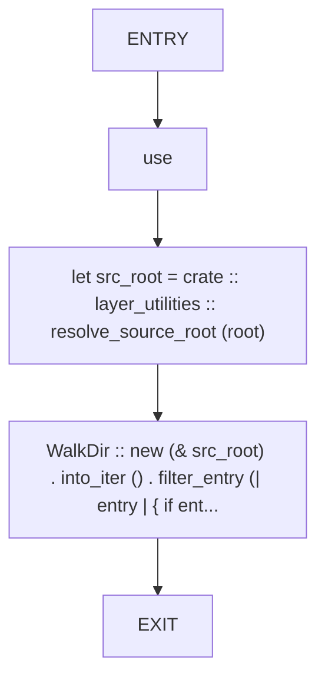

## Function: `generates_canonical_names_and_violations`

- File: src/000_cluster_001.rs
- Branches: 0
- Loops: 0
- Nodes: 16
- Edges: 15

```mermaid
flowchart TD
    generates_canonical_names_and_violations_0["ENTRY"]
    generates_canonical_names_and_violations_1["use"]
    generates_canonical_names_and_violations_2["use"]
    generates_canonical_names_and_violations_3["let dir = temp_dir ('names')"]
    generates_canonical_names_and_violations_4["create_dir_all (& dir) ?"]
    generates_canonical_names_and_violations_5["let a = dir . join ('a.rs')"]
    generates_canonical_names_and_violations_6["let b = dir . join ('b.rs')"]
    generates_canonical_names_and_violations_7["write (& a , 'use crate::b; pub fn a() {}') ?"]
    generates_canonical_names_and_violations_8["write (& b , 'pub fn b() {}') ?"]
    generates_canonical_names_and_violations_9["let result = analyze_file_ordering (& [a . clone () , b . clone ()] , Some (10)) ?"]
    generates_canonical_names_and_violations_10["let entries = & result . ordered_files"]
    generates_canonical_names_and_violations_11["macro assert_eq"]
    generates_canonical_names_and_violations_12["macro assert_eq"]
    generates_canonical_names_and_violations_13["macro assert"]
    generates_canonical_names_and_violations_14["Ok (())"]
    generates_canonical_names_and_violations_15["EXIT"]
    generates_canonical_names_and_violations_0 --> generates_canonical_names_and_violations_1
    generates_canonical_names_and_violations_1 --> generates_canonical_names_and_violations_2
    generates_canonical_names_and_violations_2 --> generates_canonical_names_and_violations_3
    generates_canonical_names_and_violations_3 --> generates_canonical_names_and_violations_4
    generates_canonical_names_and_violations_4 --> generates_canonical_names_and_violations_5
    generates_canonical_names_and_violations_5 --> generates_canonical_names_and_violations_6
    generates_canonical_names_and_violations_6 --> generates_canonical_names_and_violations_7
    generates_canonical_names_and_violations_7 --> generates_canonical_names_and_violations_8
    generates_canonical_names_and_violations_8 --> generates_canonical_names_and_violations_9
    generates_canonical_names_and_violations_9 --> generates_canonical_names_and_violations_10
    generates_canonical_names_and_violations_10 --> generates_canonical_names_and_violations_11
    generates_canonical_names_and_violations_11 --> generates_canonical_names_and_violations_12
    generates_canonical_names_and_violations_12 --> generates_canonical_names_and_violations_13
    generates_canonical_names_and_violations_13 --> generates_canonical_names_and_violations_14
    generates_canonical_names_and_violations_14 --> generates_canonical_names_and_violations_15
```

## Function: `julia_entry_paths`

- File: src/000_cluster_001.rs
- Branches: 0
- Loops: 0
- Nodes: 4
- Edges: 3

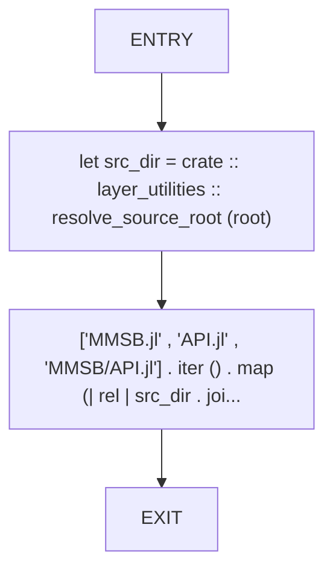

## Function: `layer_constrained_sort`

- File: src/000_cluster_001.rs
- Branches: 0
- Loops: 0
- Nodes: 8
- Edges: 7

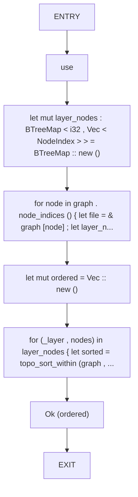

## Function: `naming_score_for_file`

- File: src/000_cluster_001.rs
- Branches: 12
- Loops: 0
- Nodes: 75
- Edges: 86

```mermaid
flowchart TD
    naming_score_for_file_0["ENTRY"]
    naming_score_for_file_1["let name = file . file_name () ? . to_string_lossy ()"]
    naming_score_for_file_2["let stem = file . file_stem () ? . to_string_lossy ()"]
    naming_score_for_file_3["let mut score = 1.0f64"]
    naming_score_for_file_4["if stem . len () < 3"]
    naming_score_for_file_5["THEN BB"]
    naming_score_for_file_6["score -= 0.2"]
    naming_score_for_file_7["EMPTY ELSE"]
    naming_score_for_file_8["IF JOIN"]
    naming_score_for_file_9["if stem . len () > 40"]
    naming_score_for_file_10["THEN BB"]
    naming_score_for_file_11["score -= 0.1"]
    naming_score_for_file_12["EMPTY ELSE"]
    naming_score_for_file_13["IF JOIN"]
    naming_score_for_file_14["if stem . chars () . any (| c | c . is_uppercase ())"]
    naming_score_for_file_15["THEN BB"]
    naming_score_for_file_16["score -= 0.1"]
    naming_score_for_file_17["EMPTY ELSE"]
    naming_score_for_file_18["IF JOIN"]
    naming_score_for_file_19["if ! stem . chars () . all (| c | c . is_ascii_lowercase () || c . is_ascii_d..."]
    naming_score_for_file_20["THEN BB"]
    naming_score_for_file_21["score -= 0.1"]
    naming_score_for_file_22["EMPTY ELSE"]
    naming_score_for_file_23["IF JOIN"]
    naming_score_for_file_24["if name . contains ('__')"]
    naming_score_for_file_25["THEN BB"]
    naming_score_for_file_26["score -= 0.1"]
    naming_score_for_file_27["EMPTY ELSE"]
    naming_score_for_file_28["IF JOIN"]
    naming_score_for_file_29["if let Some (entry) = order_entry"]
    naming_score_for_file_30["THEN BB"]
    naming_score_for_file_31["let expected = entry . suggested_name . as_str ()"]
    naming_score_for_file_32["let actual = name . as_ref ()"]
    naming_score_for_file_33["if expected != actual"]
    naming_score_for_file_34["THEN BB"]
    naming_score_for_file_35["score -= 0.3"]
    naming_score_for_file_36["ELSE BB"]
    naming_score_for_file_37["{ score += 0.1 ; }"]
    naming_score_for_file_38["IF JOIN"]
    naming_score_for_file_39["EMPTY ELSE"]
    naming_score_for_file_40["IF JOIN"]
    naming_score_for_file_41["if let Ok (contents) = fs :: read_to_string (file)"]
    naming_score_for_file_42["THEN BB"]
    naming_score_for_file_43["let mut ident_counts : HashMap < String , usize > = HashMap :: new ()"]
    naming_score_for_file_44["let ident_re = match Regex :: new (r'[A-Za-z_][A-Za-z0-9_]*') { Ok (regex) => regex , Err (_..."]
    naming_score_for_file_45["for cap in ident_re . captures_iter (& contents) { let Some (m) = cap . get (..."]
    naming_score_for_file_46["let mut idents = ident_counts . into_iter () . collect :: < Vec < _ > > ()"]
    naming_score_for_file_47["idents . sort_by (| a , b | b . 1 . cmp (& a . 1))"]
    naming_score_for_file_48["let top_idents = idents . into_iter () . take (8) . map (| (k , _) | k) . collect :: < Vec < _..."]
    naming_score_for_file_49["let name_tokens = stem . split ('_') . map (| s | s . to_lowercase ()) . filter (| s | ! s . is..."]
    naming_score_for_file_50["let overlap = top_idents . iter () . filter (| ident | name_tokens . iter () . any (| t | t..."]
    naming_score_for_file_51["if overlap == 0"]
    naming_score_for_file_52["THEN BB"]
    naming_score_for_file_53["score -= 0.1"]
    naming_score_for_file_54["ELSE BB"]
    naming_score_for_file_55["if overlap >= 2"]
    naming_score_for_file_56["THEN BB"]
    naming_score_for_file_57["score += 0.1"]
    naming_score_for_file_58["EMPTY ELSE"]
    naming_score_for_file_59["IF JOIN"]
    naming_score_for_file_60["IF JOIN"]
    naming_score_for_file_61["EMPTY ELSE"]
    naming_score_for_file_62["IF JOIN"]
    naming_score_for_file_63["if score < 0.0"]
    naming_score_for_file_64["THEN BB"]
    naming_score_for_file_65["score = 0.0"]
    naming_score_for_file_66["EMPTY ELSE"]
    naming_score_for_file_67["IF JOIN"]
    naming_score_for_file_68["if score > 1.0"]
    naming_score_for_file_69["THEN BB"]
    naming_score_for_file_70["score = 1.0"]
    naming_score_for_file_71["EMPTY ELSE"]
    naming_score_for_file_72["IF JOIN"]
    naming_score_for_file_73["Some (score * 100.0)"]
    naming_score_for_file_74["EXIT"]
    naming_score_for_file_0 --> naming_score_for_file_1
    naming_score_for_file_1 --> naming_score_for_file_2
    naming_score_for_file_2 --> naming_score_for_file_3
    naming_score_for_file_3 --> naming_score_for_file_4
    naming_score_for_file_4 --> naming_score_for_file_5
    naming_score_for_file_5 --> naming_score_for_file_6
    naming_score_for_file_4 --> naming_score_for_file_7
    naming_score_for_file_6 --> naming_score_for_file_8
    naming_score_for_file_7 --> naming_score_for_file_8
    naming_score_for_file_8 --> naming_score_for_file_9
    naming_score_for_file_9 --> naming_score_for_file_10
    naming_score_for_file_10 --> naming_score_for_file_11
    naming_score_for_file_9 --> naming_score_for_file_12
    naming_score_for_file_11 --> naming_score_for_file_13
    naming_score_for_file_12 --> naming_score_for_file_13
    naming_score_for_file_13 --> naming_score_for_file_14
    naming_score_for_file_14 --> naming_score_for_file_15
    naming_score_for_file_15 --> naming_score_for_file_16
    naming_score_for_file_14 --> naming_score_for_file_17
    naming_score_for_file_16 --> naming_score_for_file_18
    naming_score_for_file_17 --> naming_score_for_file_18
    naming_score_for_file_18 --> naming_score_for_file_19
    naming_score_for_file_19 --> naming_score_for_file_20
    naming_score_for_file_20 --> naming_score_for_file_21
    naming_score_for_file_19 --> naming_score_for_file_22
    naming_score_for_file_21 --> naming_score_for_file_23
    naming_score_for_file_22 --> naming_score_for_file_23
    naming_score_for_file_23 --> naming_score_for_file_24
    naming_score_for_file_24 --> naming_score_for_file_25
    naming_score_for_file_25 --> naming_score_for_file_26
    naming_score_for_file_24 --> naming_score_for_file_27
    naming_score_for_file_26 --> naming_score_for_file_28
    naming_score_for_file_27 --> naming_score_for_file_28
    naming_score_for_file_28 --> naming_score_for_file_29
    naming_score_for_file_29 --> naming_score_for_file_30
    naming_score_for_file_30 --> naming_score_for_file_31
    naming_score_for_file_31 --> naming_score_for_file_32
    naming_score_for_file_32 --> naming_score_for_file_33
    naming_score_for_file_33 --> naming_score_for_file_34
    naming_score_for_file_34 --> naming_score_for_file_35
    naming_score_for_file_33 --> naming_score_for_file_36
    naming_score_for_file_36 --> naming_score_for_file_37
    naming_score_for_file_35 --> naming_score_for_file_38
    naming_score_for_file_37 --> naming_score_for_file_38
    naming_score_for_file_29 --> naming_score_for_file_39
    naming_score_for_file_38 --> naming_score_for_file_40
    naming_score_for_file_39 --> naming_score_for_file_40
    naming_score_for_file_40 --> naming_score_for_file_41
    naming_score_for_file_41 --> naming_score_for_file_42
    naming_score_for_file_42 --> naming_score_for_file_43
    naming_score_for_file_43 --> naming_score_for_file_44
    naming_score_for_file_44 --> naming_score_for_file_45
    naming_score_for_file_45 --> naming_score_for_file_46
    naming_score_for_file_46 --> naming_score_for_file_47
    naming_score_for_file_47 --> naming_score_for_file_48
    naming_score_for_file_48 --> naming_score_for_file_49
    naming_score_for_file_49 --> naming_score_for_file_50
    naming_score_for_file_50 --> naming_score_for_file_51
    naming_score_for_file_51 --> naming_score_for_file_52
    naming_score_for_file_52 --> naming_score_for_file_53
    naming_score_for_file_51 --> naming_score_for_file_54
    naming_score_for_file_54 --> naming_score_for_file_55
    naming_score_for_file_55 --> naming_score_for_file_56
    naming_score_for_file_56 --> naming_score_for_file_57
    naming_score_for_file_55 --> naming_score_for_file_58
    naming_score_for_file_57 --> naming_score_for_file_59
    naming_score_for_file_58 --> naming_score_for_file_59
    naming_score_for_file_53 --> naming_score_for_file_60
    naming_score_for_file_59 --> naming_score_for_file_60
    naming_score_for_file_41 --> naming_score_for_file_61
    naming_score_for_file_60 --> naming_score_for_file_62
    naming_score_for_file_61 --> naming_score_for_file_62
    naming_score_for_file_62 --> naming_score_for_file_63
    naming_score_for_file_63 --> naming_score_for_file_64
    naming_score_for_file_64 --> naming_score_for_file_65
    naming_score_for_file_63 --> naming_score_for_file_66
    naming_score_for_file_65 --> naming_score_for_file_67
    naming_score_for_file_66 --> naming_score_for_file_67
    naming_score_for_file_67 --> naming_score_for_file_68
    naming_score_for_file_68 --> naming_score_for_file_69
    naming_score_for_file_69 --> naming_score_for_file_70
    naming_score_for_file_68 --> naming_score_for_file_71
    naming_score_for_file_70 --> naming_score_for_file_72
    naming_score_for_file_71 --> naming_score_for_file_72
    naming_score_for_file_72 --> naming_score_for_file_73
    naming_score_for_file_73 --> naming_score_for_file_74
```

## Function: `order_rust_files_by_dependency`

- File: src/000_cluster_001.rs
- Branches: 0
- Loops: 0
- Nodes: 10
- Edges: 9

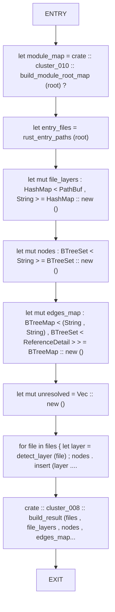

## Function: `ordered_by_name`

- File: src/000_cluster_001.rs
- Branches: 0
- Loops: 0
- Nodes: 5
- Edges: 4

```mermaid
flowchart TD
    ordered_by_name_0["ENTRY"]
    ordered_by_name_1["let mut sorted = files . to_vec ()"]
    ordered_by_name_2["sorted . sort ()"]
    ordered_by_name_3["sorted . into_iter () . filter_map (| path | node_map . get (& path) . copied..."]
    ordered_by_name_4["EXIT"]
    ordered_by_name_0 --> ordered_by_name_1
    ordered_by_name_1 --> ordered_by_name_2
    ordered_by_name_2 --> ordered_by_name_3
    ordered_by_name_3 --> ordered_by_name_4
```

## Function: `rust_entry_paths`

- File: src/000_cluster_001.rs
- Branches: 0
- Loops: 0
- Nodes: 4
- Edges: 3

```mermaid
flowchart TD
    rust_entry_paths_0["ENTRY"]
    rust_entry_paths_1["let src_dir = crate :: layer_utilities :: resolve_source_root (root)"]
    rust_entry_paths_2["['lib.rs' , 'main.rs'] . iter () . map (| rel | src_dir . join (rel)) . filte..."]
    rust_entry_paths_3["EXIT"]
    rust_entry_paths_0 --> rust_entry_paths_1
    rust_entry_paths_1 --> rust_entry_paths_2
    rust_entry_paths_2 --> rust_entry_paths_3
```

## Function: `temp_dir`

- File: src/000_cluster_001.rs
- Branches: 0
- Loops: 0
- Nodes: 5
- Edges: 4

```mermaid
flowchart TD
    temp_dir_0["ENTRY"]
    temp_dir_1["let mut dir = std :: env :: temp_dir ()"]
    temp_dir_2["dir . push (format ! ('mmsb_analyzer_{}_{}' , name , std :: time :: SystemTim..."]
    temp_dir_3["dir"]
    temp_dir_4["EXIT"]
    temp_dir_0 --> temp_dir_1
    temp_dir_1 --> temp_dir_2
    temp_dir_2 --> temp_dir_3
    temp_dir_3 --> temp_dir_4
```

## Function: `test_detects_cycles`

- File: src/000_cluster_001.rs
- Branches: 0
- Loops: 0
- Nodes: 3
- Edges: 2

```mermaid
flowchart TD
    test_detects_cycles_0["ENTRY"]
    test_detects_cycles_1["detects_cycles () . unwrap ()"]
    test_detects_cycles_2["EXIT"]
    test_detects_cycles_0 --> test_detects_cycles_1
    test_detects_cycles_1 --> test_detects_cycles_2
```

## Function: `test_generates_canonical_names_and_violations`

- File: src/000_cluster_001.rs
- Branches: 0
- Loops: 0
- Nodes: 3
- Edges: 2

```mermaid
flowchart TD
    test_generates_canonical_names_and_violations_0["ENTRY"]
    test_generates_canonical_names_and_violations_1["generates_canonical_names_and_violations () . unwrap ()"]
    test_generates_canonical_names_and_violations_2["EXIT"]
    test_generates_canonical_names_and_violations_0 --> test_generates_canonical_names_and_violations_1
    test_generates_canonical_names_and_violations_1 --> test_generates_canonical_names_and_violations_2
```

## Function: `topo_sort_orders_dependencies`

- File: src/000_cluster_001.rs
- Branches: 0
- Loops: 0
- Nodes: 17
- Edges: 16

```mermaid
flowchart TD
    topo_sort_orders_dependencies_0["ENTRY"]
    topo_sort_orders_dependencies_1["use"]
    topo_sort_orders_dependencies_2["use"]
    topo_sort_orders_dependencies_3["let dir = temp_dir ('topo')"]
    topo_sort_orders_dependencies_4["create_dir_all (& dir) ?"]
    topo_sort_orders_dependencies_5["let a = dir . join ('a.rs')"]
    topo_sort_orders_dependencies_6["let b = dir . join ('b.rs')"]
    topo_sort_orders_dependencies_7["let c = dir . join ('c.rs')"]
    topo_sort_orders_dependencies_8["write (& a , 'pub fn a() {}') ?"]
    topo_sort_orders_dependencies_9["write (& b , 'use crate::a; pub fn b() {}') ?"]
    topo_sort_orders_dependencies_10["write (& c , 'use crate::b; pub fn c() {}') ?"]
    topo_sort_orders_dependencies_11["let result = analyze_file_ordering (& [c . clone () , b . clone () , a . clone ()] , Some ..."]
    topo_sort_orders_dependencies_12["let ordered : Vec < _ > = result . ordered_files . iter () . map (| entry | entry . current_path . clon..."]
    topo_sort_orders_dependencies_13["macro assert_eq"]
    topo_sort_orders_dependencies_14["macro assert"]
    topo_sort_orders_dependencies_15["Ok (())"]
    topo_sort_orders_dependencies_16["EXIT"]
    topo_sort_orders_dependencies_0 --> topo_sort_orders_dependencies_1
    topo_sort_orders_dependencies_1 --> topo_sort_orders_dependencies_2
    topo_sort_orders_dependencies_2 --> topo_sort_orders_dependencies_3
    topo_sort_orders_dependencies_3 --> topo_sort_orders_dependencies_4
    topo_sort_orders_dependencies_4 --> topo_sort_orders_dependencies_5
    topo_sort_orders_dependencies_5 --> topo_sort_orders_dependencies_6
    topo_sort_orders_dependencies_6 --> topo_sort_orders_dependencies_7
    topo_sort_orders_dependencies_7 --> topo_sort_orders_dependencies_8
    topo_sort_orders_dependencies_8 --> topo_sort_orders_dependencies_9
    topo_sort_orders_dependencies_9 --> topo_sort_orders_dependencies_10
    topo_sort_orders_dependencies_10 --> topo_sort_orders_dependencies_11
    topo_sort_orders_dependencies_11 --> topo_sort_orders_dependencies_12
    topo_sort_orders_dependencies_12 --> topo_sort_orders_dependencies_13
    topo_sort_orders_dependencies_13 --> topo_sort_orders_dependencies_14
    topo_sort_orders_dependencies_14 --> topo_sort_orders_dependencies_15
    topo_sort_orders_dependencies_15 --> topo_sort_orders_dependencies_16
```

## Function: `topo_sort_within`

- File: src/000_cluster_001.rs
- Branches: 1
- Loops: 0
- Nodes: 16
- Edges: 16

```mermaid
flowchart TD
    topo_sort_within_0["ENTRY"]
    topo_sort_within_1["let node_set : HashSet < NodeIndex > = nodes . iter () . copied () . collect ()"]
    topo_sort_within_2["let mut indegree : HashMap < NodeIndex , usize > = HashMap :: new ()"]
    topo_sort_within_3["for & node in nodes { indegree . insert (node , 0) ; }"]
    topo_sort_within_4["for & node in nodes { let incoming = graph . neighbors_directed (node , petgr..."]
    topo_sort_within_5["let mut queue = std :: collections :: VecDeque :: new ()"]
    topo_sort_within_6["for & node in nodes { if indegree . get (& node) . copied () . unwrap_or (0) ..."]
    topo_sort_within_7["let mut ordered = Vec :: new ()"]
    topo_sort_within_8["while let Some (node) = queue . pop_front () { ordered . push (node) ; for ne..."]
    topo_sort_within_9["if ordered . len () != nodes . len ()"]
    topo_sort_within_10["THEN BB"]
    topo_sort_within_11["return Err (anyhow :: anyhow ! ('Cycle detected within layer group'))"]
    topo_sort_within_12["EMPTY ELSE"]
    topo_sort_within_13["IF JOIN"]
    topo_sort_within_14["Ok (ordered)"]
    topo_sort_within_15["EXIT"]
    topo_sort_within_0 --> topo_sort_within_1
    topo_sort_within_1 --> topo_sort_within_2
    topo_sort_within_2 --> topo_sort_within_3
    topo_sort_within_3 --> topo_sort_within_4
    topo_sort_within_4 --> topo_sort_within_5
    topo_sort_within_5 --> topo_sort_within_6
    topo_sort_within_6 --> topo_sort_within_7
    topo_sort_within_7 --> topo_sort_within_8
    topo_sort_within_8 --> topo_sort_within_9
    topo_sort_within_9 --> topo_sort_within_10
    topo_sort_within_10 --> topo_sort_within_11
    topo_sort_within_9 --> topo_sort_within_12
    topo_sort_within_11 --> topo_sort_within_13
    topo_sort_within_12 --> topo_sort_within_13
    topo_sort_within_13 --> topo_sort_within_14
    topo_sort_within_14 --> topo_sort_within_15
```

## Function: `topological_sort`

- File: src/000_cluster_001.rs
- Branches: 1
- Loops: 0
- Nodes: 16
- Edges: 16

```mermaid
flowchart TD
    topological_sort_0["ENTRY"]
    topological_sort_1["use"]
    topological_sort_2["use"]
    topological_sort_3["let mut indegree = vec ! [0usize ; graph . node_count ()]"]
    topological_sort_4["for node in graph . node_indices () { indegree [node . index ()] = graph . ne..."]
    topological_sort_5["let mut queue = VecDeque :: new ()"]
    topological_sort_6["for node in graph . node_indices () { if indegree [node . index ()] == 0 { qu..."]
    topological_sort_7["let mut ordered = Vec :: new ()"]
    topological_sort_8["while let Some (node) = queue . pop_front () { ordered . push (node) ; for ne..."]
    topological_sort_9["if ordered . len () != graph . node_count ()"]
    topological_sort_10["THEN BB"]
    topological_sort_11["return Err (anyhow :: anyhow ! ('Cycle detected in dependency graph'))"]
    topological_sort_12["EMPTY ELSE"]
    topological_sort_13["IF JOIN"]
    topological_sort_14["Ok (ordered)"]
    topological_sort_15["EXIT"]
    topological_sort_0 --> topological_sort_1
    topological_sort_1 --> topological_sort_2
    topological_sort_2 --> topological_sort_3
    topological_sort_3 --> topological_sort_4
    topological_sort_4 --> topological_sort_5
    topological_sort_5 --> topological_sort_6
    topological_sort_6 --> topological_sort_7
    topological_sort_7 --> topological_sort_8
    topological_sort_8 --> topological_sort_9
    topological_sort_9 --> topological_sort_10
    topological_sort_10 --> topological_sort_11
    topological_sort_9 --> topological_sort_12
    topological_sort_11 --> topological_sort_13
    topological_sort_12 --> topological_sort_13
    topological_sort_13 --> topological_sort_14
    topological_sort_14 --> topological_sort_15
```

