# CFG Group: src/010_cluster_008.rs

## Function: `adjacency_from_edges`

- File: src/010_cluster_008.rs
- Branches: 0
- Loops: 0
- Nodes: 5
- Edges: 4

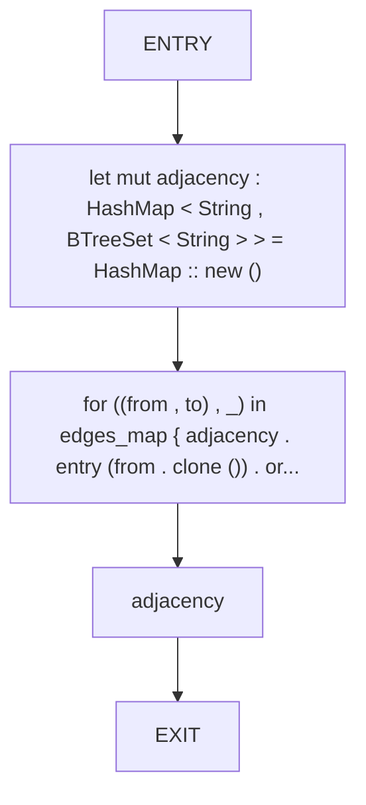

## Function: `build_result`

- File: src/010_cluster_008.rs
- Branches: 1
- Loops: 0
- Nodes: 16
- Edges: 16

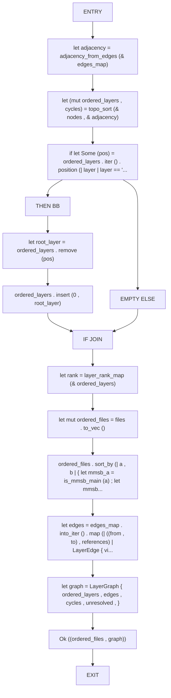

## Function: `cluster_target_path`

- File: src/010_cluster_008.rs
- Branches: 1
- Loops: 0
- Nodes: 11
- Edges: 11

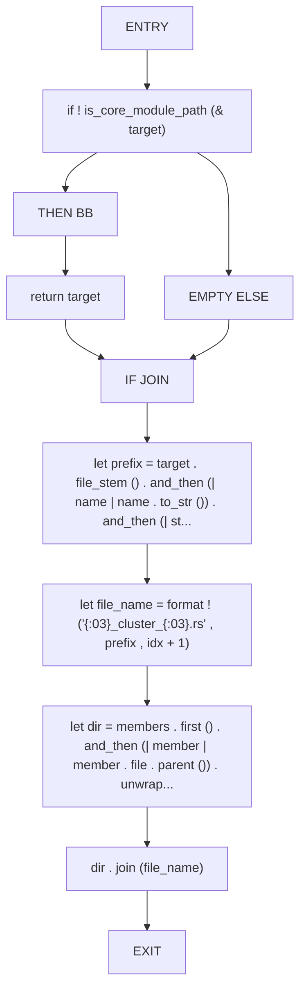

## Function: `collect_cluster_plans`

- File: src/010_cluster_008.rs
- Branches: 0
- Loops: 0
- Nodes: 6
- Edges: 5

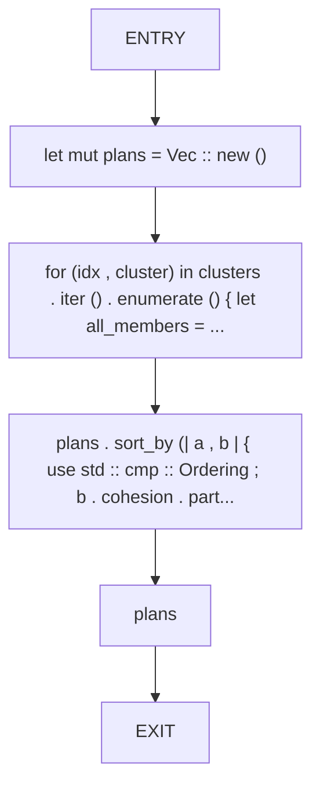

## Function: `compare_dir_layers`

- File: src/010_cluster_008.rs
- Branches: 0
- Loops: 0
- Nodes: 7
- Edges: 6

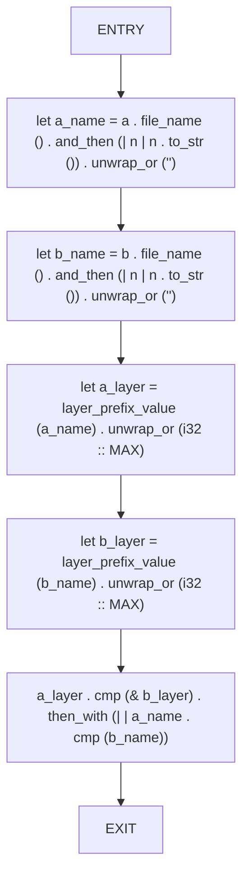

## Function: `compare_path_components`

- File: src/010_cluster_008.rs
- Branches: 0
- Loops: 0
- Nodes: 7
- Edges: 6

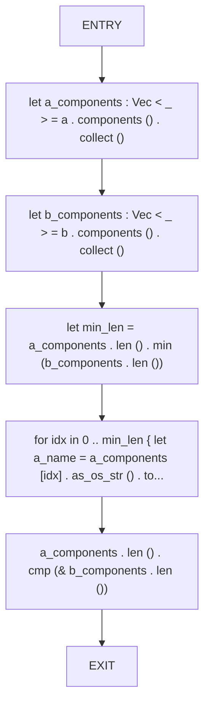

## Function: `cyclomatic_complexity`

- File: src/010_cluster_008.rs
- Branches: 1
- Loops: 0
- Nodes: 12
- Edges: 12

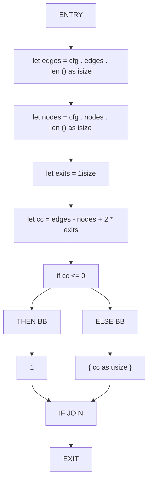

## Function: `detect_layer_violation`

- File: src/010_cluster_008.rs
- Branches: 0
- Loops: 0
- Nodes: 7
- Edges: 6

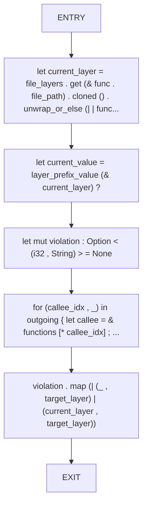

## Function: `detect_layer_violations`

- File: src/010_cluster_008.rs
- Branches: 0
- Loops: 0
- Nodes: 5
- Edges: 4

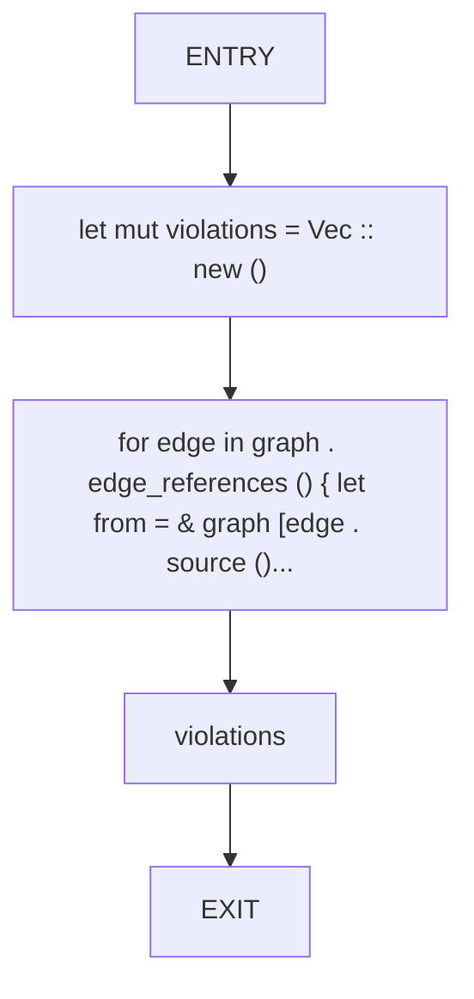

## Function: `insert_sorted`

- File: src/010_cluster_008.rs
- Branches: 1
- Loops: 0
- Nodes: 9
- Edges: 9

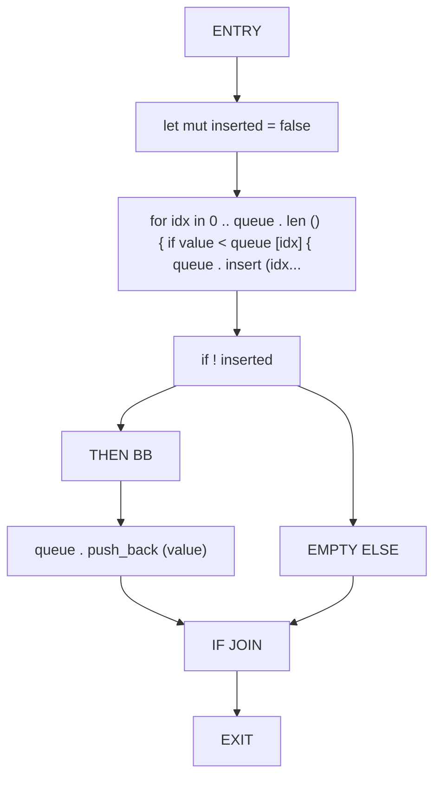

## Function: `is_core_module_path`

- File: src/010_cluster_008.rs
- Branches: 0
- Loops: 0
- Nodes: 4
- Edges: 3

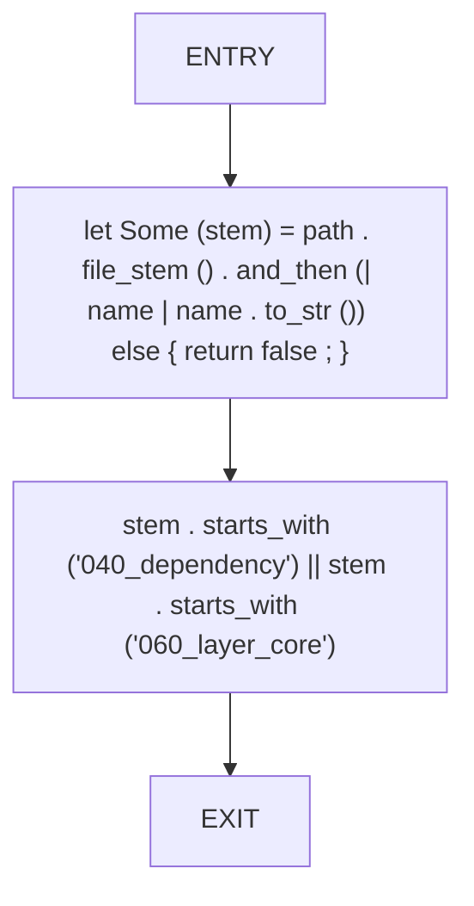

## Function: `is_layer_violation`

- File: src/010_cluster_008.rs
- Branches: 0
- Loops: 0
- Nodes: 3
- Edges: 2

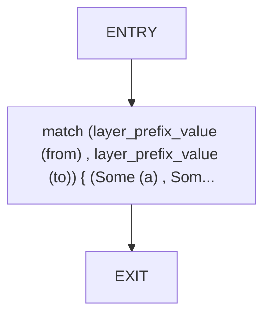

## Function: `is_mmsb_main`

- File: src/010_cluster_008.rs
- Branches: 0
- Loops: 0
- Nodes: 3
- Edges: 2

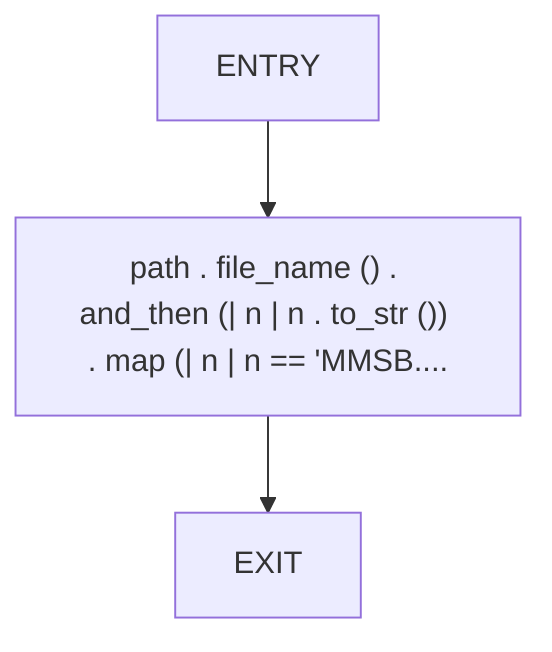

## Function: `layer_adheres`

- File: src/010_cluster_008.rs
- Branches: 0
- Loops: 0
- Nodes: 3
- Edges: 2

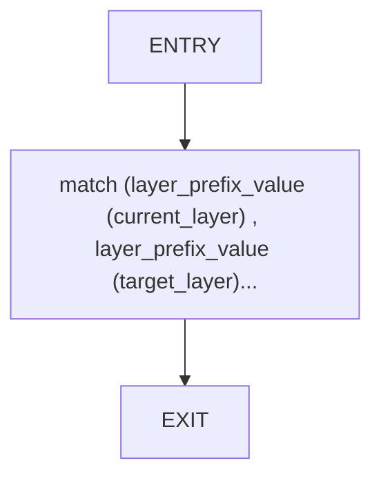

## Function: `layer_prefix_value`

- File: src/010_cluster_008.rs
- Branches: 1
- Loops: 0
- Nodes: 11
- Edges: 11

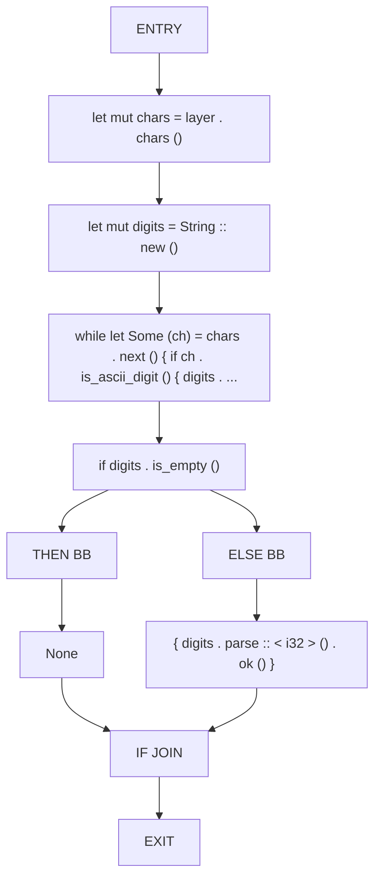

## Function: `layer_rank_map`

- File: src/010_cluster_008.rs
- Branches: 0
- Loops: 0
- Nodes: 5
- Edges: 4

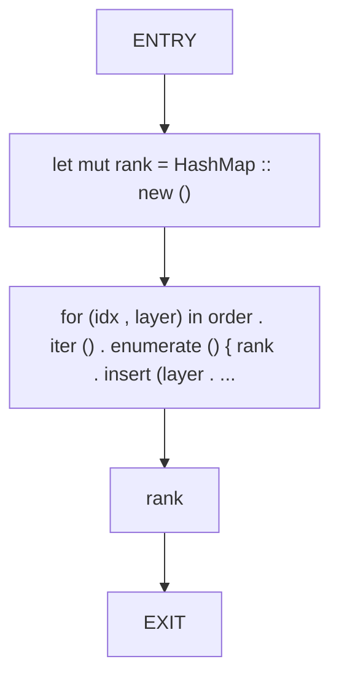

## Function: `node_style`

- File: src/010_cluster_008.rs
- Branches: 0
- Loops: 0
- Nodes: 3
- Edges: 2

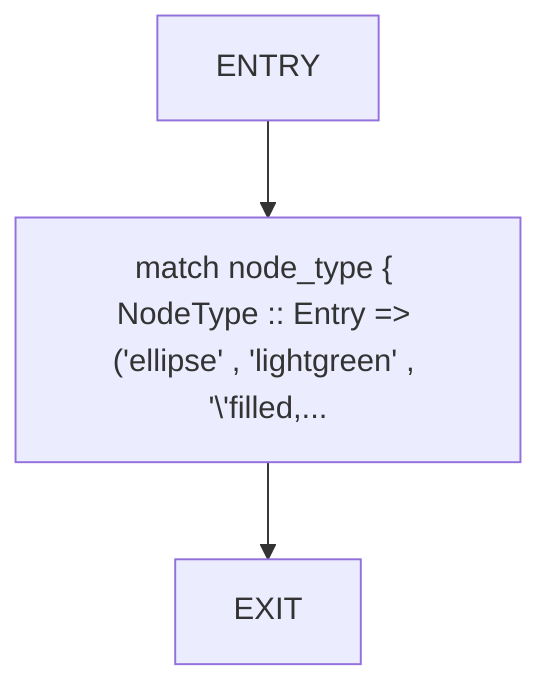

## Function: `parse_cluster_members`

- File: src/010_cluster_008.rs
- Branches: 0
- Loops: 0
- Nodes: 3
- Edges: 2

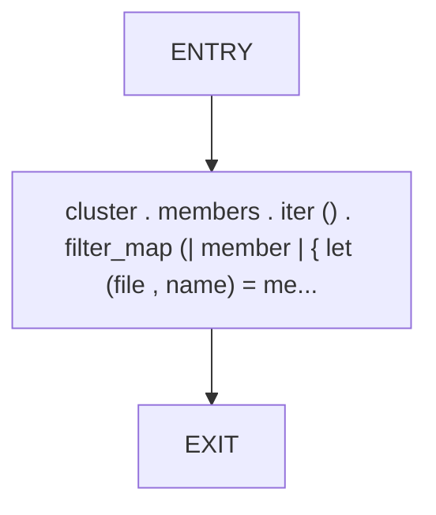

## Function: `sort_structural_items`

- File: src/010_cluster_008.rs
- Branches: 2
- Loops: 0
- Nodes: 28
- Edges: 29

```mermaid
flowchart TD
    sort_structural_items_0["ENTRY"]
    sort_structural_items_1["use"]
    sort_structural_items_2["use"]
    sort_structural_items_3["if items . len () <= 1"]
    sort_structural_items_4["THEN BB"]
    sort_structural_items_5["return"]
    sort_structural_items_6["EMPTY ELSE"]
    sort_structural_items_7["IF JOIN"]
    sort_structural_items_8["let count = items . len ()"]
    sort_structural_items_9["let mut edges : Vec < Vec < usize > > = vec ! [Vec :: new () ; count]"]
    sort_structural_items_10["let mut indegree = vec ! [0usize ; count]"]
    sort_structural_items_11["let mut file_to_items : HashMap < PathBuf , Vec < usize > > = HashMap :: new ()"]
    sort_structural_items_12["for (idx , item) in items . iter () . enumerate () { if let Some (path) = & i..."]
    sort_structural_items_13["for i in 0 .. count { for j in (i + 1) .. count { let req_i = structural_laye..."]
    sort_structural_items_14["for (idx , item) in items . iter () . enumerate () { for file in & item . out..."]
    sort_structural_items_15["let mut ordered_indices = Vec :: with_capacity (count)"]
    sort_structural_items_16["let mut available : Vec < usize > = (0 .. count) . filter (| & i | indegree [i] == 0) . collect ()"]
    sort_structural_items_17["while ! available . is_empty () { available . sort_by (| & a , & b | structur..."]
    sort_structural_items_18["if ordered_indices . len () != count"]
    sort_structural_items_19["THEN BB"]
    sort_structural_items_20["items . sort_by (structural_cmp)"]
    sort_structural_items_21["return"]
    sort_structural_items_22["EMPTY ELSE"]
    sort_structural_items_23["IF JOIN"]
    sort_structural_items_24["let mut reordered = Vec :: with_capacity (count)"]
    sort_structural_items_25["for idx in ordered_indices { reordered . push (items [idx] . clone ()) ; }"]
    sort_structural_items_26["* items = reordered"]
    sort_structural_items_27["EXIT"]
    sort_structural_items_0 --> sort_structural_items_1
    sort_structural_items_1 --> sort_structural_items_2
    sort_structural_items_2 --> sort_structural_items_3
    sort_structural_items_3 --> sort_structural_items_4
    sort_structural_items_4 --> sort_structural_items_5
    sort_structural_items_3 --> sort_structural_items_6
    sort_structural_items_5 --> sort_structural_items_7
    sort_structural_items_6 --> sort_structural_items_7
    sort_structural_items_7 --> sort_structural_items_8
    sort_structural_items_8 --> sort_structural_items_9
    sort_structural_items_9 --> sort_structural_items_10
    sort_structural_items_10 --> sort_structural_items_11
    sort_structural_items_11 --> sort_structural_items_12
    sort_structural_items_12 --> sort_structural_items_13
    sort_structural_items_13 --> sort_structural_items_14
    sort_structural_items_14 --> sort_structural_items_15
    sort_structural_items_15 --> sort_structural_items_16
    sort_structural_items_16 --> sort_structural_items_17
    sort_structural_items_17 --> sort_structural_items_18
    sort_structural_items_18 --> sort_structural_items_19
    sort_structural_items_19 --> sort_structural_items_20
    sort_structural_items_20 --> sort_structural_items_21
    sort_structural_items_18 --> sort_structural_items_22
    sort_structural_items_21 --> sort_structural_items_23
    sort_structural_items_22 --> sort_structural_items_23
    sort_structural_items_23 --> sort_structural_items_24
    sort_structural_items_24 --> sort_structural_items_25
    sort_structural_items_25 --> sort_structural_items_26
    sort_structural_items_26 --> sort_structural_items_27
```

## Function: `structural_cmp`

- File: src/010_cluster_008.rs
- Branches: 0
- Loops: 0
- Nodes: 9
- Edges: 8

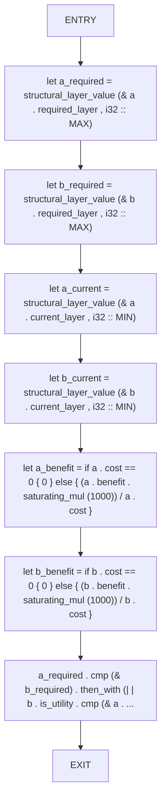

## Function: `structural_layer_value`

- File: src/010_cluster_008.rs
- Branches: 0
- Loops: 0
- Nodes: 3
- Edges: 2

```mermaid
flowchart TD
    structural_layer_value_0["ENTRY"]
    structural_layer_value_1["layer . as_ref () . and_then (| value | layer_prefix_value (value)) . unwrap_..."]
    structural_layer_value_2["EXIT"]
    structural_layer_value_0 --> structural_layer_value_1
    structural_layer_value_1 --> structural_layer_value_2
```

## Function: `topo_sort`

- File: src/010_cluster_008.rs
- Branches: 1
- Loops: 0
- Nodes: 19
- Edges: 19

```mermaid
flowchart TD
    topo_sort_0["ENTRY"]
    topo_sort_1["let mut indegree : HashMap < String , usize > = HashMap :: new ()"]
    topo_sort_2["for node in nodes { indegree . entry (node . clone ()) . or_insert (0) ; }"]
    topo_sort_3["for targets in adjacency . values () { for target in targets { * indegree . e..."]
    topo_sort_4["let mut queue : VecDeque < String > = indegree . iter () . filter_map (| (node , & deg) | if deg == 0 { Some (node ..."]
    topo_sort_5["queue . make_contiguous () . sort ()"]
    topo_sort_6["let mut order = Vec :: new ()"]
    topo_sort_7["while let Some (node) = queue . pop_front () { order . push (node . clone ())..."]
    topo_sort_8["if order . len () != nodes . len ()"]
    topo_sort_9["THEN BB"]
    topo_sort_10["let mut remaining : Vec < _ > = nodes . iter () . filter (| layer | ! order . contains (layer)) . cloned () ...."]
    topo_sort_11["remaining . sort ()"]
    topo_sort_12["let cycles = remaining . clone ()"]
    topo_sort_13["order . extend (remaining)"]
    topo_sort_14["return (order , cycles)"]
    topo_sort_15["EMPTY ELSE"]
    topo_sort_16["IF JOIN"]
    topo_sort_17["(order , Vec :: new ())"]
    topo_sort_18["EXIT"]
    topo_sort_0 --> topo_sort_1
    topo_sort_1 --> topo_sort_2
    topo_sort_2 --> topo_sort_3
    topo_sort_3 --> topo_sort_4
    topo_sort_4 --> topo_sort_5
    topo_sort_5 --> topo_sort_6
    topo_sort_6 --> topo_sort_7
    topo_sort_7 --> topo_sort_8
    topo_sort_8 --> topo_sort_9
    topo_sort_9 --> topo_sort_10
    topo_sort_10 --> topo_sort_11
    topo_sort_11 --> topo_sort_12
    topo_sort_12 --> topo_sort_13
    topo_sort_13 --> topo_sort_14
    topo_sort_8 --> topo_sort_15
    topo_sort_14 --> topo_sort_16
    topo_sort_15 --> topo_sort_16
    topo_sort_16 --> topo_sort_17
    topo_sort_17 --> topo_sort_18
```

