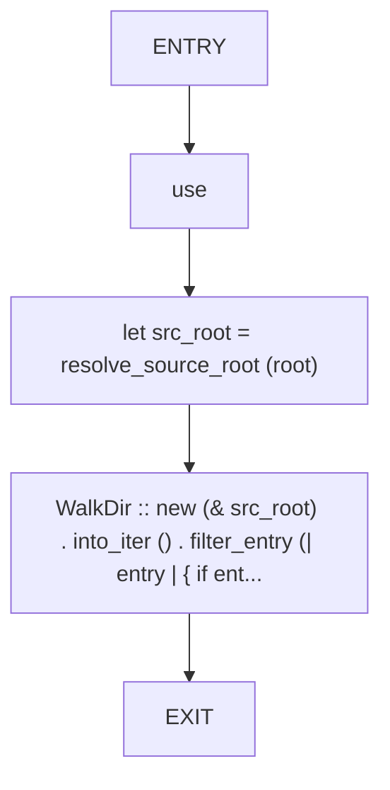

# CFG Group: src/020_cluster_010.rs

## Function: `gather_rust_files`

- File: src/020_cluster_010.rs
- Branches: 0
- Loops: 0
- Nodes: 5
- Edges: 4

```mermaid
flowchart TD
    gather_rust_files_0["ENTRY"]
    gather_rust_files_1["use"]
    gather_rust_files_2["let src_root = resolve_source_root (root)"]
    gather_rust_files_3["WalkDir :: new (& src_root) . into_iter () . filter_entry (| entry | { if ent..."]
    gather_rust_files_4["EXIT"]
    gather_rust_files_0 --> gather_rust_files_1
    gather_rust_files_1 --> gather_rust_files_2
    gather_rust_files_2 --> gather_rust_files_3
    gather_rust_files_3 --> gather_rust_files_4
```

