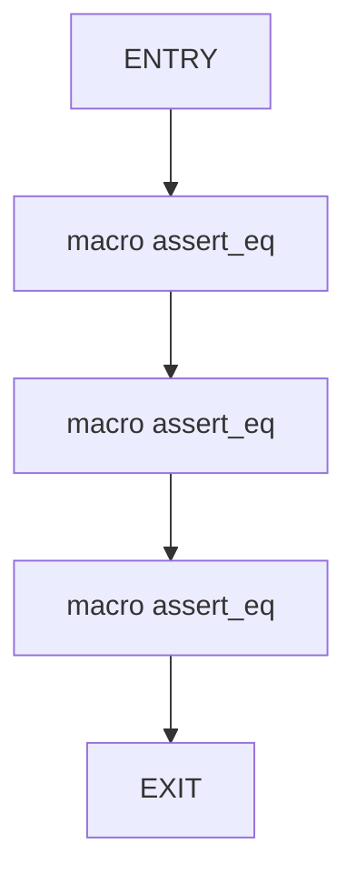
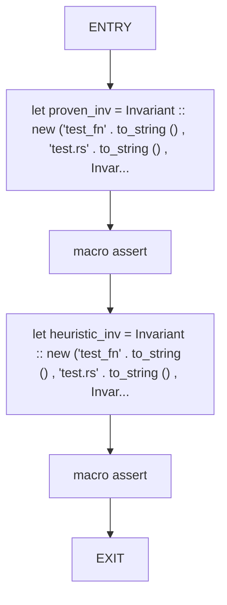
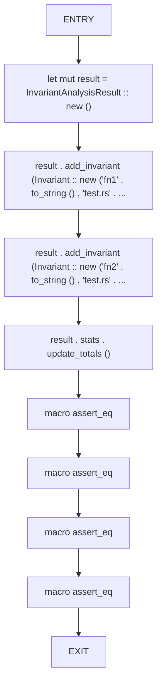

# CFG Group: src/020_invariant_types.rs

## Function: `test_confidence_from_strength`

- File: src/020_invariant_types.rs
- Branches: 0
- Loops: 0
- Nodes: 5
- Edges: 4

## Function: `test_is_blocking`

- File: src/020_invariant_types.rs
- Branches: 0
- Loops: 0
- Nodes: 6
- Edges: 5

## Function: `test_stats_calculation`

- File: src/020_invariant_types.rs
- Branches: 0
- Loops: 0
- Nodes: 10
- Edges: 9

