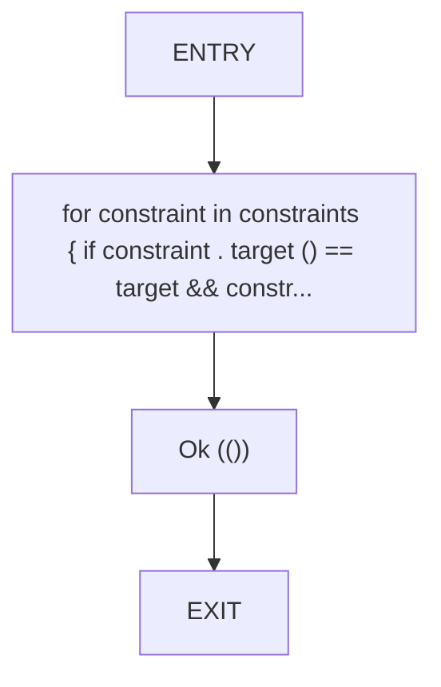
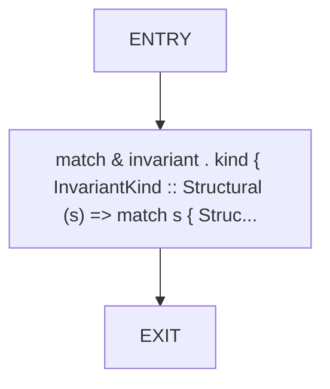
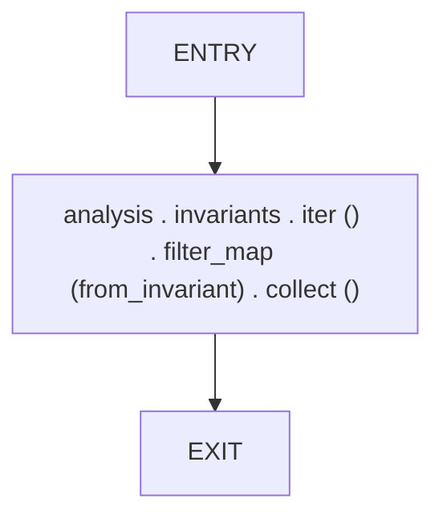
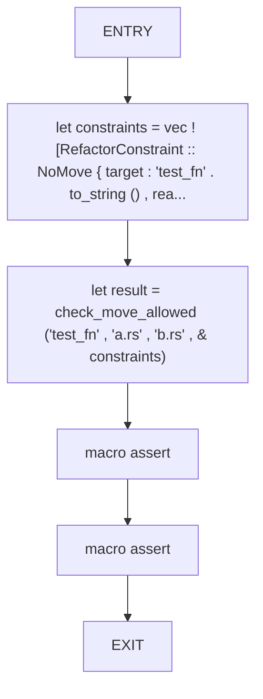
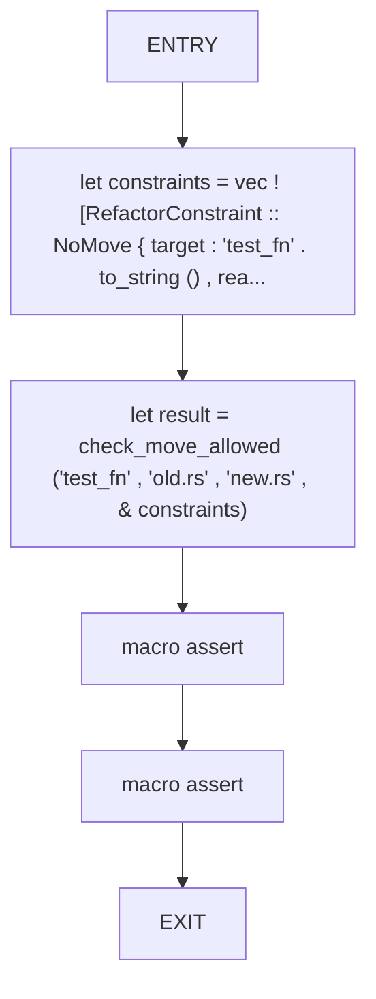
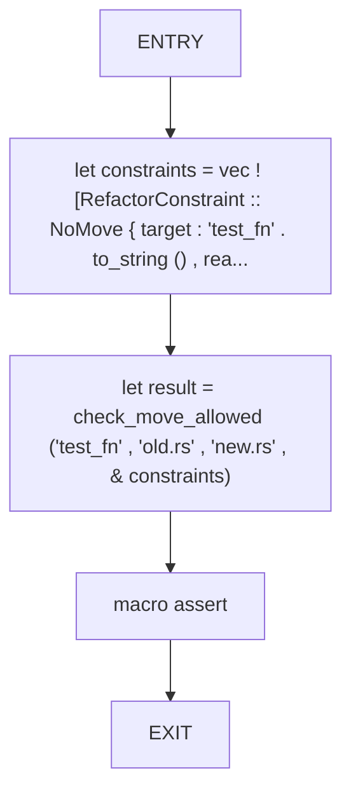
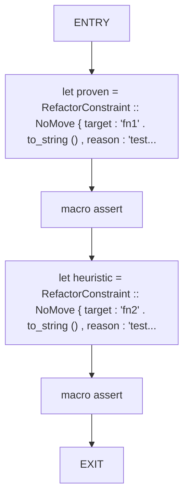
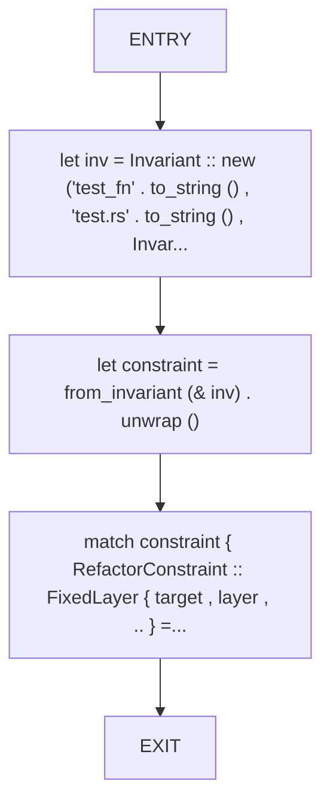

# CFG Group: src/030_refactor_constraints.rs

## Function: `check_move_allowed`

- File: src/030_refactor_constraints.rs
- Branches: 0
- Loops: 0
- Nodes: 4
- Edges: 3

## Function: `from_invariant`

- File: src/030_refactor_constraints.rs
- Branches: 0
- Loops: 0
- Nodes: 3
- Edges: 2

## Function: `generate_constraints`

- File: src/030_refactor_constraints.rs
- Branches: 0
- Loops: 0
- Nodes: 3
- Edges: 2

## Function: `test_check_move_allowed`

- File: src/030_refactor_constraints.rs
- Branches: 0
- Loops: 0
- Nodes: 6
- Edges: 5

## Function: `test_check_move_allowed_blocking`

- File: src/030_refactor_constraints.rs
- Branches: 0
- Loops: 0
- Nodes: 6
- Edges: 5

## Function: `test_check_move_allowed_non_blocking`

- File: src/030_refactor_constraints.rs
- Branches: 0
- Loops: 0
- Nodes: 5
- Edges: 4

## Function: `test_constraint_is_blocking`

- File: src/030_refactor_constraints.rs
- Branches: 0
- Loops: 0
- Nodes: 6
- Edges: 5

## Function: `test_from_invariant_layer_fixed`

- File: src/030_refactor_constraints.rs
- Branches: 0
- Loops: 0
- Nodes: 5
- Edges: 4

