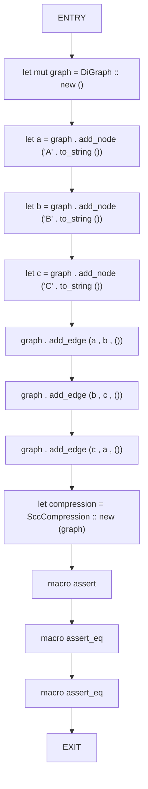
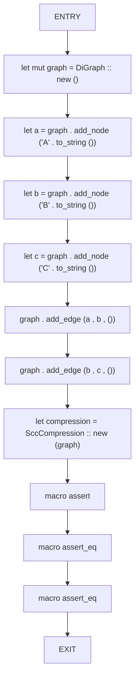

# CFG Group: src/040_scc_compressor.rs

## Function: `test_scc_compression_cycle`

- File: src/040_scc_compressor.rs
- Branches: 0
- Loops: 0
- Nodes: 13
- Edges: 12

## Function: `test_scc_compression_dag`

- File: src/040_scc_compressor.rs
- Branches: 0
- Loops: 0
- Nodes: 12
- Edges: 11

## Function: `test_scc_compression_mixed`

- File: src/040_scc_compressor.rs
- Branches: 0
- Loops: 0
- Nodes: 16
- Edges: 15

```mermaid
flowchart TD
    test_scc_compression_mixed_0["ENTRY"]
    test_scc_compression_mixed_1["let mut graph = DiGraph :: new ()"]
    test_scc_compression_mixed_2["let a = graph . add_node ('A' . to_string ())"]
    test_scc_compression_mixed_3["let b = graph . add_node ('B' . to_string ())"]
    test_scc_compression_mixed_4["let c = graph . add_node ('C' . to_string ())"]
    test_scc_compression_mixed_5["let d = graph . add_node ('D' . to_string ())"]
    test_scc_compression_mixed_6["graph . add_edge (a , b , ())"]
    test_scc_compression_mixed_7["graph . add_edge (b , c , ())"]
    test_scc_compression_mixed_8["graph . add_edge (c , b , ())"]
    test_scc_compression_mixed_9["graph . add_edge (a , d , ())"]
    test_scc_compression_mixed_10["let compression = SccCompression :: new (graph)"]
    test_scc_compression_mixed_11["macro assert"]
    test_scc_compression_mixed_12["macro assert_eq"]
    test_scc_compression_mixed_13["macro assert_eq"]
    test_scc_compression_mixed_14["macro assert_eq"]
    test_scc_compression_mixed_15["EXIT"]
    test_scc_compression_mixed_0 --> test_scc_compression_mixed_1
    test_scc_compression_mixed_1 --> test_scc_compression_mixed_2
    test_scc_compression_mixed_2 --> test_scc_compression_mixed_3
    test_scc_compression_mixed_3 --> test_scc_compression_mixed_4
    test_scc_compression_mixed_4 --> test_scc_compression_mixed_5
    test_scc_compression_mixed_5 --> test_scc_compression_mixed_6
    test_scc_compression_mixed_6 --> test_scc_compression_mixed_7
    test_scc_compression_mixed_7 --> test_scc_compression_mixed_8
    test_scc_compression_mixed_8 --> test_scc_compression_mixed_9
    test_scc_compression_mixed_9 --> test_scc_compression_mixed_10
    test_scc_compression_mixed_10 --> test_scc_compression_mixed_11
    test_scc_compression_mixed_11 --> test_scc_compression_mixed_12
    test_scc_compression_mixed_12 --> test_scc_compression_mixed_13
    test_scc_compression_mixed_13 --> test_scc_compression_mixed_14
    test_scc_compression_mixed_14 --> test_scc_compression_mixed_15
```

