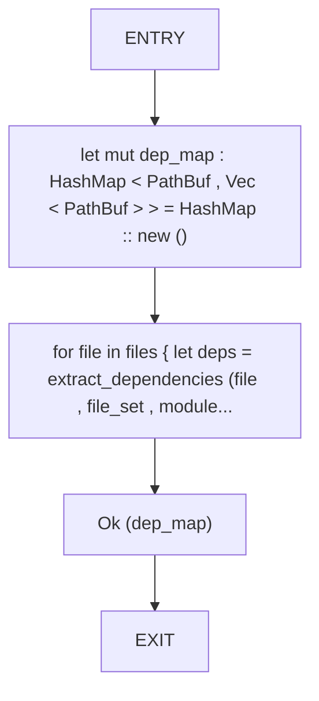
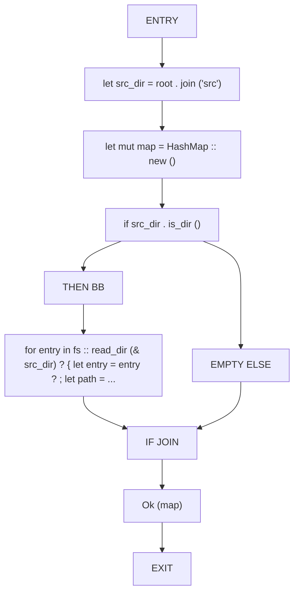
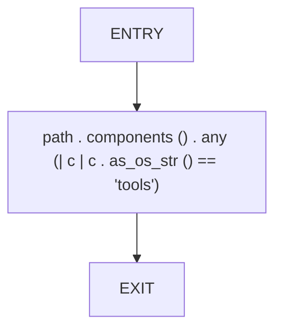
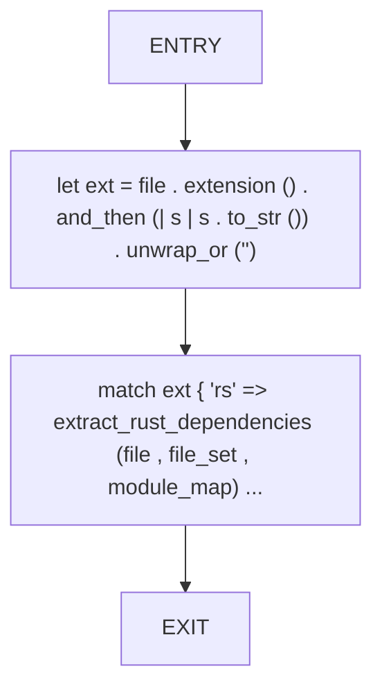
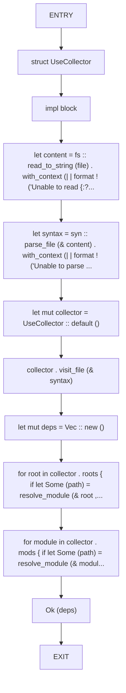
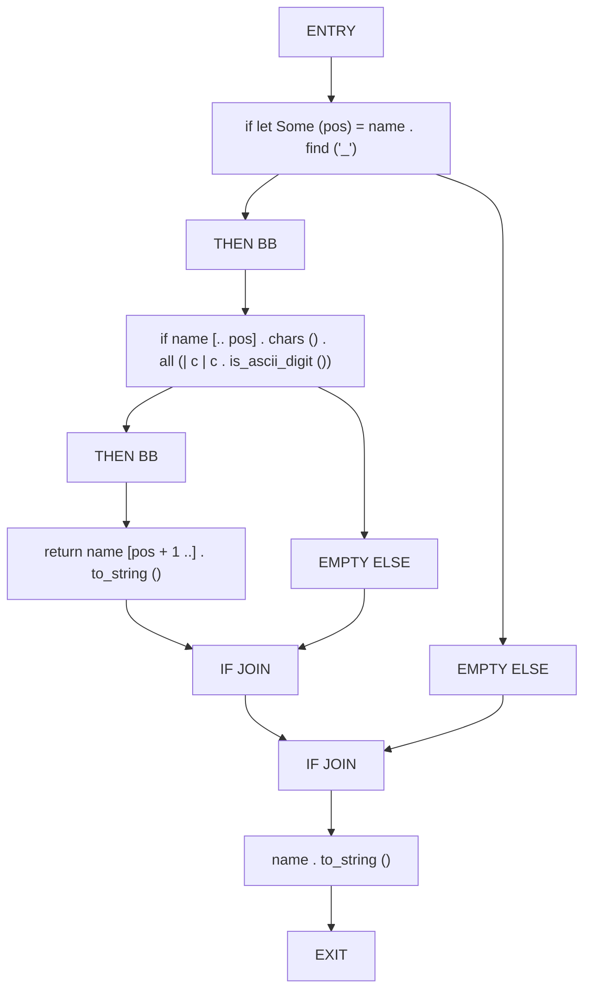
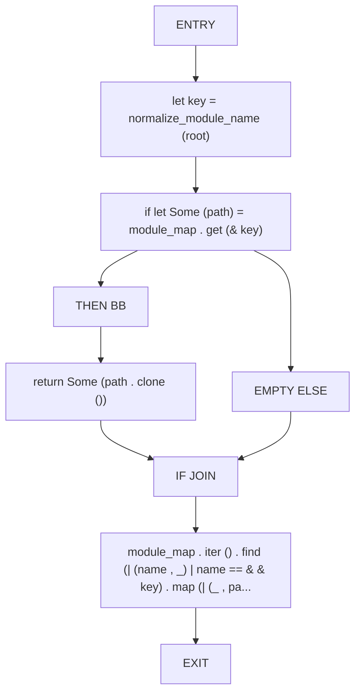
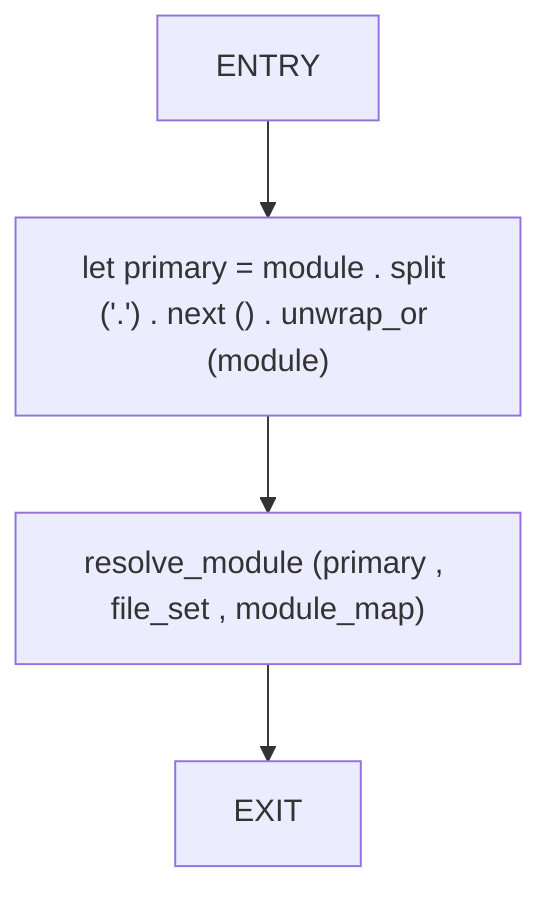

# CFG Group: src/050_cluster_010.rs

## Function: `build_dependency_map`

- File: src/050_cluster_010.rs
- Branches: 0
- Loops: 0
- Nodes: 5
- Edges: 4

## Function: `build_module_root_map`

- File: src/050_cluster_010.rs
- Branches: 1
- Loops: 0
- Nodes: 10
- Edges: 10

## Function: `contains_tools`

- File: src/050_cluster_010.rs
- Branches: 0
- Loops: 0
- Nodes: 3
- Edges: 2

## Function: `extract_dependencies`

- File: src/050_cluster_010.rs
- Branches: 0
- Loops: 0
- Nodes: 4
- Edges: 3

## Function: `extract_julia_dependencies`

- File: src/050_cluster_010.rs
- Branches: 0
- Loops: 0
- Nodes: 16
- Edges: 15

```mermaid
flowchart TD
    extract_julia_dependencies_0["ENTRY"]
    extract_julia_dependencies_1["item"]
    extract_julia_dependencies_2["item"]
    extract_julia_dependencies_3["item"]
    extract_julia_dependencies_4["item"]
    extract_julia_dependencies_5["item"]
    extract_julia_dependencies_6["item"]
    extract_julia_dependencies_7["let content = fs :: read_to_string (file) . with_context (| | format ! ('Unable to read {:?..."]
    extract_julia_dependencies_8["let mut deps = Vec :: new ()"]
    extract_julia_dependencies_9["for cap in INCLUDE_RE . captures_iter (& content) { if let Some (path_match) ..."]
    extract_julia_dependencies_10["for cap in MMSB_USING_RE . captures_iter (& content) { if let Some (module_ma..."]
    extract_julia_dependencies_11["for cap in MMSB_SYMBOL_RE . captures_iter (& content) { if let Some (symbols)..."]
    extract_julia_dependencies_12["for cap in LOCAL_USING_RE . captures_iter (& content) { if let Some (module_m..."]
    extract_julia_dependencies_13["for cap in PLAIN_USING_RE . captures_iter (& content) { if let Some (module_m..."]
    extract_julia_dependencies_14["Ok (deps)"]
    extract_julia_dependencies_15["EXIT"]
    extract_julia_dependencies_0 --> extract_julia_dependencies_1
    extract_julia_dependencies_1 --> extract_julia_dependencies_2
    extract_julia_dependencies_2 --> extract_julia_dependencies_3
    extract_julia_dependencies_3 --> extract_julia_dependencies_4
    extract_julia_dependencies_4 --> extract_julia_dependencies_5
    extract_julia_dependencies_5 --> extract_julia_dependencies_6
    extract_julia_dependencies_6 --> extract_julia_dependencies_7
    extract_julia_dependencies_7 --> extract_julia_dependencies_8
    extract_julia_dependencies_8 --> extract_julia_dependencies_9
    extract_julia_dependencies_9 --> extract_julia_dependencies_10
    extract_julia_dependencies_10 --> extract_julia_dependencies_11
    extract_julia_dependencies_11 --> extract_julia_dependencies_12
    extract_julia_dependencies_12 --> extract_julia_dependencies_13
    extract_julia_dependencies_13 --> extract_julia_dependencies_14
    extract_julia_dependencies_14 --> extract_julia_dependencies_15
```

## Function: `extract_rust_dependencies`

- File: src/050_cluster_010.rs
- Branches: 0
- Loops: 0
- Nodes: 12
- Edges: 11

## Function: `normalize_module_name`

- File: src/050_cluster_010.rs
- Branches: 2
- Loops: 0
- Nodes: 12
- Edges: 13

## Function: `resolve_module`

- File: src/050_cluster_010.rs
- Branches: 1
- Loops: 0
- Nodes: 9
- Edges: 9

## Function: `resolve_module_name`

- File: src/050_cluster_010.rs
- Branches: 0
- Loops: 0
- Nodes: 4
- Edges: 3

