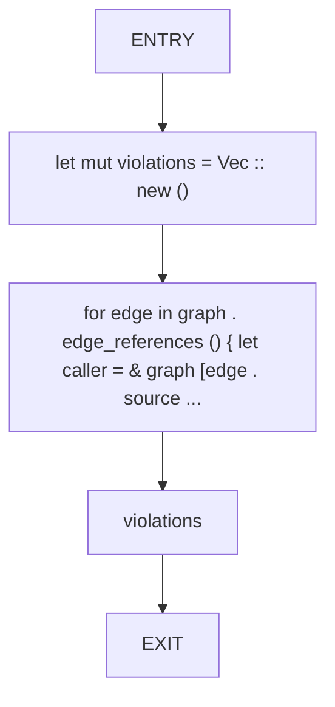
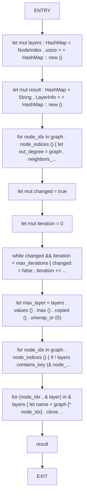
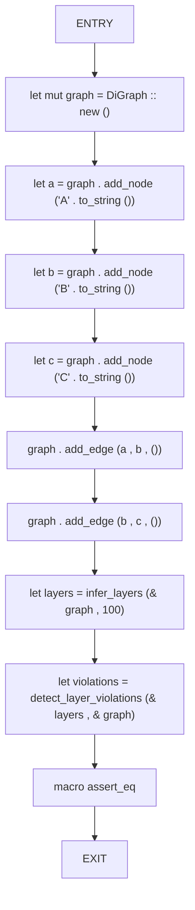
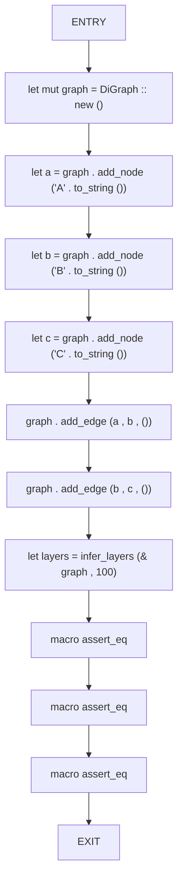

# CFG Group: src/060_layer_inference.rs

## Function: `detect_layer_violations`

- File: src/060_layer_inference.rs
- Branches: 0
- Loops: 0
- Nodes: 5
- Edges: 4

## Function: `infer_layers`

- File: src/060_layer_inference.rs
- Branches: 0
- Loops: 0
- Nodes: 12
- Edges: 11

## Function: `test_detect_layer_violations_none`

- File: src/060_layer_inference.rs
- Branches: 0
- Loops: 0
- Nodes: 11
- Edges: 10

## Function: `test_layer_inference_diamond`

- File: src/060_layer_inference.rs
- Branches: 0
- Loops: 0
- Nodes: 16
- Edges: 15

```mermaid
flowchart TD
    test_layer_inference_diamond_0["ENTRY"]
    test_layer_inference_diamond_1["let mut graph = DiGraph :: new ()"]
    test_layer_inference_diamond_2["let a = graph . add_node ('A' . to_string ())"]
    test_layer_inference_diamond_3["let b = graph . add_node ('B' . to_string ())"]
    test_layer_inference_diamond_4["let c = graph . add_node ('C' . to_string ())"]
    test_layer_inference_diamond_5["let d = graph . add_node ('D' . to_string ())"]
    test_layer_inference_diamond_6["graph . add_edge (a , b , ())"]
    test_layer_inference_diamond_7["graph . add_edge (a , c , ())"]
    test_layer_inference_diamond_8["graph . add_edge (b , d , ())"]
    test_layer_inference_diamond_9["graph . add_edge (c , d , ())"]
    test_layer_inference_diamond_10["let layers = infer_layers (& graph , 100)"]
    test_layer_inference_diamond_11["macro assert_eq"]
    test_layer_inference_diamond_12["macro assert_eq"]
    test_layer_inference_diamond_13["macro assert_eq"]
    test_layer_inference_diamond_14["macro assert_eq"]
    test_layer_inference_diamond_15["EXIT"]
    test_layer_inference_diamond_0 --> test_layer_inference_diamond_1
    test_layer_inference_diamond_1 --> test_layer_inference_diamond_2
    test_layer_inference_diamond_2 --> test_layer_inference_diamond_3
    test_layer_inference_diamond_3 --> test_layer_inference_diamond_4
    test_layer_inference_diamond_4 --> test_layer_inference_diamond_5
    test_layer_inference_diamond_5 --> test_layer_inference_diamond_6
    test_layer_inference_diamond_6 --> test_layer_inference_diamond_7
    test_layer_inference_diamond_7 --> test_layer_inference_diamond_8
    test_layer_inference_diamond_8 --> test_layer_inference_diamond_9
    test_layer_inference_diamond_9 --> test_layer_inference_diamond_10
    test_layer_inference_diamond_10 --> test_layer_inference_diamond_11
    test_layer_inference_diamond_11 --> test_layer_inference_diamond_12
    test_layer_inference_diamond_12 --> test_layer_inference_diamond_13
    test_layer_inference_diamond_13 --> test_layer_inference_diamond_14
    test_layer_inference_diamond_14 --> test_layer_inference_diamond_15
```

## Function: `test_layer_inference_simple_dag`

- File: src/060_layer_inference.rs
- Branches: 0
- Loops: 0
- Nodes: 12
- Edges: 11

