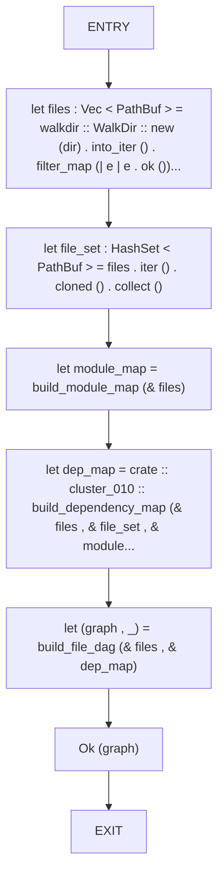
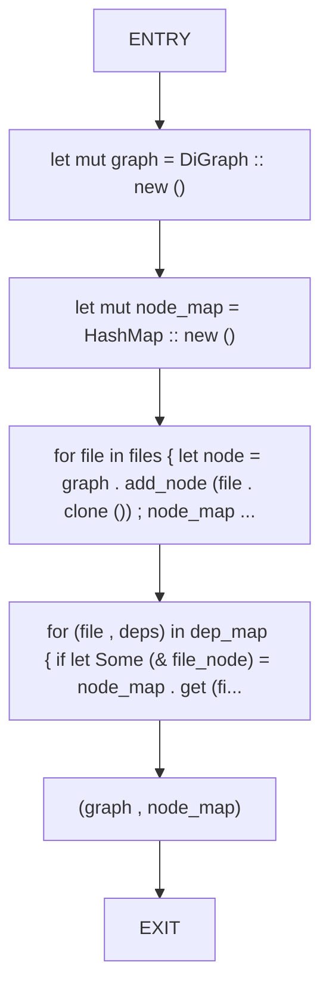
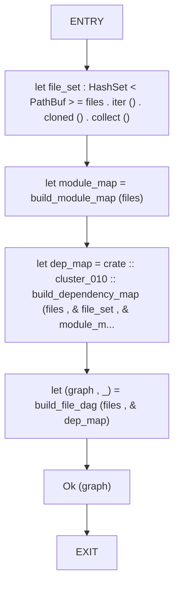
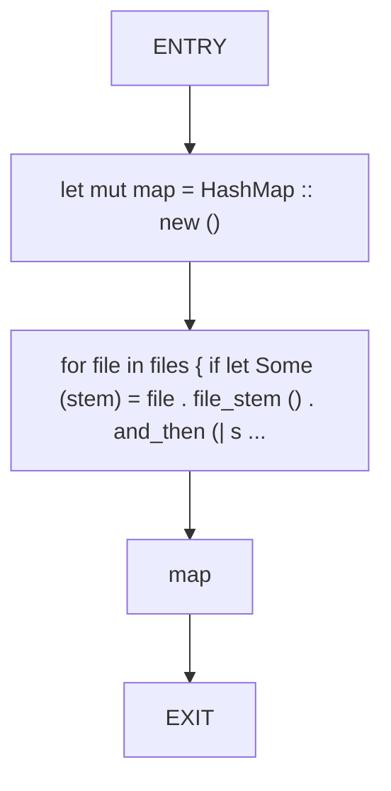
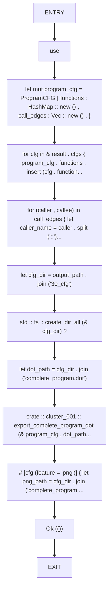
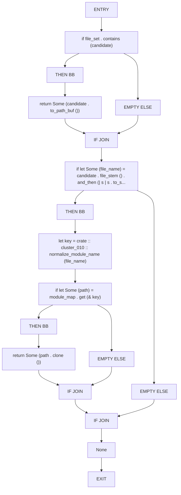

# CFG Group: src/070_cluster_011.rs

## Function: `build_directory_dag`

- File: src/070_cluster_011.rs
- Branches: 0
- Loops: 0
- Nodes: 8
- Edges: 7

## Function: `build_file_dag`

- File: src/070_cluster_011.rs
- Branches: 0
- Loops: 0
- Nodes: 7
- Edges: 6

## Function: `build_file_dependency_graph`

- File: src/070_cluster_011.rs
- Branches: 0
- Loops: 0
- Nodes: 7
- Edges: 6

## Function: `build_module_map`

- File: src/070_cluster_011.rs
- Branches: 0
- Loops: 0
- Nodes: 5
- Edges: 4

## Function: `export_program_cfg_to_path`

- File: src/070_cluster_011.rs
- Branches: 0
- Loops: 0
- Nodes: 12
- Edges: 11

## Function: `resolve_path`

- File: src/070_cluster_011.rs
- Branches: 3
- Loops: 0
- Nodes: 18
- Edges: 20

