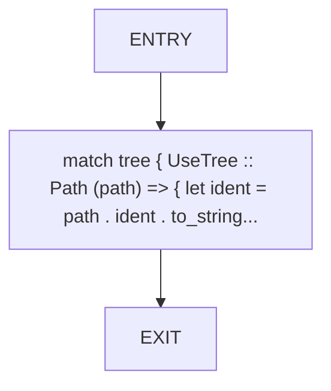

# CFG Group: src/040_dependency.rs

## Function: `collect_roots`

- File: src/040_dependency.rs
- Branches: 0
- Loops: 0
- Nodes: 3
- Edges: 2

```mermaid
flowchart TD
    collect_roots_0["ENTRY"]
    collect_roots_1["match tree { UseTree :: Path (path) => { let ident = path . ident . to_string..."]
    collect_roots_2["EXIT"]
    collect_roots_0 --> collect_roots_1
    collect_roots_1 --> collect_roots_2
```

