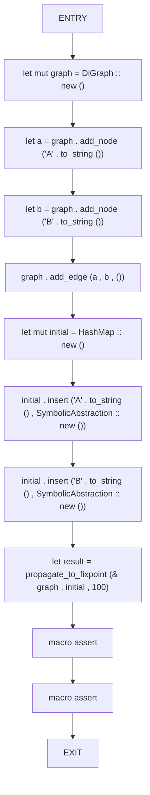

# CFG Group: src/080_fixpoint_solver.rs

## Function: `propagate_to_fixpoint`

- File: src/080_fixpoint_solver.rs
- Branches: 0
- Loops: 0
- Nodes: 13
- Edges: 12

```mermaid
flowchart TD
    propagate_to_fixpoint_0["ENTRY"]
    propagate_to_fixpoint_1["let mut name_to_idx : HashMap < String , NodeIndex > = HashMap :: new ()"]
    propagate_to_fixpoint_2["for idx in graph . node_indices () { name_to_idx . insert (graph [idx] . clon..."]
    propagate_to_fixpoint_3["let mut current : HashMap < NodeIndex , SymbolicAbstraction > = HashMap :: new ()"]
    propagate_to_fixpoint_4["for (name , abstraction) in & initial { if let Some (& idx) = name_to_idx . g..."]
    propagate_to_fixpoint_5["let mut iteration = 0"]
    propagate_to_fixpoint_6["let mut converged = false"]
    propagate_to_fixpoint_7["while iteration < max_iterations { iteration += 1 ; let mut next = current . ..."]
    propagate_to_fixpoint_8["let mut abstractions = HashMap :: new ()"]
    propagate_to_fixpoint_9["let mut stable_nodes = Vec :: new ()"]
    propagate_to_fixpoint_10["for (idx , abstraction) in & current { let name = graph [* idx] . clone () ; ..."]
    propagate_to_fixpoint_11["FixpointResult { abstractions , iterations : iteration , converged , stable_n..."]
    propagate_to_fixpoint_12["EXIT"]
    propagate_to_fixpoint_0 --> propagate_to_fixpoint_1
    propagate_to_fixpoint_1 --> propagate_to_fixpoint_2
    propagate_to_fixpoint_2 --> propagate_to_fixpoint_3
    propagate_to_fixpoint_3 --> propagate_to_fixpoint_4
    propagate_to_fixpoint_4 --> propagate_to_fixpoint_5
    propagate_to_fixpoint_5 --> propagate_to_fixpoint_6
    propagate_to_fixpoint_6 --> propagate_to_fixpoint_7
    propagate_to_fixpoint_7 --> propagate_to_fixpoint_8
    propagate_to_fixpoint_8 --> propagate_to_fixpoint_9
    propagate_to_fixpoint_9 --> propagate_to_fixpoint_10
    propagate_to_fixpoint_10 --> propagate_to_fixpoint_11
    propagate_to_fixpoint_11 --> propagate_to_fixpoint_12
```

## Function: `test_fixpoint_convergence`

- File: src/080_fixpoint_solver.rs
- Branches: 0
- Loops: 0
- Nodes: 12
- Edges: 11

## Function: `test_fixpoint_simple`

- File: src/080_fixpoint_solver.rs
- Branches: 0
- Loops: 0
- Nodes: 18
- Edges: 17

```mermaid
flowchart TD
    test_fixpoint_simple_0["ENTRY"]
    test_fixpoint_simple_1["let mut graph = DiGraph :: new ()"]
    test_fixpoint_simple_2["let a = graph . add_node ('A' . to_string ())"]
    test_fixpoint_simple_3["let b = graph . add_node ('B' . to_string ())"]
    test_fixpoint_simple_4["let c = graph . add_node ('C' . to_string ())"]
    test_fixpoint_simple_5["graph . add_edge (a , b , ())"]
    test_fixpoint_simple_6["graph . add_edge (b , c , ())"]
    test_fixpoint_simple_7["let mut initial = HashMap :: new ()"]
    test_fixpoint_simple_8["let mut c_abs = SymbolicAbstraction :: new ()"]
    test_fixpoint_simple_9["c_abs . effects . insert ('Pure' . to_string ())"]
    test_fixpoint_simple_10["initial . insert ('C' . to_string () , c_abs)"]
    test_fixpoint_simple_11["initial . insert ('A' . to_string () , SymbolicAbstraction :: new ())"]
    test_fixpoint_simple_12["initial . insert ('B' . to_string () , SymbolicAbstraction :: new ())"]
    test_fixpoint_simple_13["let result = propagate_to_fixpoint (& graph , initial , 100)"]
    test_fixpoint_simple_14["macro assert"]
    test_fixpoint_simple_15["macro assert"]
    test_fixpoint_simple_16["macro assert"]
    test_fixpoint_simple_17["EXIT"]
    test_fixpoint_simple_0 --> test_fixpoint_simple_1
    test_fixpoint_simple_1 --> test_fixpoint_simple_2
    test_fixpoint_simple_2 --> test_fixpoint_simple_3
    test_fixpoint_simple_3 --> test_fixpoint_simple_4
    test_fixpoint_simple_4 --> test_fixpoint_simple_5
    test_fixpoint_simple_5 --> test_fixpoint_simple_6
    test_fixpoint_simple_6 --> test_fixpoint_simple_7
    test_fixpoint_simple_7 --> test_fixpoint_simple_8
    test_fixpoint_simple_8 --> test_fixpoint_simple_9
    test_fixpoint_simple_9 --> test_fixpoint_simple_10
    test_fixpoint_simple_10 --> test_fixpoint_simple_11
    test_fixpoint_simple_11 --> test_fixpoint_simple_12
    test_fixpoint_simple_12 --> test_fixpoint_simple_13
    test_fixpoint_simple_13 --> test_fixpoint_simple_14
    test_fixpoint_simple_14 --> test_fixpoint_simple_15
    test_fixpoint_simple_15 --> test_fixpoint_simple_16
    test_fixpoint_simple_16 --> test_fixpoint_simple_17
```

## Function: `test_symbolic_abstraction_merge`

- File: src/080_fixpoint_solver.rs
- Branches: 0
- Loops: 0
- Nodes: 14
- Edges: 13

```mermaid
flowchart TD
    test_symbolic_abstraction_merge_0["ENTRY"]
    test_symbolic_abstraction_merge_1["let mut abs1 = SymbolicAbstraction :: new ()"]
    test_symbolic_abstraction_merge_2["abs1 . type_sig = Some ('String' . to_string ())"]
    test_symbolic_abstraction_merge_3["abs1 . effects . insert ('IO' . to_string ())"]
    test_symbolic_abstraction_merge_4["abs1 . layer = Some (1)"]
    test_symbolic_abstraction_merge_5["let mut abs2 = SymbolicAbstraction :: new ()"]
    test_symbolic_abstraction_merge_6["abs2 . effects . insert ('Mutation' . to_string ())"]
    test_symbolic_abstraction_merge_7["abs2 . layer = Some (2)"]
    test_symbolic_abstraction_merge_8["abs1 . merge (& abs2)"]
    test_symbolic_abstraction_merge_9["macro assert_eq"]
    test_symbolic_abstraction_merge_10["macro assert"]
    test_symbolic_abstraction_merge_11["macro assert"]
    test_symbolic_abstraction_merge_12["macro assert_eq"]
    test_symbolic_abstraction_merge_13["EXIT"]
    test_symbolic_abstraction_merge_0 --> test_symbolic_abstraction_merge_1
    test_symbolic_abstraction_merge_1 --> test_symbolic_abstraction_merge_2
    test_symbolic_abstraction_merge_2 --> test_symbolic_abstraction_merge_3
    test_symbolic_abstraction_merge_3 --> test_symbolic_abstraction_merge_4
    test_symbolic_abstraction_merge_4 --> test_symbolic_abstraction_merge_5
    test_symbolic_abstraction_merge_5 --> test_symbolic_abstraction_merge_6
    test_symbolic_abstraction_merge_6 --> test_symbolic_abstraction_merge_7
    test_symbolic_abstraction_merge_7 --> test_symbolic_abstraction_merge_8
    test_symbolic_abstraction_merge_8 --> test_symbolic_abstraction_merge_9
    test_symbolic_abstraction_merge_9 --> test_symbolic_abstraction_merge_10
    test_symbolic_abstraction_merge_10 --> test_symbolic_abstraction_merge_11
    test_symbolic_abstraction_merge_11 --> test_symbolic_abstraction_merge_12
    test_symbolic_abstraction_merge_12 --> test_symbolic_abstraction_merge_13
```

