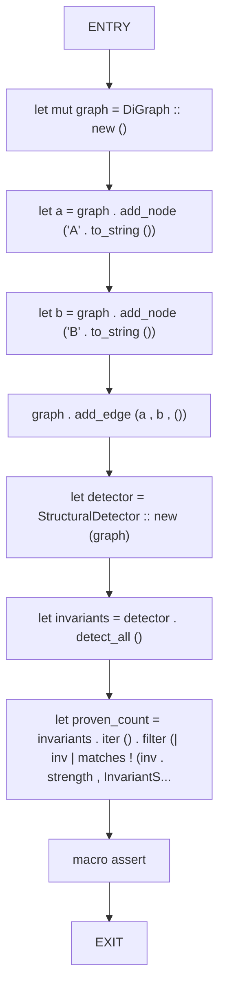
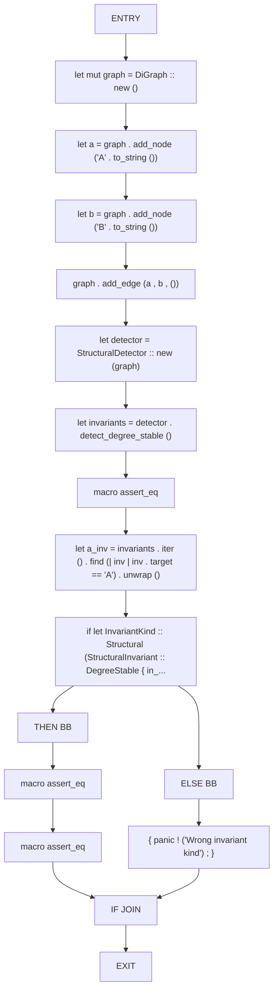

# CFG Group: src/040_structural_detector.rs

## Function: `test_all_structural_invariants_proven`

- File: src/040_structural_detector.rs
- Branches: 0
- Loops: 0
- Nodes: 10
- Edges: 9

## Function: `test_detect_degree_stable`

- File: src/040_structural_detector.rs
- Branches: 1
- Loops: 0
- Nodes: 17
- Edges: 17

## Function: `test_detect_leaf_root`

- File: src/040_structural_detector.rs
- Branches: 0
- Loops: 0
- Nodes: 16
- Edges: 15

```mermaid
flowchart TD
    test_detect_leaf_root_0["ENTRY"]
    test_detect_leaf_root_1["let mut graph = DiGraph :: new ()"]
    test_detect_leaf_root_2["let a = graph . add_node ('A' . to_string ())"]
    test_detect_leaf_root_3["let b = graph . add_node ('B' . to_string ())"]
    test_detect_leaf_root_4["let c = graph . add_node ('C' . to_string ())"]
    test_detect_leaf_root_5["graph . add_edge (a , b , ())"]
    test_detect_leaf_root_6["graph . add_edge (b , c , ())"]
    test_detect_leaf_root_7["let detector = StructuralDetector :: new (graph)"]
    test_detect_leaf_root_8["let invariants = detector . detect_leaf_root ()"]
    test_detect_leaf_root_9["let roots : Vec < _ > = invariants . iter () . filter (| inv | matches ! (inv . kind , InvariantKind ..."]
    test_detect_leaf_root_10["let leaves : Vec < _ > = invariants . iter () . filter (| inv | matches ! (inv . kind , InvariantKind ..."]
    test_detect_leaf_root_11["macro assert_eq"]
    test_detect_leaf_root_12["macro assert_eq"]
    test_detect_leaf_root_13["macro assert_eq"]
    test_detect_leaf_root_14["macro assert_eq"]
    test_detect_leaf_root_15["EXIT"]
    test_detect_leaf_root_0 --> test_detect_leaf_root_1
    test_detect_leaf_root_1 --> test_detect_leaf_root_2
    test_detect_leaf_root_2 --> test_detect_leaf_root_3
    test_detect_leaf_root_3 --> test_detect_leaf_root_4
    test_detect_leaf_root_4 --> test_detect_leaf_root_5
    test_detect_leaf_root_5 --> test_detect_leaf_root_6
    test_detect_leaf_root_6 --> test_detect_leaf_root_7
    test_detect_leaf_root_7 --> test_detect_leaf_root_8
    test_detect_leaf_root_8 --> test_detect_leaf_root_9
    test_detect_leaf_root_9 --> test_detect_leaf_root_10
    test_detect_leaf_root_10 --> test_detect_leaf_root_11
    test_detect_leaf_root_11 --> test_detect_leaf_root_12
    test_detect_leaf_root_12 --> test_detect_leaf_root_13
    test_detect_leaf_root_13 --> test_detect_leaf_root_14
    test_detect_leaf_root_14 --> test_detect_leaf_root_15
```

