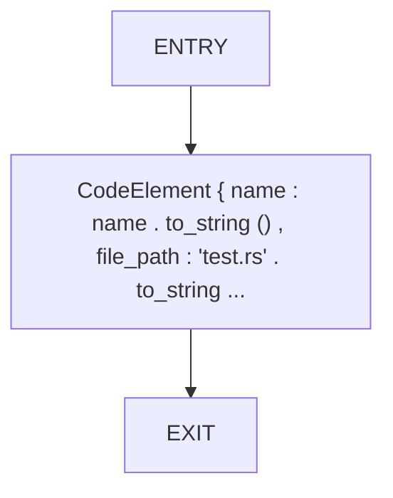
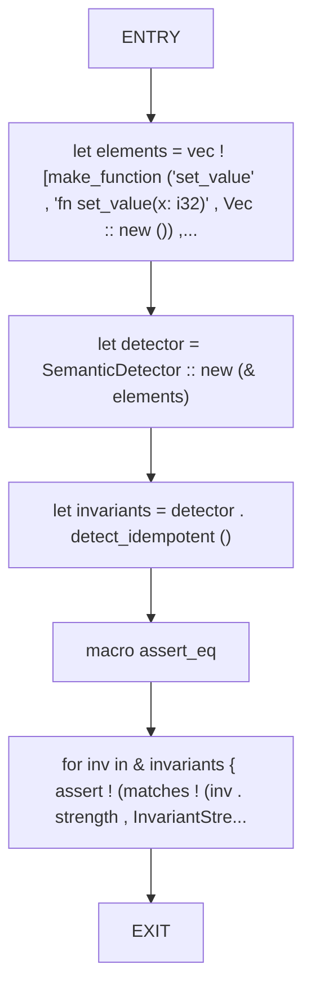
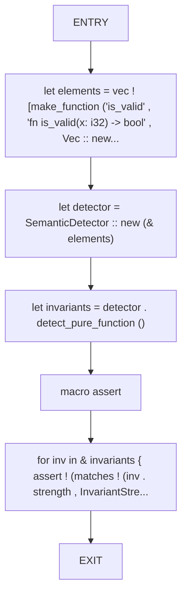
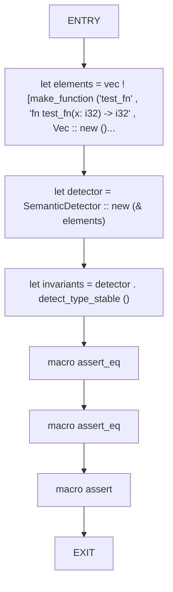
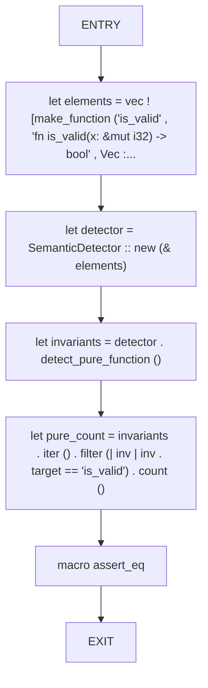

# CFG Group: src/050_semantic_detector.rs

## Function: `make_function`

- File: src/050_semantic_detector.rs
- Branches: 0
- Loops: 0
- Nodes: 3
- Edges: 2

## Function: `test_detect_idempotent_heuristic`

- File: src/050_semantic_detector.rs
- Branches: 0
- Loops: 0
- Nodes: 7
- Edges: 6

## Function: `test_detect_pure_function_heuristic`

- File: src/050_semantic_detector.rs
- Branches: 0
- Loops: 0
- Nodes: 7
- Edges: 6

## Function: `test_detect_type_stable`

- File: src/050_semantic_detector.rs
- Branches: 0
- Loops: 0
- Nodes: 8
- Edges: 7

## Function: `test_no_pure_for_mutable`

- File: src/050_semantic_detector.rs
- Branches: 0
- Loops: 0
- Nodes: 7
- Edges: 6

