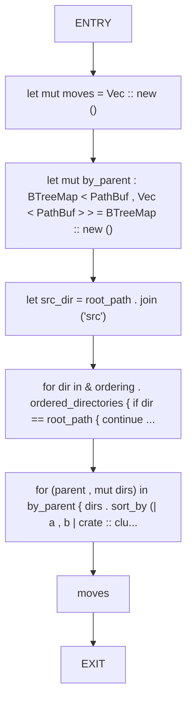
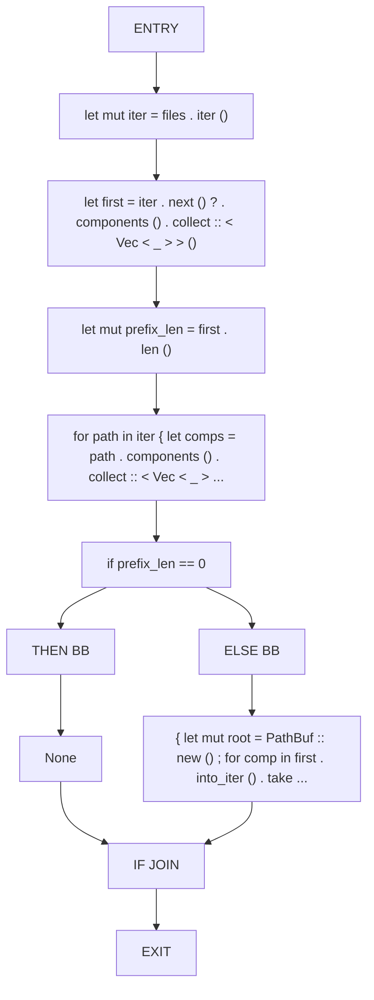
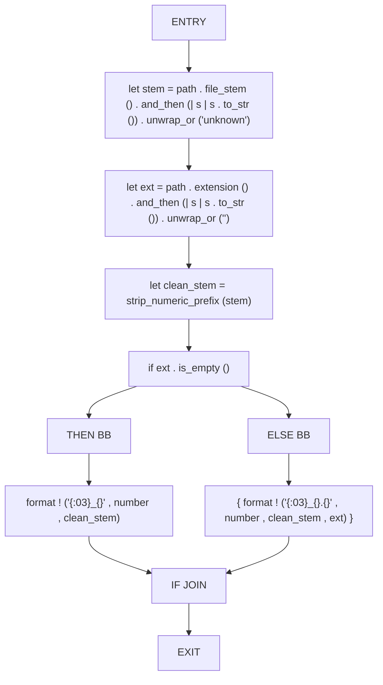
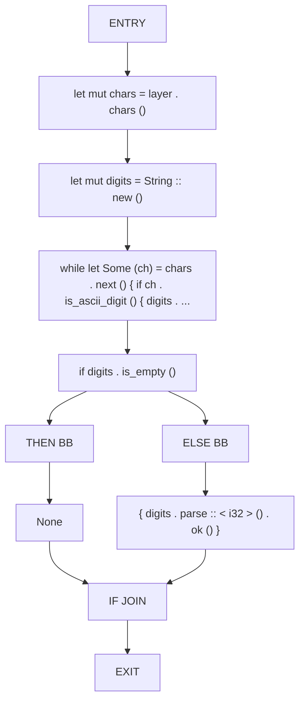
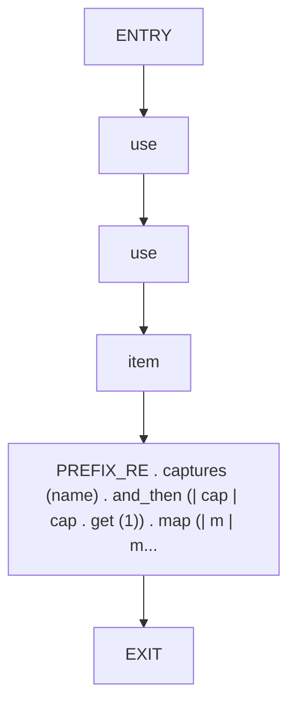

# CFG Group: src/110_cluster_006.rs

## Function: `collect_directory_moves`

- File: src/110_cluster_006.rs
- Branches: 0
- Loops: 0
- Nodes: 8
- Edges: 7

## Function: `common_root`

- File: src/110_cluster_006.rs
- Branches: 1
- Loops: 0
- Nodes: 12
- Edges: 12

## Function: `compute_cohesion_score`

- File: src/110_cluster_006.rs
- Branches: 0
- Loops: 0
- Nodes: 15
- Edges: 14

```mermaid
flowchart TD
    compute_cohesion_score_0["ENTRY"]
    compute_cohesion_score_1["let mut total_calls = 0usize"]
    compute_cohesion_score_2["let mut intra_calls = 0usize"]
    compute_cohesion_score_3["let mut external_calls = 0usize"]
    compute_cohesion_score_4["let mut layer_ok = 0usize"]
    compute_cohesion_score_5["for (callee_idx , count) in outgoing { total_calls += count ; let callee = & ..."]
    compute_cohesion_score_6["let total_calls_f = total_calls as f64"]
    compute_cohesion_score_7["let call_locality = if total_calls == 0 { 1.0 } else { intra_calls as f64 / total_calls_f }"]
    compute_cohesion_score_8["let layer_adherence = if total_calls == 0 { 1.0 } else { layer_ok as f64 / total_calls_f }"]
    compute_cohesion_score_9["let cross_file_calls = if total_calls == 0 { 0.0 } else { external_calls as f64 / total_calls_f }"]
    compute_cohesion_score_10["let total_type_refs = call_analysis . same_file_type_refs + call_analysis . other_file_type_refs"]
    compute_cohesion_score_11["let type_coupling = if total_type_refs == 0 { 1.0 } else { call_analysis . same_file_type_refs as..."]
    compute_cohesion_score_12["let score = 0.4 * call_locality + 0.3 * type_coupling + 0.2 * layer_adherence - 0.1 * cro..."]
    compute_cohesion_score_13["score . clamp (0.0 , 1.0)"]
    compute_cohesion_score_14["EXIT"]
    compute_cohesion_score_0 --> compute_cohesion_score_1
    compute_cohesion_score_1 --> compute_cohesion_score_2
    compute_cohesion_score_2 --> compute_cohesion_score_3
    compute_cohesion_score_3 --> compute_cohesion_score_4
    compute_cohesion_score_4 --> compute_cohesion_score_5
    compute_cohesion_score_5 --> compute_cohesion_score_6
    compute_cohesion_score_6 --> compute_cohesion_score_7
    compute_cohesion_score_7 --> compute_cohesion_score_8
    compute_cohesion_score_8 --> compute_cohesion_score_9
    compute_cohesion_score_9 --> compute_cohesion_score_10
    compute_cohesion_score_10 --> compute_cohesion_score_11
    compute_cohesion_score_11 --> compute_cohesion_score_12
    compute_cohesion_score_12 --> compute_cohesion_score_13
    compute_cohesion_score_13 --> compute_cohesion_score_14
```

## Function: `generate_canonical_name`

- File: src/110_cluster_006.rs
- Branches: 1
- Loops: 0
- Nodes: 11
- Edges: 11

## Function: `layer_prefix_value`

- File: src/110_cluster_006.rs
- Branches: 1
- Loops: 0
- Nodes: 11
- Edges: 11

## Function: `order_directories`

- File: src/110_cluster_006.rs
- Branches: 1
- Loops: 0
- Nodes: 21
- Edges: 21

```mermaid
flowchart TD
    order_directories_0["ENTRY"]
    order_directories_1["let root = common_root (files)"]
    order_directories_2["let mut dirs : HashSet < PathBuf > = HashSet :: new ()"]
    order_directories_3["for file in files { let mut current = file . parent () . map (Path :: to_path..."]
    order_directories_4["let mut ordered : Vec < PathBuf > = dirs . into_iter () . collect ()"]
    order_directories_5["ordered . sort_by (| a , b | crate :: cluster_008 :: compare_path_components ..."]
    order_directories_6["let mut node_map = HashMap :: new ()"]
    order_directories_7["for (idx , dir) in ordered . iter () . enumerate () { node_map . insert (dir ..."]
    order_directories_8["let mut adjacency : Vec < BTreeSet < usize > > = vec ! [BTreeSet :: new () ; ordered . len ()]"]
    order_directories_9["let mut indegree = vec ! [0usize ; ordered . len ()]"]
    order_directories_10["for (file , deps) in dep_map { let Some (from_dir) = file . parent () . map (..."]
    order_directories_11["let mut queue : BTreeSet < usize > = indegree . iter () . enumerate () . filter_map (| (idx , & deg) | if deg == 0..."]
    order_directories_12["let mut result = Vec :: with_capacity (ordered . len ())"]
    order_directories_13["while let Some (& idx) = queue . iter () . next () { queue . remove (& idx) ;..."]
    order_directories_14["if result . len () < ordered . len ()"]
    order_directories_15["THEN BB"]
    order_directories_16["for (idx , dir) in ordered . iter () . enumerate () { if indegree [idx] > 0 {..."]
    order_directories_17["EMPTY ELSE"]
    order_directories_18["IF JOIN"]
    order_directories_19["result"]
    order_directories_20["EXIT"]
    order_directories_0 --> order_directories_1
    order_directories_1 --> order_directories_2
    order_directories_2 --> order_directories_3
    order_directories_3 --> order_directories_4
    order_directories_4 --> order_directories_5
    order_directories_5 --> order_directories_6
    order_directories_6 --> order_directories_7
    order_directories_7 --> order_directories_8
    order_directories_8 --> order_directories_9
    order_directories_9 --> order_directories_10
    order_directories_10 --> order_directories_11
    order_directories_11 --> order_directories_12
    order_directories_12 --> order_directories_13
    order_directories_13 --> order_directories_14
    order_directories_14 --> order_directories_15
    order_directories_15 --> order_directories_16
    order_directories_14 --> order_directories_17
    order_directories_16 --> order_directories_18
    order_directories_17 --> order_directories_18
    order_directories_18 --> order_directories_19
    order_directories_19 --> order_directories_20
```

## Function: `strip_numeric_prefix`

- File: src/110_cluster_006.rs
- Branches: 0
- Loops: 0
- Nodes: 6
- Edges: 5

