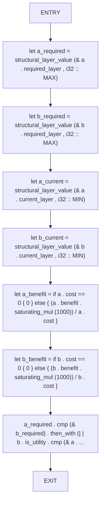

# CFG Group: src/060_layer_core.rs

## Function: `sort_structural_items`

- File: src/060_layer_core.rs
- Branches: 2
- Loops: 0
- Nodes: 28
- Edges: 29

```mermaid
flowchart TD
    sort_structural_items_0["ENTRY"]
    sort_structural_items_1["use"]
    sort_structural_items_2["use"]
    sort_structural_items_3["if items . len () <= 1"]
    sort_structural_items_4["THEN BB"]
    sort_structural_items_5["return"]
    sort_structural_items_6["EMPTY ELSE"]
    sort_structural_items_7["IF JOIN"]
    sort_structural_items_8["let count = items . len ()"]
    sort_structural_items_9["let mut edges : Vec < Vec < usize > > = vec ! [Vec :: new () ; count]"]
    sort_structural_items_10["let mut indegree = vec ! [0usize ; count]"]
    sort_structural_items_11["let mut file_to_items : HashMap < PathBuf , Vec < usize > > = HashMap :: new ()"]
    sort_structural_items_12["for (idx , item) in items . iter () . enumerate () { if let Some (path) = & i..."]
    sort_structural_items_13["for i in 0 .. count { for j in (i + 1) .. count { let req_i = structural_laye..."]
    sort_structural_items_14["for (idx , item) in items . iter () . enumerate () { for file in & item . out..."]
    sort_structural_items_15["let mut ordered_indices = Vec :: with_capacity (count)"]
    sort_structural_items_16["let mut available : Vec < usize > = (0 .. count) . filter (| & i | indegree [i] == 0) . collect ()"]
    sort_structural_items_17["while ! available . is_empty () { available . sort_by (| & a , & b | structur..."]
    sort_structural_items_18["if ordered_indices . len () != count"]
    sort_structural_items_19["THEN BB"]
    sort_structural_items_20["items . sort_by (structural_cmp)"]
    sort_structural_items_21["return"]
    sort_structural_items_22["EMPTY ELSE"]
    sort_structural_items_23["IF JOIN"]
    sort_structural_items_24["let mut reordered = Vec :: with_capacity (count)"]
    sort_structural_items_25["for idx in ordered_indices { reordered . push (items [idx] . clone ()) ; }"]
    sort_structural_items_26["* items = reordered"]
    sort_structural_items_27["EXIT"]
    sort_structural_items_0 --> sort_structural_items_1
    sort_structural_items_1 --> sort_structural_items_2
    sort_structural_items_2 --> sort_structural_items_3
    sort_structural_items_3 --> sort_structural_items_4
    sort_structural_items_4 --> sort_structural_items_5
    sort_structural_items_3 --> sort_structural_items_6
    sort_structural_items_5 --> sort_structural_items_7
    sort_structural_items_6 --> sort_structural_items_7
    sort_structural_items_7 --> sort_structural_items_8
    sort_structural_items_8 --> sort_structural_items_9
    sort_structural_items_9 --> sort_structural_items_10
    sort_structural_items_10 --> sort_structural_items_11
    sort_structural_items_11 --> sort_structural_items_12
    sort_structural_items_12 --> sort_structural_items_13
    sort_structural_items_13 --> sort_structural_items_14
    sort_structural_items_14 --> sort_structural_items_15
    sort_structural_items_15 --> sort_structural_items_16
    sort_structural_items_16 --> sort_structural_items_17
    sort_structural_items_17 --> sort_structural_items_18
    sort_structural_items_18 --> sort_structural_items_19
    sort_structural_items_19 --> sort_structural_items_20
    sort_structural_items_20 --> sort_structural_items_21
    sort_structural_items_18 --> sort_structural_items_22
    sort_structural_items_21 --> sort_structural_items_23
    sort_structural_items_22 --> sort_structural_items_23
    sort_structural_items_23 --> sort_structural_items_24
    sort_structural_items_24 --> sort_structural_items_25
    sort_structural_items_25 --> sort_structural_items_26
    sort_structural_items_26 --> sort_structural_items_27
```

## Function: `structural_cmp`

- File: src/060_layer_core.rs
- Branches: 0
- Loops: 0
- Nodes: 9
- Edges: 8

