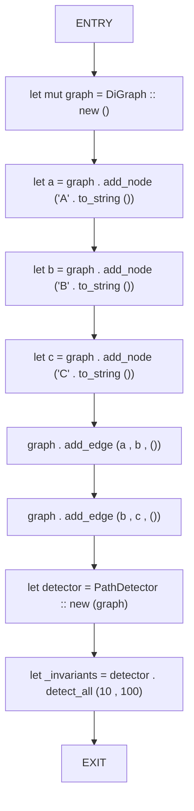
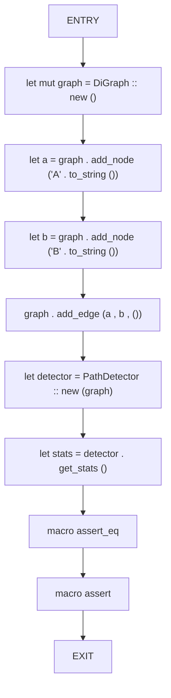

# CFG Group: src/140_path_detector.rs

## Function: `test_extract_facts_from_path`

- File: src/140_path_detector.rs
- Branches: 0
- Loops: 0
- Nodes: 16
- Edges: 15

```mermaid
flowchart TD
    test_extract_facts_from_path_0["ENTRY"]
    test_extract_facts_from_path_1["let mut graph = DiGraph :: new ()"]
    test_extract_facts_from_path_2["let a = graph . add_node ('A' . to_string ())"]
    test_extract_facts_from_path_3["let b = graph . add_node ('B' . to_string ())"]
    test_extract_facts_from_path_4["let c = graph . add_node ('C' . to_string ())"]
    test_extract_facts_from_path_5["graph . add_edge (a , b , ())"]
    test_extract_facts_from_path_6["graph . add_edge (b , c , ())"]
    test_extract_facts_from_path_7["let detector = PathDetector :: new (graph)"]
    test_extract_facts_from_path_8["let path = vec ! [a , b , c]"]
    test_extract_facts_from_path_9["let facts = detector . extract_facts_from_path (& path)"]
    test_extract_facts_from_path_10["macro assert"]
    test_extract_facts_from_path_11["macro assert"]
    test_extract_facts_from_path_12["macro assert"]
    test_extract_facts_from_path_13["macro assert"]
    test_extract_facts_from_path_14["macro assert"]
    test_extract_facts_from_path_15["EXIT"]
    test_extract_facts_from_path_0 --> test_extract_facts_from_path_1
    test_extract_facts_from_path_1 --> test_extract_facts_from_path_2
    test_extract_facts_from_path_2 --> test_extract_facts_from_path_3
    test_extract_facts_from_path_3 --> test_extract_facts_from_path_4
    test_extract_facts_from_path_4 --> test_extract_facts_from_path_5
    test_extract_facts_from_path_5 --> test_extract_facts_from_path_6
    test_extract_facts_from_path_6 --> test_extract_facts_from_path_7
    test_extract_facts_from_path_7 --> test_extract_facts_from_path_8
    test_extract_facts_from_path_8 --> test_extract_facts_from_path_9
    test_extract_facts_from_path_9 --> test_extract_facts_from_path_10
    test_extract_facts_from_path_10 --> test_extract_facts_from_path_11
    test_extract_facts_from_path_11 --> test_extract_facts_from_path_12
    test_extract_facts_from_path_12 --> test_extract_facts_from_path_13
    test_extract_facts_from_path_13 --> test_extract_facts_from_path_14
    test_extract_facts_from_path_14 --> test_extract_facts_from_path_15
```

## Function: `test_path_detector_diamond`

- File: src/140_path_detector.rs
- Branches: 2
- Loops: 0
- Nodes: 25
- Edges: 26

```mermaid
flowchart TD
    test_path_detector_diamond_0["ENTRY"]
    test_path_detector_diamond_1["let mut graph = DiGraph :: new ()"]
    test_path_detector_diamond_2["let a = graph . add_node ('A' . to_string ())"]
    test_path_detector_diamond_3["let b = graph . add_node ('B' . to_string ())"]
    test_path_detector_diamond_4["let c = graph . add_node ('C' . to_string ())"]
    test_path_detector_diamond_5["let d = graph . add_node ('D' . to_string ())"]
    test_path_detector_diamond_6["graph . add_edge (a , b , ())"]
    test_path_detector_diamond_7["graph . add_edge (a , c , ())"]
    test_path_detector_diamond_8["graph . add_edge (b , d , ())"]
    test_path_detector_diamond_9["graph . add_edge (c , d , ())"]
    test_path_detector_diamond_10["let detector = PathDetector :: new (graph)"]
    test_path_detector_diamond_11["let invariants = detector . detect_all (10 , 100)"]
    test_path_detector_diamond_12["let a_invs : Vec < _ > = invariants . iter () . filter (| inv | inv . target == 'A') . collect ()"]
    test_path_detector_diamond_13["if ! a_invs . is_empty ()"]
    test_path_detector_diamond_14["THEN BB"]
    test_path_detector_diamond_15["let inv = a_invs [0]"]
    test_path_detector_diamond_16["if let InvariantKind :: PathIntersection (ref pi) = inv . kind"]
    test_path_detector_diamond_17["THEN BB"]
    test_path_detector_diamond_18["macro assert_eq"]
    test_path_detector_diamond_19["macro assert"]
    test_path_detector_diamond_20["EMPTY ELSE"]
    test_path_detector_diamond_21["IF JOIN"]
    test_path_detector_diamond_22["EMPTY ELSE"]
    test_path_detector_diamond_23["IF JOIN"]
    test_path_detector_diamond_24["EXIT"]
    test_path_detector_diamond_0 --> test_path_detector_diamond_1
    test_path_detector_diamond_1 --> test_path_detector_diamond_2
    test_path_detector_diamond_2 --> test_path_detector_diamond_3
    test_path_detector_diamond_3 --> test_path_detector_diamond_4
    test_path_detector_diamond_4 --> test_path_detector_diamond_5
    test_path_detector_diamond_5 --> test_path_detector_diamond_6
    test_path_detector_diamond_6 --> test_path_detector_diamond_7
    test_path_detector_diamond_7 --> test_path_detector_diamond_8
    test_path_detector_diamond_8 --> test_path_detector_diamond_9
    test_path_detector_diamond_9 --> test_path_detector_diamond_10
    test_path_detector_diamond_10 --> test_path_detector_diamond_11
    test_path_detector_diamond_11 --> test_path_detector_diamond_12
    test_path_detector_diamond_12 --> test_path_detector_diamond_13
    test_path_detector_diamond_13 --> test_path_detector_diamond_14
    test_path_detector_diamond_14 --> test_path_detector_diamond_15
    test_path_detector_diamond_15 --> test_path_detector_diamond_16
    test_path_detector_diamond_16 --> test_path_detector_diamond_17
    test_path_detector_diamond_17 --> test_path_detector_diamond_18
    test_path_detector_diamond_18 --> test_path_detector_diamond_19
    test_path_detector_diamond_16 --> test_path_detector_diamond_20
    test_path_detector_diamond_19 --> test_path_detector_diamond_21
    test_path_detector_diamond_20 --> test_path_detector_diamond_21
    test_path_detector_diamond_13 --> test_path_detector_diamond_22
    test_path_detector_diamond_21 --> test_path_detector_diamond_23
    test_path_detector_diamond_22 --> test_path_detector_diamond_23
    test_path_detector_diamond_23 --> test_path_detector_diamond_24
```

## Function: `test_path_detector_simple`

- File: src/140_path_detector.rs
- Branches: 0
- Loops: 0
- Nodes: 10
- Edges: 9

## Function: `test_path_stats`

- File: src/140_path_detector.rs
- Branches: 0
- Loops: 0
- Nodes: 10
- Edges: 9

