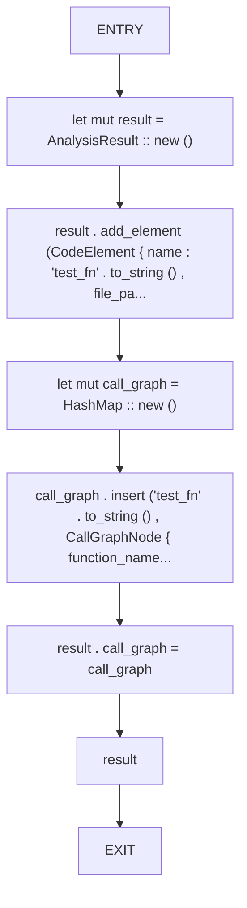
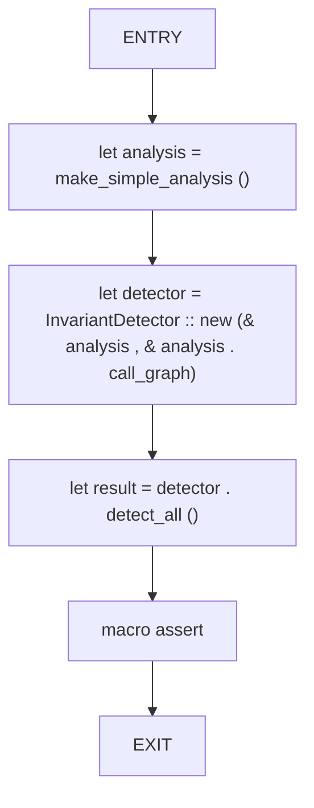
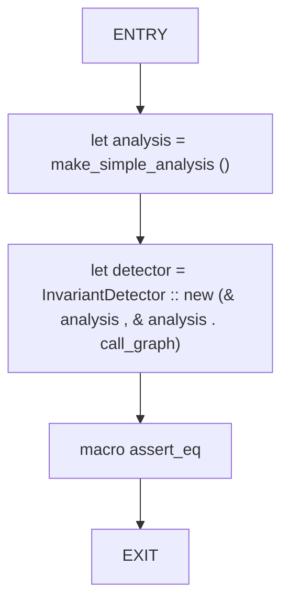

# CFG Group: src/150_invariant_integrator.rs

## Function: `make_simple_analysis`

- File: src/150_invariant_integrator.rs
- Branches: 0
- Loops: 0
- Nodes: 8
- Edges: 7

## Function: `test_detect_all`

- File: src/150_invariant_integrator.rs
- Branches: 0
- Loops: 0
- Nodes: 6
- Edges: 5

## Function: `test_invariant_detector_creation`

- File: src/150_invariant_integrator.rs
- Branches: 0
- Loops: 0
- Nodes: 5
- Edges: 4

