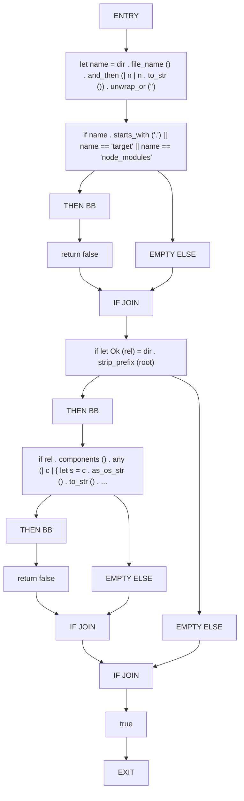
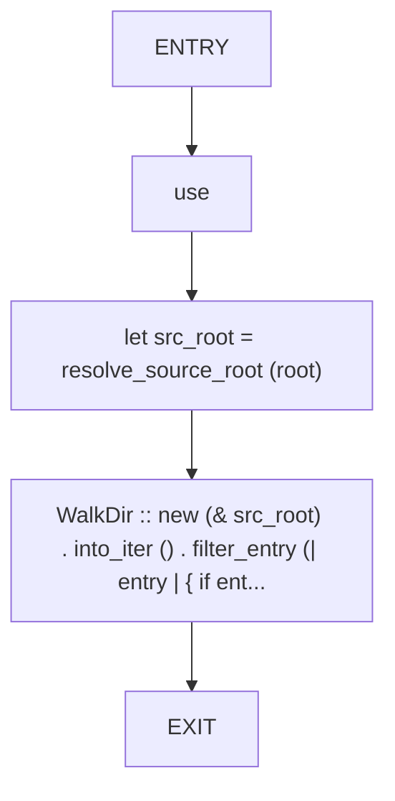
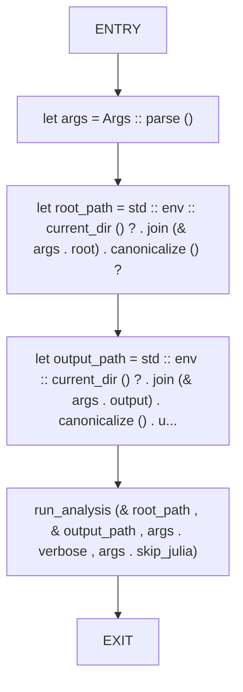
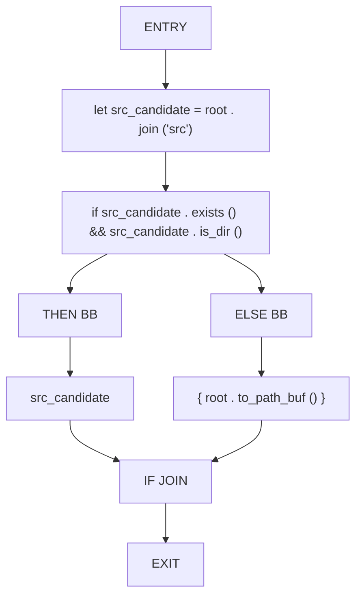

# CFG Group: src/070_layer_utilities.rs

## Function: `allow_analysis_dir`

- File: src/070_layer_utilities.rs
- Branches: 3
- Loops: 0
- Nodes: 18
- Edges: 20

## Function: `gather_rust_files`

- File: src/070_layer_utilities.rs
- Branches: 0
- Loops: 0
- Nodes: 5
- Edges: 4

## Function: `main`

- File: src/070_layer_utilities.rs
- Branches: 0
- Loops: 0
- Nodes: 6
- Edges: 5

## Function: `resolve_source_root`

- File: src/070_layer_utilities.rs
- Branches: 1
- Loops: 0
- Nodes: 9
- Edges: 9

## Function: `run_analysis`

- File: src/070_layer_utilities.rs
- Branches: 2
- Loops: 0
- Nodes: 76
- Edges: 77

```mermaid
flowchart TD
    run_analysis_0["ENTRY"]
    run_analysis_1["use"]
    run_analysis_2["use"]
    run_analysis_3["use"]
    run_analysis_4["use"]
    run_analysis_5["use"]
    run_analysis_6["use"]
    run_analysis_7["use"]
    run_analysis_8["use"]
    run_analysis_9["use"]
    run_analysis_10["let julia_script_path = root_path . join ('src/000_main.jl')"]
    run_analysis_11["macro println"]
    run_analysis_12["macro println"]
    run_analysis_13["macro println"]
    run_analysis_14["macro println"]
    run_analysis_15["macro println"]
    run_analysis_16["let rust_analyzer = RustAnalyzer :: new (root_path . to_string_lossy () . to_string ())"]
    run_analysis_17["let mut combined_result = AnalysisResult :: new ()"]
    run_analysis_18["macro println"]
    run_analysis_19["let mut rust_count = 0"]
    run_analysis_20["let rust_files = gather_rust_files (root_path)"]
    run_analysis_21["let (ordered_rust_files , rust_layer_graph) = crate :: dependency :: order_rust_files_by_dependency (& rust_files , root_pa..."]
    run_analysis_22["let rust_file_ordering = crate :: dependency :: analyze_file_ordering (& rust_files , None) . context ..."]
    run_analysis_23["let julia_file_ordering = FileOrderingResult { ordered_files : Vec :: new () , violations : Vec :: new ..."]
    run_analysis_24["for path in ordered_rust_files { if verbose { println ! (' Analyzing: {:?}' ,..."]
    run_analysis_25["macro println"]
    run_analysis_26["let mut julia_count = 0"]
    run_analysis_27["let mut julia_layer_graph = LayerGraph { ordered_layers : Vec :: new () , edges : Vec :: new () , cycles ..."]
    run_analysis_28["if ! skip_julia"]
    run_analysis_29["THEN BB"]
    run_analysis_30["macro println"]
    run_analysis_31["let julia_files = gather_julia_files (root_path)"]
    run_analysis_32["let (ordered_julia_files , jlg) = crate :: dependency :: order_julia_files_by_dependency (& julia_files , root_..."]
    run_analysis_33["julia_layer_graph = jlg"]
    run_analysis_34["if julia_script_path . exists ()"]
    run_analysis_35["THEN BB"]
    run_analysis_36["let julia_analyzer = JuliaAnalyzer :: new (root_path . to_path_buf () , julia_script_path . clone ..."]
    run_analysis_37["for path in ordered_julia_files { if verbose { println ! (' Analyzing: {:?}' ..."]
    run_analysis_38["ELSE BB"]
    run_analysis_39["{ println ! (' Skipping Julia analysis (script not found)') ; }"]
    run_analysis_40["IF JOIN"]
    run_analysis_41["macro println"]
    run_analysis_42["EMPTY ELSE"]
    run_analysis_43["IF JOIN"]
    run_analysis_44["macro println"]
    run_analysis_45["let mut cf_analyzer = ControlFlowAnalyzer :: new ()"]
    run_analysis_46["cf_analyzer . build_call_graph (& combined_result)"]
    run_analysis_47["use"]
    run_analysis_48["macro println"]
    run_analysis_49["let invariants_result = { let invariant_detector = InvariantDetector :: new (& combined_result , & co..."]
    run_analysis_50["let constraints = { let invariant_detector = InvariantDetector :: new (& combined_result , & co..."]
    run_analysis_51["combined_result . invariants = invariants_result"]
    run_analysis_52["combined_result . constraints = constraints"]
    run_analysis_53["macro println"]
    run_analysis_54["let cohesion_analyzer = FunctionCohesionAnalyzer :: new ()"]
    run_analysis_55["let placements = cohesion_analyzer . analyze (& combined_result) ?"]
    run_analysis_56["let clusters = cohesion_analyzer . detect_clusters (& combined_result) ?"]
    run_analysis_57["macro println"]
    run_analysis_58["let dir_analyzer = DirectoryAnalyzer :: new (root_path . to_path_buf ())"]
    run_analysis_59["let dir_analysis = dir_analyzer . analyze () ?"]
    run_analysis_60["macro println"]
    run_analysis_61["let report_gen = ReportGenerator :: new (output_path . to_string_lossy () . to_string ())"]
    run_analysis_62["report_gen . generate_all (& combined_result , & cf_analyzer , & rust_layer_g..."]
    run_analysis_63["macro println"]
    run_analysis_64["export_program_cfg_to_path (& combined_result , & cf_analyzer . call_edges ()..."]
    run_analysis_65["macro println"]
    run_analysis_66["use"]
    run_analysis_67["invariant_reporter :: generate_invariant_report (& combined_result . invarian..."]
    run_analysis_68["invariant_reporter :: export_constraints_json (& combined_result . constraint..."]
    run_analysis_69["macro println"]
    run_analysis_70["macro println"]
    run_analysis_71["macro println"]
    run_analysis_72["macro println"]
    run_analysis_73["macro println"]
    run_analysis_74["Ok (())"]
    run_analysis_75["EXIT"]
    run_analysis_0 --> run_analysis_1
    run_analysis_1 --> run_analysis_2
    run_analysis_2 --> run_analysis_3
    run_analysis_3 --> run_analysis_4
    run_analysis_4 --> run_analysis_5
    run_analysis_5 --> run_analysis_6
    run_analysis_6 --> run_analysis_7
    run_analysis_7 --> run_analysis_8
    run_analysis_8 --> run_analysis_9
    run_analysis_9 --> run_analysis_10
    run_analysis_10 --> run_analysis_11
    run_analysis_11 --> run_analysis_12
    run_analysis_12 --> run_analysis_13
    run_analysis_13 --> run_analysis_14
    run_analysis_14 --> run_analysis_15
    run_analysis_15 --> run_analysis_16
    run_analysis_16 --> run_analysis_17
    run_analysis_17 --> run_analysis_18
    run_analysis_18 --> run_analysis_19
    run_analysis_19 --> run_analysis_20
    run_analysis_20 --> run_analysis_21
    run_analysis_21 --> run_analysis_22
    run_analysis_22 --> run_analysis_23
    run_analysis_23 --> run_analysis_24
    run_analysis_24 --> run_analysis_25
    run_analysis_25 --> run_analysis_26
    run_analysis_26 --> run_analysis_27
    run_analysis_27 --> run_analysis_28
    run_analysis_28 --> run_analysis_29
    run_analysis_29 --> run_analysis_30
    run_analysis_30 --> run_analysis_31
    run_analysis_31 --> run_analysis_32
    run_analysis_32 --> run_analysis_33
    run_analysis_33 --> run_analysis_34
    run_analysis_34 --> run_analysis_35
    run_analysis_35 --> run_analysis_36
    run_analysis_36 --> run_analysis_37
    run_analysis_34 --> run_analysis_38
    run_analysis_38 --> run_analysis_39
    run_analysis_37 --> run_analysis_40
    run_analysis_39 --> run_analysis_40
    run_analysis_40 --> run_analysis_41
    run_analysis_28 --> run_analysis_42
    run_analysis_41 --> run_analysis_43
    run_analysis_42 --> run_analysis_43
    run_analysis_43 --> run_analysis_44
    run_analysis_44 --> run_analysis_45
    run_analysis_45 --> run_analysis_46
    run_analysis_46 --> run_analysis_47
    run_analysis_47 --> run_analysis_48
    run_analysis_48 --> run_analysis_49
    run_analysis_49 --> run_analysis_50
    run_analysis_50 --> run_analysis_51
    run_analysis_51 --> run_analysis_52
    run_analysis_52 --> run_analysis_53
    run_analysis_53 --> run_analysis_54
    run_analysis_54 --> run_analysis_55
    run_analysis_55 --> run_analysis_56
    run_analysis_56 --> run_analysis_57
    run_analysis_57 --> run_analysis_58
    run_analysis_58 --> run_analysis_59
    run_analysis_59 --> run_analysis_60
    run_analysis_60 --> run_analysis_61
    run_analysis_61 --> run_analysis_62
    run_analysis_62 --> run_analysis_63
    run_analysis_63 --> run_analysis_64
    run_analysis_64 --> run_analysis_65
    run_analysis_65 --> run_analysis_66
    run_analysis_66 --> run_analysis_67
    run_analysis_67 --> run_analysis_68
    run_analysis_68 --> run_analysis_69
    run_analysis_69 --> run_analysis_70
    run_analysis_70 --> run_analysis_71
    run_analysis_71 --> run_analysis_72
    run_analysis_72 --> run_analysis_73
    run_analysis_73 --> run_analysis_74
    run_analysis_74 --> run_analysis_75
```

