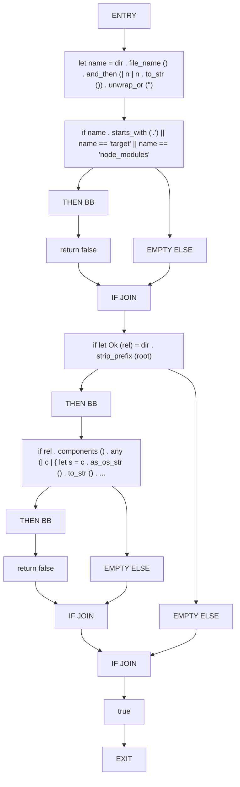
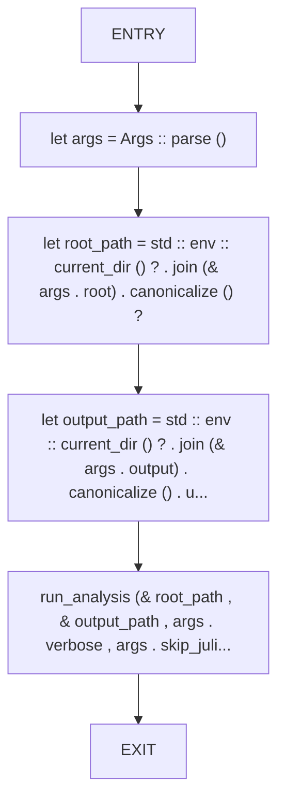
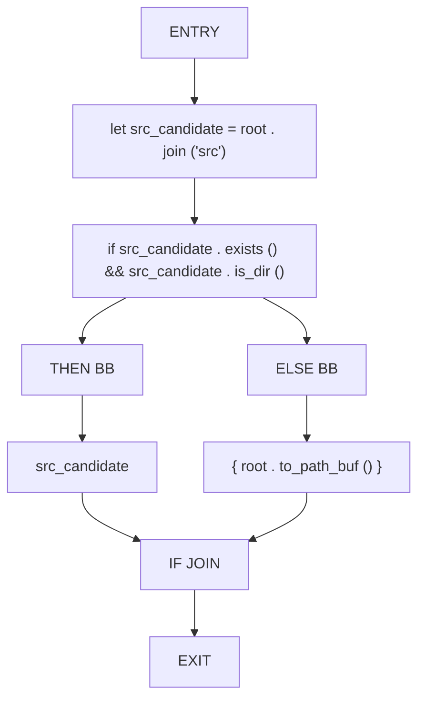

# CFG Group: src/160_layer_utilities.rs

## Function: `allow_analysis_dir`

- File: src/160_layer_utilities.rs
- Branches: 3
- Loops: 0
- Nodes: 18
- Edges: 20

## Function: `main`

- File: src/160_layer_utilities.rs
- Branches: 0
- Loops: 0
- Nodes: 6
- Edges: 5

## Function: `resolve_source_root`

- File: src/160_layer_utilities.rs
- Branches: 1
- Loops: 0
- Nodes: 9
- Edges: 9

## Function: `run_dead_code_pipeline`

- File: src/160_layer_utilities.rs
- Branches: 0
- Loops: 0
- Nodes: 15
- Edges: 14

```mermaid
flowchart TD
    run_dead_code_pipeline_0["ENTRY"]
    run_dead_code_pipeline_1["let rust_files = gather_rust_files (& config . root)"]
    run_dead_code_pipeline_2["let mut intent_map = HashMap :: new ()"]
    run_dead_code_pipeline_3["let mut test_boundaries = TestBoundaries :: default ()"]
    run_dead_code_pipeline_4["for file in & rust_files { let intents = detect_intent_signals (file , config..."]
    run_dead_code_pipeline_5["let call_graph = build_call_graph (elements)"]
    run_dead_code_pipeline_6["let entrypoints = collect_entrypoints (elements , config . policy . as_ref ())"]
    run_dead_code_pipeline_7["let exports = collect_exports (& config . root)"]
    run_dead_code_pipeline_8["let mut items = Vec :: new ()"]
    run_dead_code_pipeline_9["for element in elements { if element . element_type != ElementType :: Functio..."]
    run_dead_code_pipeline_10["let metadata = DeadCodeReportMetadata { analyzer_version : env ! ('CARGO_PKG_VERSION') . to_..."]
    run_dead_code_pipeline_11["let report = build_report (chrono :: Local :: now () . to_rfc3339 () , items , metadata ,)"]
    run_dead_code_pipeline_12["write_outputs (& report , config) ?"]
    run_dead_code_pipeline_13["Ok (report)"]
    run_dead_code_pipeline_14["EXIT"]
    run_dead_code_pipeline_0 --> run_dead_code_pipeline_1
    run_dead_code_pipeline_1 --> run_dead_code_pipeline_2
    run_dead_code_pipeline_2 --> run_dead_code_pipeline_3
    run_dead_code_pipeline_3 --> run_dead_code_pipeline_4
    run_dead_code_pipeline_4 --> run_dead_code_pipeline_5
    run_dead_code_pipeline_5 --> run_dead_code_pipeline_6
    run_dead_code_pipeline_6 --> run_dead_code_pipeline_7
    run_dead_code_pipeline_7 --> run_dead_code_pipeline_8
    run_dead_code_pipeline_8 --> run_dead_code_pipeline_9
    run_dead_code_pipeline_9 --> run_dead_code_pipeline_10
    run_dead_code_pipeline_10 --> run_dead_code_pipeline_11
    run_dead_code_pipeline_11 --> run_dead_code_pipeline_12
    run_dead_code_pipeline_12 --> run_dead_code_pipeline_13
    run_dead_code_pipeline_13 --> run_dead_code_pipeline_14
```

