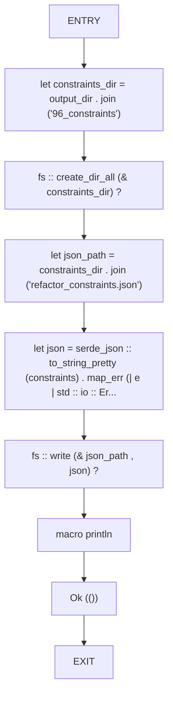
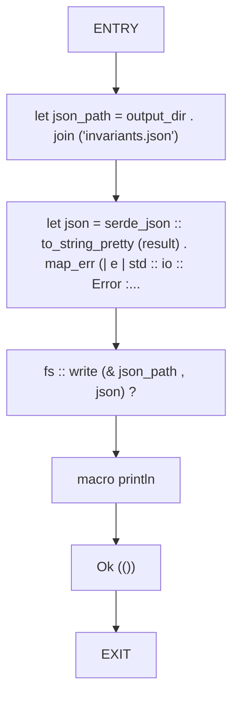
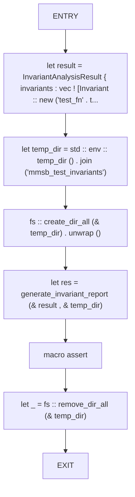

# CFG Group: src/170_invariant_reporter.rs

## Function: `export_constraints_json`

- File: src/170_invariant_reporter.rs
- Branches: 0
- Loops: 0
- Nodes: 9
- Edges: 8

## Function: `export_json`

- File: src/170_invariant_reporter.rs
- Branches: 0
- Loops: 0
- Nodes: 7
- Edges: 6

## Function: `generate_invariant_report`

- File: src/170_invariant_reporter.rs
- Branches: 7
- Loops: 0
- Nodes: 83
- Edges: 89

```mermaid
flowchart TD
    generate_invariant_report_0["ENTRY"]
    generate_invariant_report_1["let report_dir = output_dir . join ('95_invariants')"]
    generate_invariant_report_2["fs :: create_dir_all (& report_dir) ?"]
    generate_invariant_report_3["let report_path = report_dir . join ('index.md')"]
    generate_invariant_report_4["let mut report = String :: new ()"]
    generate_invariant_report_5["report . push_str ('# Invariant Analysis Report\n\n')"]
    generate_invariant_report_6["report . push_str (& format ! ('Generated: {}\n\n' , chrono :: Local :: now (..."]
    generate_invariant_report_7["report . push_str ('## Summary\n\n')"]
    generate_invariant_report_8["report . push_str (& format ! ('- **Total Invariants**: {}\n' , result . stat..."]
    generate_invariant_report_9["report . push_str (& format ! ('- **Proven**: {} ({:.1}%)\n' , result . stats..."]
    generate_invariant_report_10["report . push_str (& format ! ('- **Empirical**: {}\n' , result . stats . emp..."]
    generate_invariant_report_11["report . push_str (& format ! ('- **Heuristic**: {} ({:.1}%) ⚠️ LOW CONFI..."]
    generate_invariant_report_12["report . push_str (& format ! ('- **Violations**: {}\n\n' , result . stats . ..."]
    generate_invariant_report_13["report . push_str ('### By Kind\n\n')"]
    generate_invariant_report_14["report . push_str (& format ! ('- **Structural**: {}\n' , result . stats . st..."]
    generate_invariant_report_15["report . push_str (& format ! ('- **Semantic**: {}\n' , result . stats . sema..."]
    generate_invariant_report_16["report . push_str (& format ! ('- **Delta**: {}\n' , result . stats . delta_c..."]
    generate_invariant_report_17["report . push_str (& format ! ('- **Path-Intersection**: {}\n\n' , result . s..."]
    generate_invariant_report_18["report . push_str ('## Proven Invariants (Mechanical Truth)\n\n')"]
    generate_invariant_report_19["report . push_str ('These invariants are mathematically proven from graph str..."]
    generate_invariant_report_20["let proven : Vec < _ > = result . invariants . iter () . filter (| inv | matches ! (inv . strength , I..."]
    generate_invariant_report_21["if proven . is_empty ()"]
    generate_invariant_report_22["THEN BB"]
    generate_invariant_report_23["report . push_str ('*None detected*\n\n')"]
    generate_invariant_report_24["ELSE BB"]
    generate_invariant_report_25["{ for inv in & proven { report . push_str (& format ! ('### {}\n\n' , inv . t..."]
    generate_invariant_report_26["IF JOIN"]
    generate_invariant_report_27["report . push_str ('## Empirical Invariants (High Confidence)\n\n')"]
    generate_invariant_report_28["report . push_str ('These invariants were observed across multiple paths/samp..."]
    generate_invariant_report_29["let empirical : Vec < _ > = result . invariants . iter () . filter (| inv | matches ! (inv . strength , I..."]
    generate_invariant_report_30["if empirical . is_empty ()"]
    generate_invariant_report_31["THEN BB"]
    generate_invariant_report_32["report . push_str ('*None detected*\n\n')"]
    generate_invariant_report_33["ELSE BB"]
    generate_invariant_report_34["{ for inv in empirical . iter () . take (20) { report . push_str (& format ! ..."]
    generate_invariant_report_35["IF JOIN"]
    generate_invariant_report_36["report . push_str ('## Heuristic Signals (Low Confidence - Review Required)\n..."]
    generate_invariant_report_37["report . push_str ('⚠️ **WARNING**: These are based on naming patterns an..."]
    generate_invariant_report_38["let heuristic : Vec < _ > = result . invariants . iter () . filter (| inv | matches ! (inv . strength , I..."]
    generate_invariant_report_39["if heuristic . is_empty ()"]
    generate_invariant_report_40["THEN BB"]
    generate_invariant_report_41["report . push_str ('*None detected*\n\n')"]
    generate_invariant_report_42["ELSE BB"]
    generate_invariant_report_43["{ for inv in heuristic . iter () . take (10) { report . push_str (& format ! ..."]
    generate_invariant_report_44["IF JOIN"]
    generate_invariant_report_45["if ! result . violations . is_empty ()"]
    generate_invariant_report_46["THEN BB"]
    generate_invariant_report_47["report . push_str ('## Violations\n\n')"]
    generate_invariant_report_48["report . push_str ('Detected violations of invariants, grouped by severity.\n..."]
    generate_invariant_report_49["let mut critical : Vec < _ > = result . violations . iter () . filter (| v | matches ! (v . severity , Viola..."]
    generate_invariant_report_50["critical . sort_by_key (| v | & v . invariant . target)"]
    generate_invariant_report_51["if ! critical . is_empty ()"]
    generate_invariant_report_52["THEN BB"]
    generate_invariant_report_53["report . push_str ('### Critical\n\n')"]
    generate_invariant_report_54["for violation in critical { report . push_str (& format ! ('- **{}**: {}\n' ,..."]
    generate_invariant_report_55["report . push_str ('\n')"]
    generate_invariant_report_56["EMPTY ELSE"]
    generate_invariant_report_57["IF JOIN"]
    generate_invariant_report_58["EMPTY ELSE"]
    generate_invariant_report_59["IF JOIN"]
    generate_invariant_report_60["if ! result . layer_assignments . is_empty ()"]
    generate_invariant_report_61["THEN BB"]
    generate_invariant_report_62["report . push_str ('## Layer Assignments (Inferred from Call Graph)\n\n')"]
    generate_invariant_report_63["report . push_str ('Layers are **NOT** based on filename prefixes. They are c..."]
    generate_invariant_report_64["let mut layers : Vec < _ > = result . layer_assignments . iter () . collect ()"]
    generate_invariant_report_65["layers . sort_by_key (| (_ , info) | info . layer)"]
    generate_invariant_report_66["for (name , info) in layers . iter () . take (20) { report . push_str (& form..."]
    generate_invariant_report_67["if layers . len () > 20"]
    generate_invariant_report_68["THEN BB"]
    generate_invariant_report_69["report . push_str (& format ! ('\n*... and {} more (see JSON export)*\n\n' , ..."]
    generate_invariant_report_70["ELSE BB"]
    generate_invariant_report_71["{ report . push_str ('\n') ; }"]
    generate_invariant_report_72["IF JOIN"]
    generate_invariant_report_73["EMPTY ELSE"]
    generate_invariant_report_74["IF JOIN"]
    generate_invariant_report_75["fs :: write (& report_path , report) ?"]
    generate_invariant_report_76["macro println"]
    generate_invariant_report_77["export_json (result , & report_dir) ?"]
    generate_invariant_report_78["let conscience_map_path = report_dir . join ('conscience_map.md')"]
    generate_invariant_report_79["crate :: conscience_graph :: generate_conscience_map (& result . invariants ,..."]
    generate_invariant_report_80["macro println"]
    generate_invariant_report_81["Ok (())"]
    generate_invariant_report_82["EXIT"]
    generate_invariant_report_0 --> generate_invariant_report_1
    generate_invariant_report_1 --> generate_invariant_report_2
    generate_invariant_report_2 --> generate_invariant_report_3
    generate_invariant_report_3 --> generate_invariant_report_4
    generate_invariant_report_4 --> generate_invariant_report_5
    generate_invariant_report_5 --> generate_invariant_report_6
    generate_invariant_report_6 --> generate_invariant_report_7
    generate_invariant_report_7 --> generate_invariant_report_8
    generate_invariant_report_8 --> generate_invariant_report_9
    generate_invariant_report_9 --> generate_invariant_report_10
    generate_invariant_report_10 --> generate_invariant_report_11
    generate_invariant_report_11 --> generate_invariant_report_12
    generate_invariant_report_12 --> generate_invariant_report_13
    generate_invariant_report_13 --> generate_invariant_report_14
    generate_invariant_report_14 --> generate_invariant_report_15
    generate_invariant_report_15 --> generate_invariant_report_16
    generate_invariant_report_16 --> generate_invariant_report_17
    generate_invariant_report_17 --> generate_invariant_report_18
    generate_invariant_report_18 --> generate_invariant_report_19
    generate_invariant_report_19 --> generate_invariant_report_20
    generate_invariant_report_20 --> generate_invariant_report_21
    generate_invariant_report_21 --> generate_invariant_report_22
    generate_invariant_report_22 --> generate_invariant_report_23
    generate_invariant_report_21 --> generate_invariant_report_24
    generate_invariant_report_24 --> generate_invariant_report_25
    generate_invariant_report_23 --> generate_invariant_report_26
    generate_invariant_report_25 --> generate_invariant_report_26
    generate_invariant_report_26 --> generate_invariant_report_27
    generate_invariant_report_27 --> generate_invariant_report_28
    generate_invariant_report_28 --> generate_invariant_report_29
    generate_invariant_report_29 --> generate_invariant_report_30
    generate_invariant_report_30 --> generate_invariant_report_31
    generate_invariant_report_31 --> generate_invariant_report_32
    generate_invariant_report_30 --> generate_invariant_report_33
    generate_invariant_report_33 --> generate_invariant_report_34
    generate_invariant_report_32 --> generate_invariant_report_35
    generate_invariant_report_34 --> generate_invariant_report_35
    generate_invariant_report_35 --> generate_invariant_report_36
    generate_invariant_report_36 --> generate_invariant_report_37
    generate_invariant_report_37 --> generate_invariant_report_38
    generate_invariant_report_38 --> generate_invariant_report_39
    generate_invariant_report_39 --> generate_invariant_report_40
    generate_invariant_report_40 --> generate_invariant_report_41
    generate_invariant_report_39 --> generate_invariant_report_42
    generate_invariant_report_42 --> generate_invariant_report_43
    generate_invariant_report_41 --> generate_invariant_report_44
    generate_invariant_report_43 --> generate_invariant_report_44
    generate_invariant_report_44 --> generate_invariant_report_45
    generate_invariant_report_45 --> generate_invariant_report_46
    generate_invariant_report_46 --> generate_invariant_report_47
    generate_invariant_report_47 --> generate_invariant_report_48
    generate_invariant_report_48 --> generate_invariant_report_49
    generate_invariant_report_49 --> generate_invariant_report_50
    generate_invariant_report_50 --> generate_invariant_report_51
    generate_invariant_report_51 --> generate_invariant_report_52
    generate_invariant_report_52 --> generate_invariant_report_53
    generate_invariant_report_53 --> generate_invariant_report_54
    generate_invariant_report_54 --> generate_invariant_report_55
    generate_invariant_report_51 --> generate_invariant_report_56
    generate_invariant_report_55 --> generate_invariant_report_57
    generate_invariant_report_56 --> generate_invariant_report_57
    generate_invariant_report_45 --> generate_invariant_report_58
    generate_invariant_report_57 --> generate_invariant_report_59
    generate_invariant_report_58 --> generate_invariant_report_59
    generate_invariant_report_59 --> generate_invariant_report_60
    generate_invariant_report_60 --> generate_invariant_report_61
    generate_invariant_report_61 --> generate_invariant_report_62
    generate_invariant_report_62 --> generate_invariant_report_63
    generate_invariant_report_63 --> generate_invariant_report_64
    generate_invariant_report_64 --> generate_invariant_report_65
    generate_invariant_report_65 --> generate_invariant_report_66
    generate_invariant_report_66 --> generate_invariant_report_67
    generate_invariant_report_67 --> generate_invariant_report_68
    generate_invariant_report_68 --> generate_invariant_report_69
    generate_invariant_report_67 --> generate_invariant_report_70
    generate_invariant_report_70 --> generate_invariant_report_71
    generate_invariant_report_69 --> generate_invariant_report_72
    generate_invariant_report_71 --> generate_invariant_report_72
    generate_invariant_report_60 --> generate_invariant_report_73
    generate_invariant_report_72 --> generate_invariant_report_74
    generate_invariant_report_73 --> generate_invariant_report_74
    generate_invariant_report_74 --> generate_invariant_report_75
    generate_invariant_report_75 --> generate_invariant_report_76
    generate_invariant_report_76 --> generate_invariant_report_77
    generate_invariant_report_77 --> generate_invariant_report_78
    generate_invariant_report_78 --> generate_invariant_report_79
    generate_invariant_report_79 --> generate_invariant_report_80
    generate_invariant_report_80 --> generate_invariant_report_81
    generate_invariant_report_81 --> generate_invariant_report_82
```

## Function: `test_generate_report`

- File: src/170_invariant_reporter.rs
- Branches: 0
- Loops: 0
- Nodes: 8
- Edges: 7

