# CFG Group: src/082_conscience_graph.rs

## Function: `generate_conscience_map`

- File: src/082_conscience_graph.rs
- Branches: 0
- Loops: 0
- Nodes: 26
- Edges: 25

```mermaid
flowchart TD
    generate_conscience_map_0["ENTRY"]
    generate_conscience_map_1["let mut content = String :: new ()"]
    generate_conscience_map_2["content . push_str ('# Conscience Map\n\n')"]
    generate_conscience_map_3["content . push_str ('## Overview\n\n')"]
    generate_conscience_map_4["content . push_str ('This map shows which functions are protected by mechanic..."]
    generate_conscience_map_5["content . push_str ('Functions with blocking invariants cannot be refactored ..."]
    generate_conscience_map_6["let mut by_function : HashMap < String , Vec < & Invariant > > = HashMap :: new ()"]
    generate_conscience_map_7["for inv in invariants { by_function . entry (inv . target . clone ()) . or_de..."]
    generate_conscience_map_8["let total_functions = by_function . len ()"]
    generate_conscience_map_9["let protected_functions = by_function . values () . filter (| invs | invs . iter () . any (| i | i . is..."]
    generate_conscience_map_10["content . push_str (& format ! ('**Total Functions**: {}\n\n' , total_functio..."]
    generate_conscience_map_11["content . push_str (& format ! ('**Protected Functions**: {} ({:.1}%)\n\n' , ..."]
    generate_conscience_map_12["let mut funcs : Vec < _ > = by_function . into_iter () . collect ()"]
    generate_conscience_map_13["funcs . sort_by_key (| (_ , invs) | { - (invs . iter () . filter (| i | i . i..."]
    generate_conscience_map_14["content . push_str ('---\n\n')"]
    generate_conscience_map_15["content . push_str ('## Functions by Protection Level\n\n')"]
    generate_conscience_map_16["for (func , invs) in funcs { let blocking_count = invs . iter () . filter (| ..."]
    generate_conscience_map_17["content . push_str ('---\n\n')"]
    generate_conscience_map_18["content . push_str ('## Legend\n\n')"]
    generate_conscience_map_19["content . push_str ('- ✓ **PROVEN**: Mathematical certainty from graph topo..."]
    generate_conscience_map_20["content . push_str ('- ◆ **EMPIRICAL**: Observed across multiple paths (hig..."]
    generate_conscience_map_21["content . push_str ('- ? **HEURISTIC**: Name-based guess (LOW CONFIDENCE - ve..."]
    generate_conscience_map_22["content . push_str ('- 🔒 **Blocking**: Constraint mechanically enforced\n\n')"]
    generate_conscience_map_23["std :: fs :: write (output_path , content) ?"]
    generate_conscience_map_24["Ok (())"]
    generate_conscience_map_25["EXIT"]
    generate_conscience_map_0 --> generate_conscience_map_1
    generate_conscience_map_1 --> generate_conscience_map_2
    generate_conscience_map_2 --> generate_conscience_map_3
    generate_conscience_map_3 --> generate_conscience_map_4
    generate_conscience_map_4 --> generate_conscience_map_5
    generate_conscience_map_5 --> generate_conscience_map_6
    generate_conscience_map_6 --> generate_conscience_map_7
    generate_conscience_map_7 --> generate_conscience_map_8
    generate_conscience_map_8 --> generate_conscience_map_9
    generate_conscience_map_9 --> generate_conscience_map_10
    generate_conscience_map_10 --> generate_conscience_map_11
    generate_conscience_map_11 --> generate_conscience_map_12
    generate_conscience_map_12 --> generate_conscience_map_13
    generate_conscience_map_13 --> generate_conscience_map_14
    generate_conscience_map_14 --> generate_conscience_map_15
    generate_conscience_map_15 --> generate_conscience_map_16
    generate_conscience_map_16 --> generate_conscience_map_17
    generate_conscience_map_17 --> generate_conscience_map_18
    generate_conscience_map_18 --> generate_conscience_map_19
    generate_conscience_map_19 --> generate_conscience_map_20
    generate_conscience_map_20 --> generate_conscience_map_21
    generate_conscience_map_21 --> generate_conscience_map_22
    generate_conscience_map_22 --> generate_conscience_map_23
    generate_conscience_map_23 --> generate_conscience_map_24
    generate_conscience_map_24 --> generate_conscience_map_25
```

## Function: `generate_conscience_stats`

- File: src/082_conscience_graph.rs
- Branches: 0
- Loops: 0
- Nodes: 10
- Edges: 9

## Function: `kind_name`

- File: src/082_conscience_graph.rs
- Branches: 0
- Loops: 0
- Nodes: 3
- Edges: 2

## Function: `make_test_invariant`

- File: src/082_conscience_graph.rs
- Branches: 0
- Loops: 0
- Nodes: 3
- Edges: 2

## Function: `strength_emoji`

- File: src/082_conscience_graph.rs
- Branches: 0
- Loops: 0
- Nodes: 3
- Edges: 2

```mermaid
flowchart TD
    strength_emoji_0["ENTRY"]
    strength_emoji_1["match inv . strength { InvariantStrength :: Proven => '✓' , InvariantStreng..."]
    strength_emoji_2["EXIT"]
    strength_emoji_0 --> strength_emoji_1
    strength_emoji_1 --> strength_emoji_2
```

## Function: `test_generate_stats`

- File: src/082_conscience_graph.rs
- Branches: 0
- Loops: 0
- Nodes: 8
- Edges: 7

## Function: `test_strength_emoji`

- File: src/082_conscience_graph.rs
- Branches: 0
- Loops: 0
- Nodes: 8
- Edges: 7

