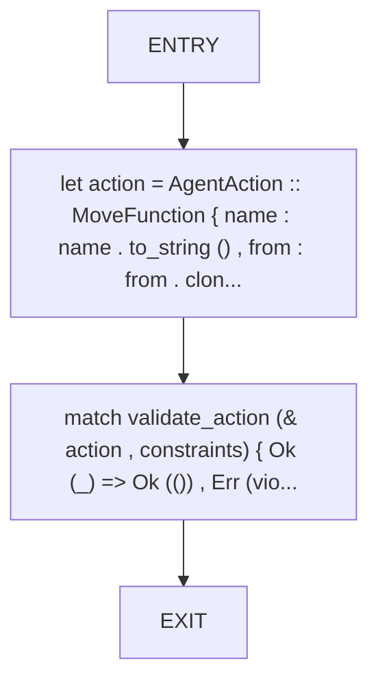
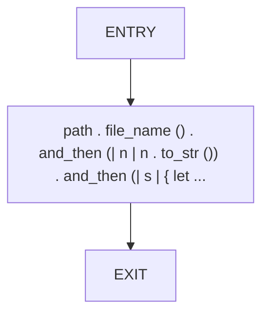
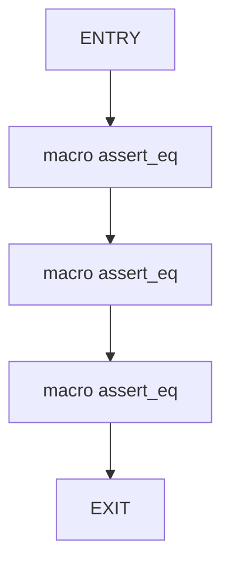
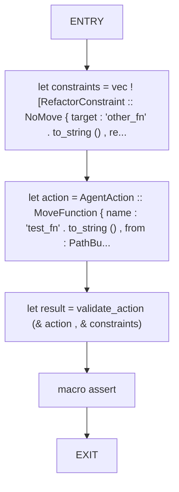
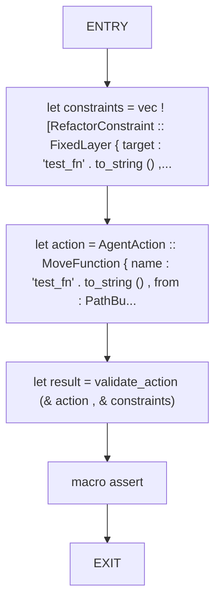
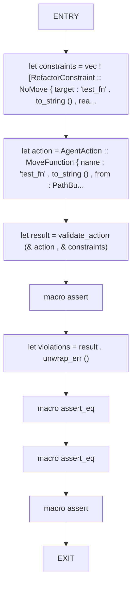
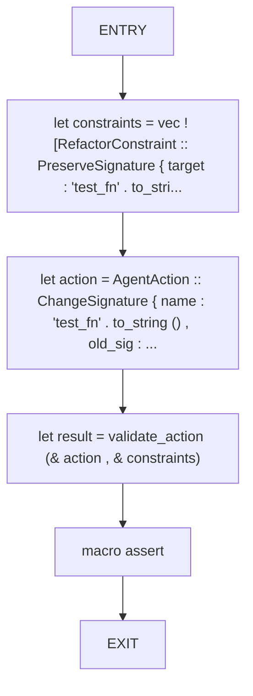
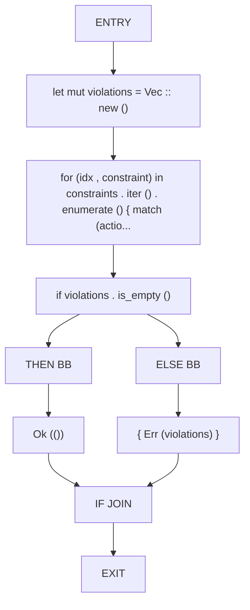

# CFG Group: src/190_action_validator.rs

## Function: `check_move_allowed`

- File: src/190_action_validator.rs
- Branches: 0
- Loops: 0
- Nodes: 4
- Edges: 3

## Function: `extract_layer`

- File: src/190_action_validator.rs
- Branches: 0
- Loops: 0
- Nodes: 3
- Edges: 2

## Function: `test_extract_layer`

- File: src/190_action_validator.rs
- Branches: 0
- Loops: 0
- Nodes: 5
- Edges: 4

## Function: `test_validate_allowed_action`

- File: src/190_action_validator.rs
- Branches: 0
- Loops: 0
- Nodes: 6
- Edges: 5

## Function: `test_validate_layer_fixed_constraint`

- File: src/190_action_validator.rs
- Branches: 0
- Loops: 0
- Nodes: 6
- Edges: 5

## Function: `test_validate_no_move_constraint`

- File: src/190_action_validator.rs
- Branches: 0
- Loops: 0
- Nodes: 10
- Edges: 9

## Function: `test_validate_preserve_signature`

- File: src/190_action_validator.rs
- Branches: 0
- Loops: 0
- Nodes: 6
- Edges: 5

## Function: `validate_action`

- File: src/190_action_validator.rs
- Branches: 1
- Loops: 0
- Nodes: 10
- Edges: 10

