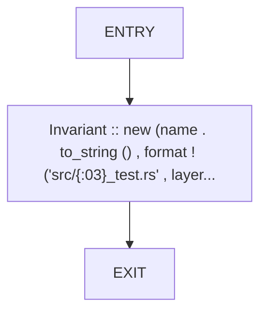
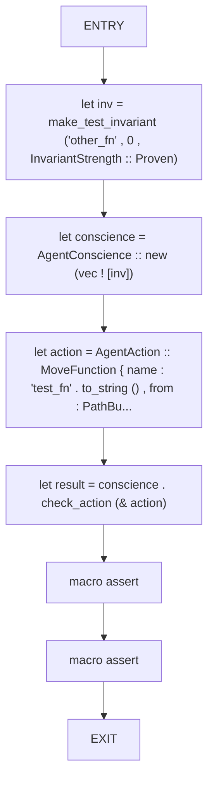
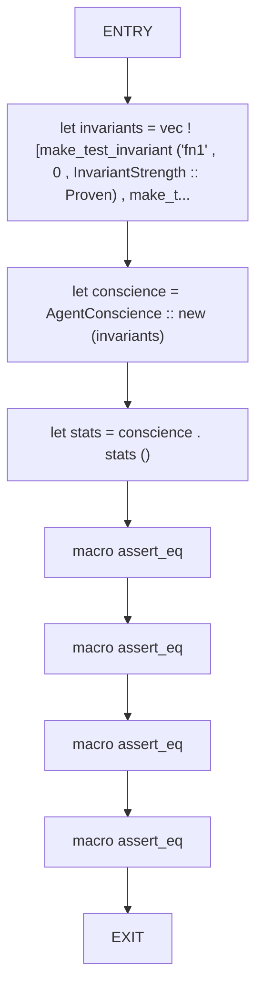
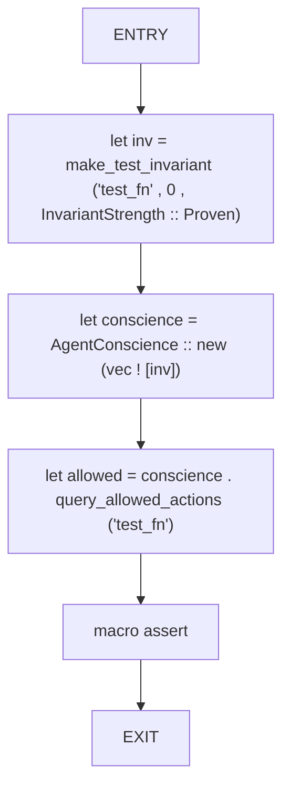

# CFG Group: src/200_agent_conscience.rs

## Function: `make_test_invariant`

- File: src/200_agent_conscience.rs
- Branches: 0
- Loops: 0
- Nodes: 3
- Edges: 2

## Function: `test_conscience_allows_valid_action`

- File: src/200_agent_conscience.rs
- Branches: 0
- Loops: 0
- Nodes: 8
- Edges: 7

## Function: `test_conscience_blocks_invalid_move`

- File: src/200_agent_conscience.rs
- Branches: 0
- Loops: 0
- Nodes: 8
- Edges: 7

## Function: `test_conscience_stats`

- File: src/200_agent_conscience.rs
- Branches: 0
- Loops: 0
- Nodes: 9
- Edges: 8

## Function: `test_query_allowed_actions`

- File: src/200_agent_conscience.rs
- Branches: 0
- Loops: 0
- Nodes: 6
- Edges: 5

