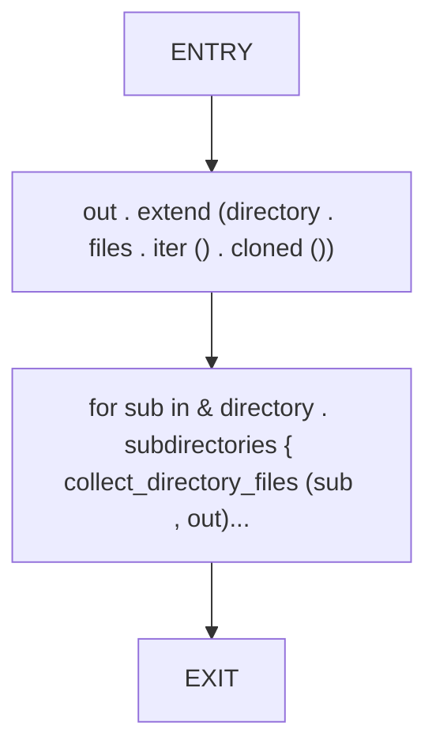
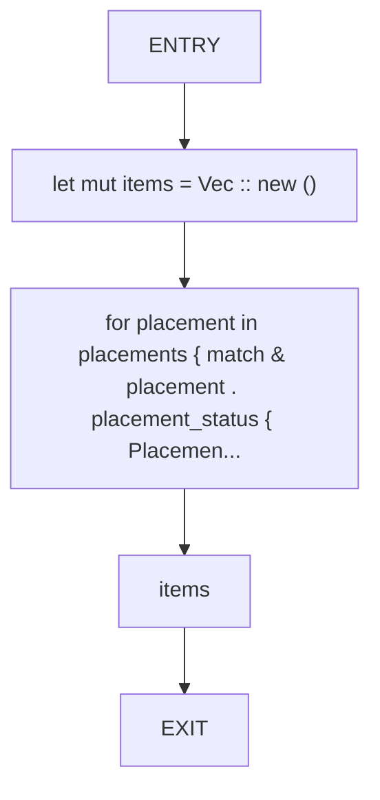
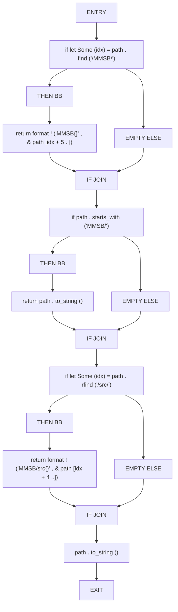
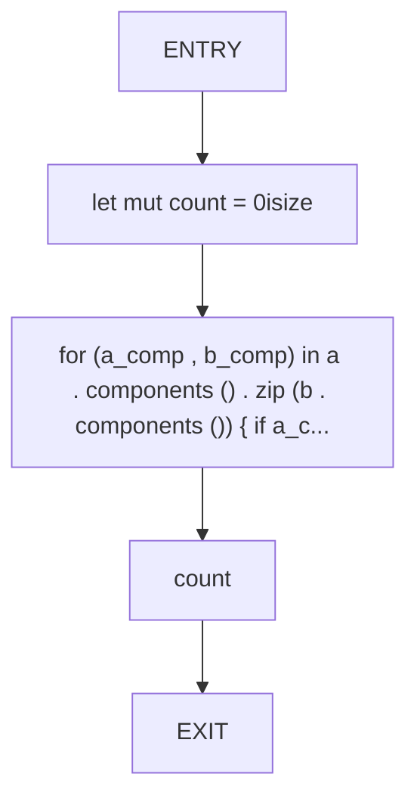
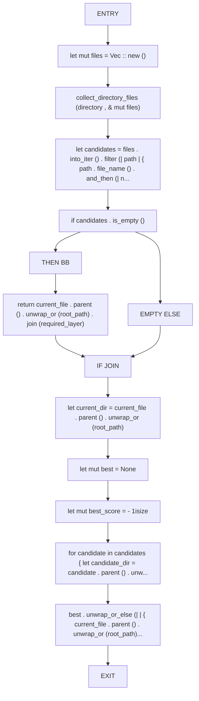
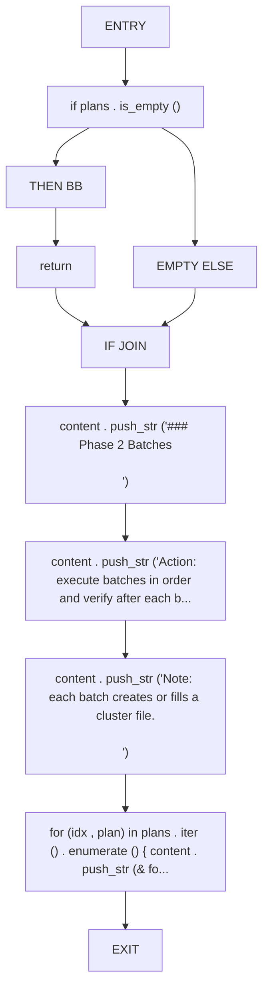
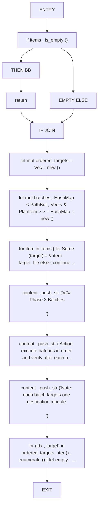

# CFG Group: src/090_utilities.rs

## Function: `collect_directory_files`

- File: src/090_utilities.rs
- Branches: 0
- Loops: 0
- Nodes: 4
- Edges: 3

## Function: `collect_move_items`

- File: src/090_utilities.rs
- Branches: 0
- Loops: 0
- Nodes: 5
- Edges: 4

## Function: `compress_path`

- File: src/090_utilities.rs
- Branches: 3
- Loops: 0
- Nodes: 18
- Edges: 20

## Function: `compute_move_metrics`

- File: src/090_utilities.rs
- Branches: 0
- Loops: 0
- Nodes: 13
- Edges: 12

```mermaid
flowchart TD
    compute_move_metrics_0["ENTRY"]
    compute_move_metrics_1["let incoming_calls = placement . call_analysis . calls_from_other_files . iter () . map (| (_ , co..."]
    compute_move_metrics_2["let callers = placement . call_analysis . calls_from_other_files . len ()"]
    compute_move_metrics_3["let mut touched = BTreeSet :: new ()"]
    compute_move_metrics_4["touched . insert (placement . current_file . clone ())"]
    compute_move_metrics_5["let mut outgoing_files = Vec :: new ()"]
    compute_move_metrics_6["for (path , _) in & placement . call_analysis . inter_file_calls { touched . ..."]
    compute_move_metrics_7["let mut caller_files = Vec :: new ()"]
    compute_move_metrics_8["for (path , _) in & placement . call_analysis . calls_from_other_files { touc..."]
    compute_move_metrics_9["let cost = touched . len () . max (1)"]
    compute_move_metrics_10["let benefit = 1 + callers"]
    compute_move_metrics_11["(incoming_calls , benefit , cost , callers , caller_files , outgoing_files)"]
    compute_move_metrics_12["EXIT"]
    compute_move_metrics_0 --> compute_move_metrics_1
    compute_move_metrics_1 --> compute_move_metrics_2
    compute_move_metrics_2 --> compute_move_metrics_3
    compute_move_metrics_3 --> compute_move_metrics_4
    compute_move_metrics_4 --> compute_move_metrics_5
    compute_move_metrics_5 --> compute_move_metrics_6
    compute_move_metrics_6 --> compute_move_metrics_7
    compute_move_metrics_7 --> compute_move_metrics_8
    compute_move_metrics_8 --> compute_move_metrics_9
    compute_move_metrics_9 --> compute_move_metrics_10
    compute_move_metrics_10 --> compute_move_metrics_11
    compute_move_metrics_11 --> compute_move_metrics_12
```

## Function: `path_common_prefix_len`

- File: src/090_utilities.rs
- Branches: 0
- Loops: 0
- Nodes: 5
- Edges: 4

## Function: `resolve_required_layer_path`

- File: src/090_utilities.rs
- Branches: 1
- Loops: 0
- Nodes: 15
- Edges: 15

## Function: `write_cluster_batches`

- File: src/090_utilities.rs
- Branches: 1
- Loops: 0
- Nodes: 11
- Edges: 11

## Function: `write_structural_batches`

- File: src/090_utilities.rs
- Branches: 1
- Loops: 0
- Nodes: 14
- Edges: 14

