# CFG Group: src/211_dead_code_attribute_parser.rs

## Function: `collect_latent_attrs`

- File: src/211_dead_code_attribute_parser.rs
- Branches: 0
- Loops: 0
- Nodes: 5
- Edges: 4

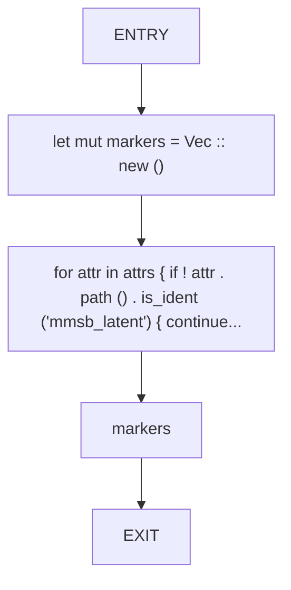

## Function: `detect_intent_signals`

- File: src/211_dead_code_attribute_parser.rs
- Branches: 0
- Loops: 0
- Nodes: 7
- Edges: 6

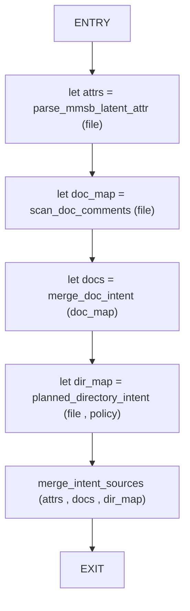

## Function: `detect_test_modules`

- File: src/211_dead_code_attribute_parser.rs
- Branches: 0
- Loops: 0
- Nodes: 7
- Edges: 6

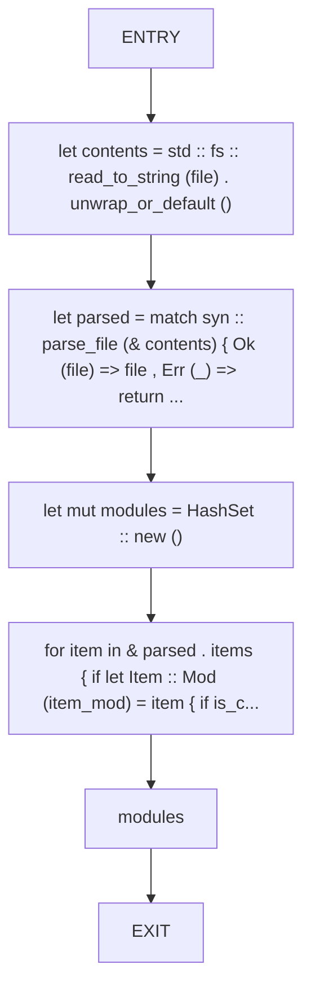

## Function: `detect_test_symbols`

- File: src/211_dead_code_attribute_parser.rs
- Branches: 0
- Loops: 0
- Nodes: 7
- Edges: 6

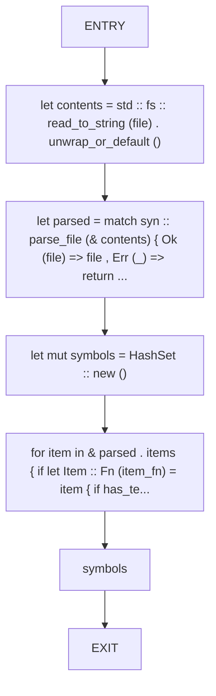

## Function: `extract_attribute_value`

- File: src/211_dead_code_attribute_parser.rs
- Branches: 0
- Loops: 0
- Nodes: 5
- Edges: 4

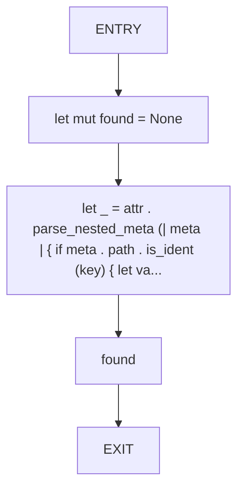

## Function: `is_cfg_test_item`

- File: src/211_dead_code_attribute_parser.rs
- Branches: 0
- Loops: 0
- Nodes: 3
- Edges: 2

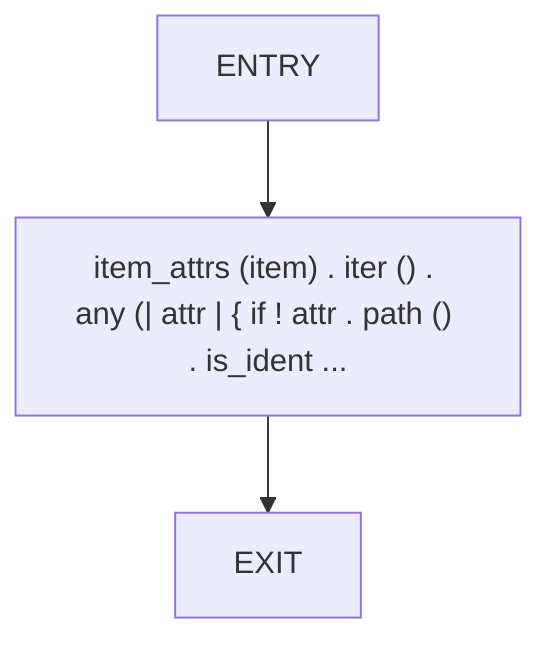

## Function: `marker_from_str`

- File: src/211_dead_code_attribute_parser.rs
- Branches: 0
- Loops: 0
- Nodes: 3
- Edges: 2

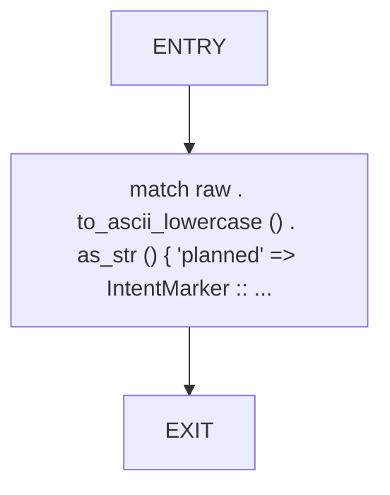

## Function: `parse_mmsb_latent_attr`

- File: src/211_dead_code_attribute_parser.rs
- Branches: 0
- Loops: 0
- Nodes: 7
- Edges: 6

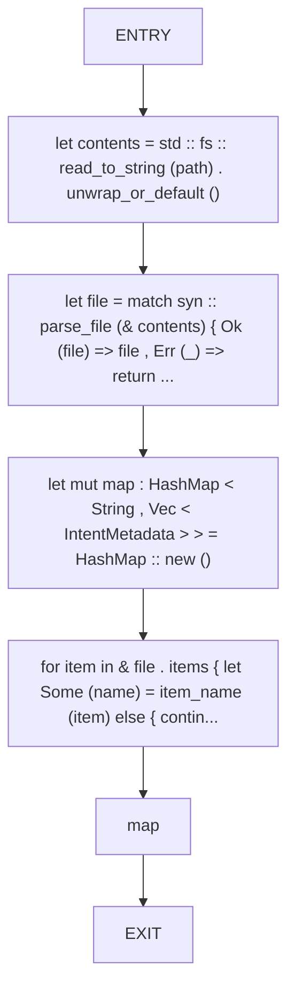

## Function: `scan_doc_comments`

- File: src/211_dead_code_attribute_parser.rs
- Branches: 0
- Loops: 0
- Nodes: 7
- Edges: 6

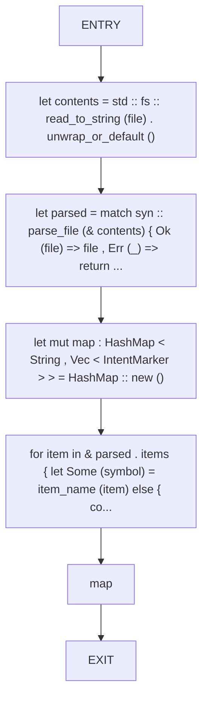

## Function: `scan_file_attributes`

- File: src/211_dead_code_attribute_parser.rs
- Branches: 0
- Loops: 0
- Nodes: 7
- Edges: 6

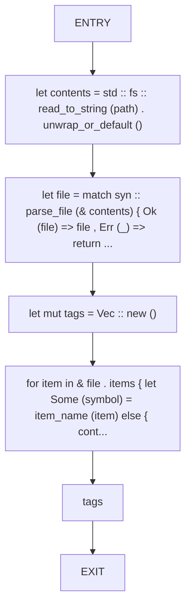

## Function: `scan_intent_tags`

- File: src/211_dead_code_attribute_parser.rs
- Branches: 1
- Loops: 0
- Nodes: 13
- Edges: 13

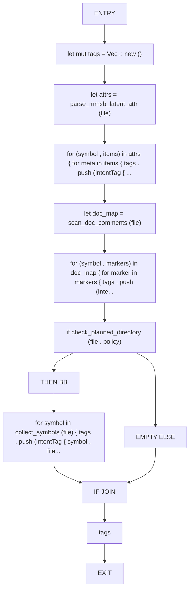

