# CFG Group: src/230_cohesion_analyzer.rs

## Function: `build_call_analysis`

- File: src/230_cohesion_analyzer.rs
- Branches: 0
- Loops: 0
- Nodes: 10
- Edges: 9

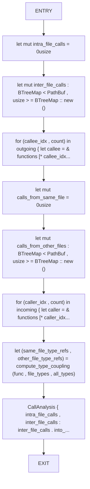

## Function: `build_call_edges`

- File: src/230_cohesion_analyzer.rs
- Branches: 0
- Loops: 0
- Nodes: 8
- Edges: 7

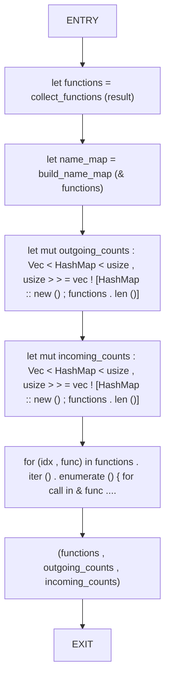

## Function: `build_function_layers`

- File: src/230_cohesion_analyzer.rs
- Branches: 0
- Loops: 0
- Nodes: 5
- Edges: 4

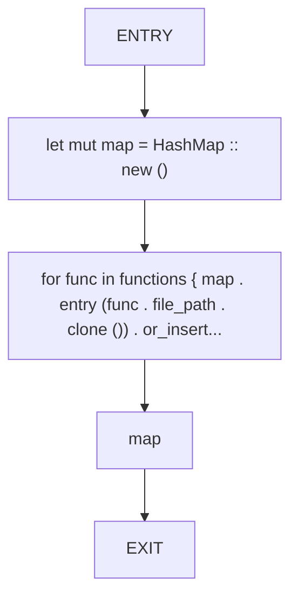

## Function: `build_name_map`

- File: src/230_cohesion_analyzer.rs
- Branches: 0
- Loops: 0
- Nodes: 5
- Edges: 4

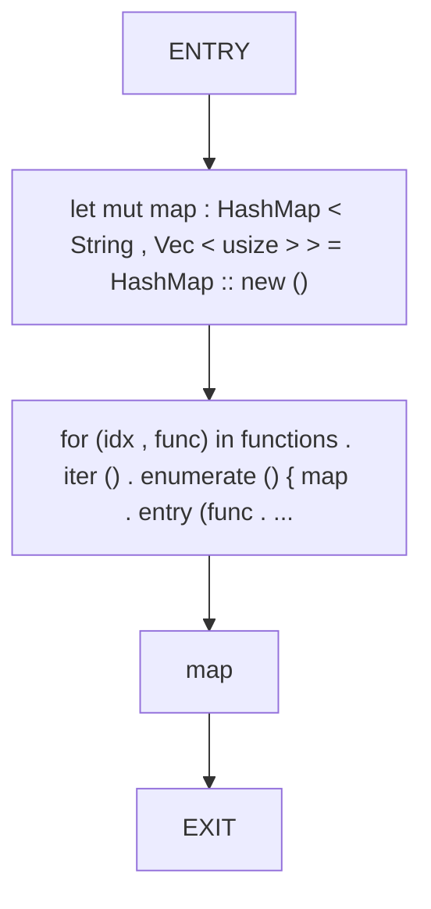

## Function: `build_type_maps`

- File: src/230_cohesion_analyzer.rs
- Branches: 0
- Loops: 0
- Nodes: 6
- Edges: 5

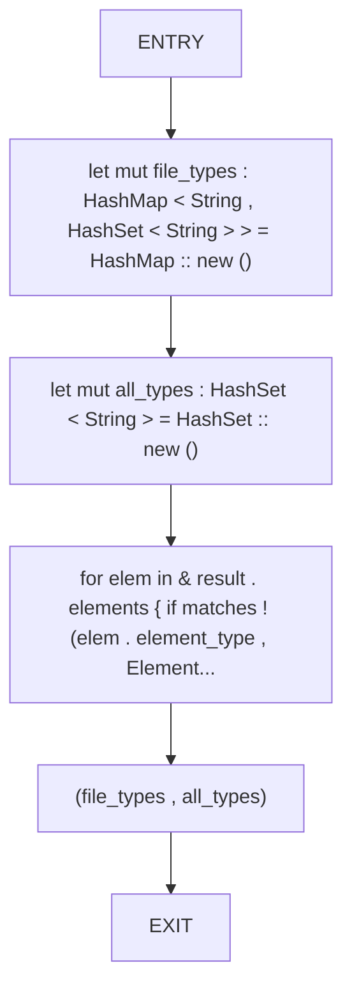

## Function: `build_undirected_graph`

- File: src/230_cohesion_analyzer.rs
- Branches: 0
- Loops: 0
- Nodes: 10
- Edges: 9

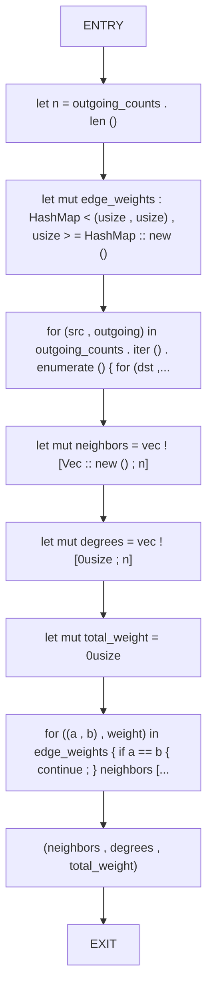

## Function: `collect_functions`

- File: src/230_cohesion_analyzer.rs
- Branches: 0
- Loops: 0
- Nodes: 3
- Edges: 2

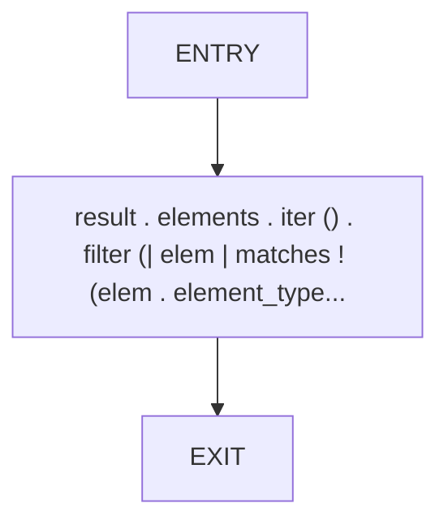

## Function: `compute_cluster_cohesion`

- File: src/230_cohesion_analyzer.rs
- Branches: 1
- Loops: 0
- Nodes: 12
- Edges: 12

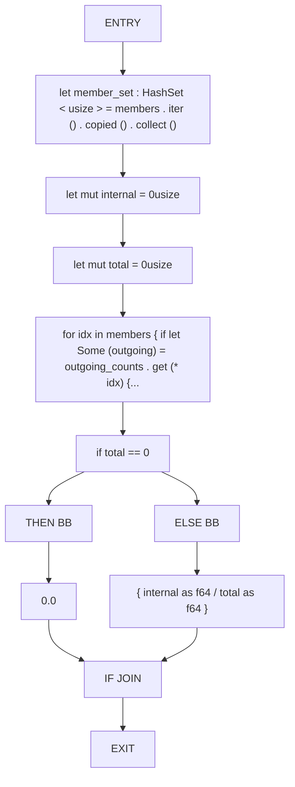

## Function: `compute_type_coupling`

- File: src/230_cohesion_analyzer.rs
- Branches: 0
- Loops: 0
- Nodes: 8
- Edges: 7

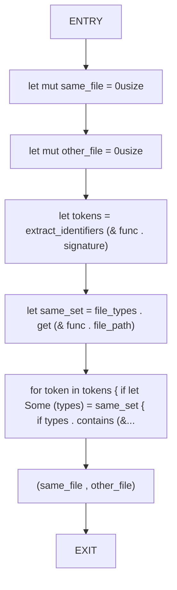

## Function: `determine_status`

- File: src/230_cohesion_analyzer.rs
- Branches: 4
- Loops: 0
- Nodes: 26
- Edges: 29

```mermaid
flowchart TD
    determine_status_0["ENTRY"]
    determine_status_1["let total_activity = call_analysis . intra_file_calls + call_analysis . calls_from_same_file"]
    determine_status_2["let external_activity : usize = call_analysis . calls_from_other_files . iter () . map (| (_ , count) | * cou..."]
    determine_status_3["if total_activity == 0 && external_activity == 0"]
    determine_status_4["THEN BB"]
    determine_status_5["return PlacementStatus :: Orphaned { suggested_module : 'utilities' . to_stri..."]
    determine_status_6["EMPTY ELSE"]
    determine_status_7["IF JOIN"]
    determine_status_8["if let Some ((current_layer , required_layer)) = layer_violation"]
    determine_status_9["THEN BB"]
    determine_status_10["return PlacementStatus :: LayerViolation { current_layer , required_layer , }"]
    determine_status_11["EMPTY ELSE"]
    determine_status_12["IF JOIN"]
    determine_status_13["if cohesion_score >= threshold"]
    determine_status_14["THEN BB"]
    determine_status_15["return PlacementStatus :: Correct"]
    determine_status_16["EMPTY ELSE"]
    determine_status_17["IF JOIN"]
    determine_status_18["let mut impact = threshold - cohesion_score"]
    determine_status_19["if impact < 0.0"]
    determine_status_20["THEN BB"]
    determine_status_21["impact = 0.0"]
    determine_status_22["EMPTY ELSE"]
    determine_status_23["IF JOIN"]
    determine_status_24["PlacementStatus :: ShouldMove { reason : format ! ('cohesion {:.2} below thre..."]
    determine_status_25["EXIT"]
    determine_status_0 --> determine_status_1
    determine_status_1 --> determine_status_2
    determine_status_2 --> determine_status_3
    determine_status_3 --> determine_status_4
    determine_status_4 --> determine_status_5
    determine_status_3 --> determine_status_6
    determine_status_5 --> determine_status_7
    determine_status_6 --> determine_status_7
    determine_status_7 --> determine_status_8
    determine_status_8 --> determine_status_9
    determine_status_9 --> determine_status_10
    determine_status_8 --> determine_status_11
    determine_status_10 --> determine_status_12
    determine_status_11 --> determine_status_12
    determine_status_12 --> determine_status_13
    determine_status_13 --> determine_status_14
    determine_status_14 --> determine_status_15
    determine_status_13 --> determine_status_16
    determine_status_15 --> determine_status_17
    determine_status_16 --> determine_status_17
    determine_status_17 --> determine_status_18
    determine_status_18 --> determine_status_19
    determine_status_19 --> determine_status_20
    determine_status_20 --> determine_status_21
    determine_status_19 --> determine_status_22
    determine_status_21 --> determine_status_23
    determine_status_22 --> determine_status_23
    determine_status_23 --> determine_status_24
    determine_status_24 --> determine_status_25
```

## Function: `extract_identifiers`

- File: src/230_cohesion_analyzer.rs
- Branches: 1
- Loops: 0
- Nodes: 11
- Edges: 11

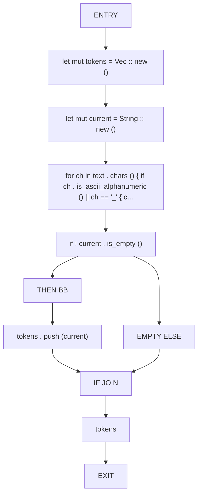

## Function: `louvain_communities`

- File: src/230_cohesion_analyzer.rs
- Branches: 2
- Loops: 0
- Nodes: 20
- Edges: 21

```mermaid
flowchart TD
    louvain_communities_0["ENTRY"]
    louvain_communities_1["let n = outgoing_counts . len ()"]
    louvain_communities_2["if n == 0"]
    louvain_communities_3["THEN BB"]
    louvain_communities_4["return Vec :: new ()"]
    louvain_communities_5["EMPTY ELSE"]
    louvain_communities_6["IF JOIN"]
    louvain_communities_7["let (neighbors , degrees , total_weight) = build_undirected_graph (outgoing_counts)"]
    louvain_communities_8["if total_weight == 0"]
    louvain_communities_9["THEN BB"]
    louvain_communities_10["return (0 .. n) . collect ()"]
    louvain_communities_11["EMPTY ELSE"]
    louvain_communities_12["IF JOIN"]
    louvain_communities_13["let two_m = (2 * total_weight) as f64"]
    louvain_communities_14["let mut community : Vec < usize > = (0 .. n) . collect ()"]
    louvain_communities_15["let mut sum_tot = degrees . clone ()"]
    louvain_communities_16["let max_iters = 25"]
    louvain_communities_17["for iter in 0 .. max_iters { let mut moved = false ; for node in 0 .. n { let..."]
    louvain_communities_18["community"]
    louvain_communities_19["EXIT"]
    louvain_communities_0 --> louvain_communities_1
    louvain_communities_1 --> louvain_communities_2
    louvain_communities_2 --> louvain_communities_3
    louvain_communities_3 --> louvain_communities_4
    louvain_communities_2 --> louvain_communities_5
    louvain_communities_4 --> louvain_communities_6
    louvain_communities_5 --> louvain_communities_6
    louvain_communities_6 --> louvain_communities_7
    louvain_communities_7 --> louvain_communities_8
    louvain_communities_8 --> louvain_communities_9
    louvain_communities_9 --> louvain_communities_10
    louvain_communities_8 --> louvain_communities_11
    louvain_communities_10 --> louvain_communities_12
    louvain_communities_11 --> louvain_communities_12
    louvain_communities_12 --> louvain_communities_13
    louvain_communities_13 --> louvain_communities_14
    louvain_communities_14 --> louvain_communities_15
    louvain_communities_15 --> louvain_communities_16
    louvain_communities_16 --> louvain_communities_17
    louvain_communities_17 --> louvain_communities_18
    louvain_communities_18 --> louvain_communities_19
```

## Function: `suggest_cluster_file`

- File: src/230_cohesion_analyzer.rs
- Branches: 0
- Loops: 0
- Nodes: 5
- Edges: 4

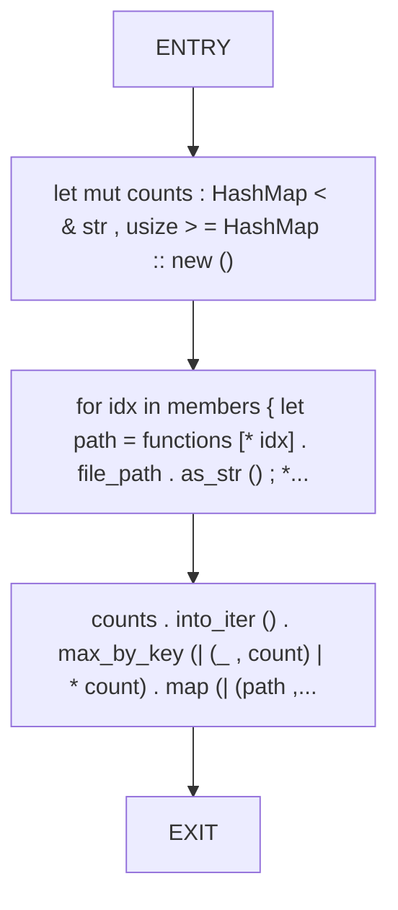

## Function: `suggest_file`

- File: src/230_cohesion_analyzer.rs
- Branches: 3
- Loops: 0
- Nodes: 21
- Edges: 23

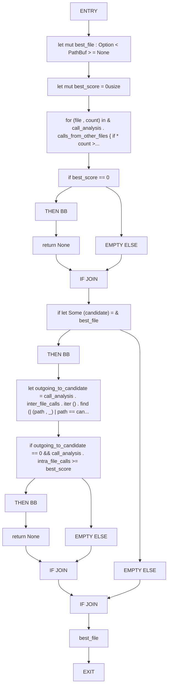

