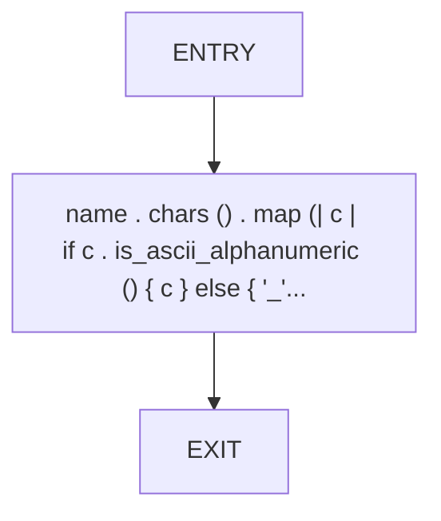

# CFG Group: src/130_control_flow.rs

## Function: `sanitize_identifier`

- File: src/130_control_flow.rs
- Branches: 0
- Loops: 0
- Nodes: 3
- Edges: 2

```mermaid
flowchart TD
    sanitize_identifier_0["ENTRY"]
    sanitize_identifier_1["name . chars () . map (| c | if c . is_ascii_alphanumeric () { c } else { '_'..."]
    sanitize_identifier_2["EXIT"]
    sanitize_identifier_0 --> sanitize_identifier_1
    sanitize_identifier_1 --> sanitize_identifier_2
```

