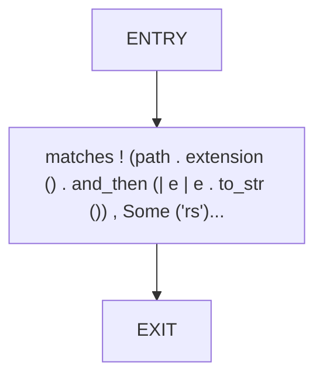
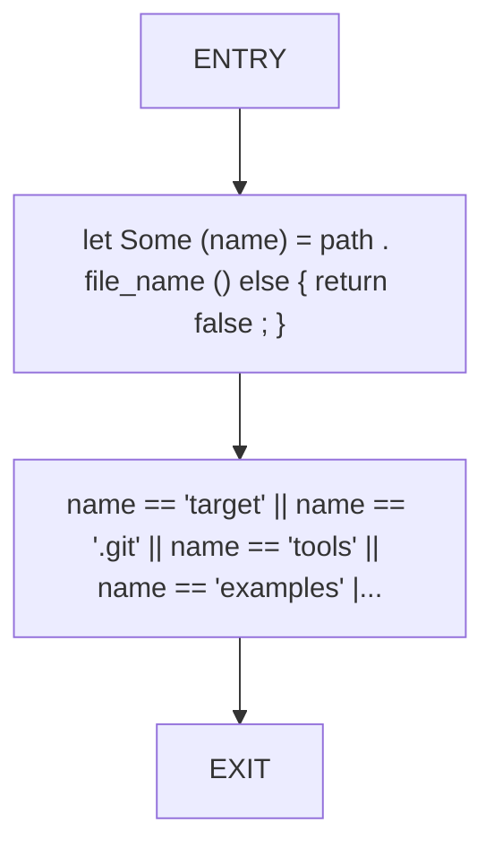

# CFG Group: src/240_directory_analyzer.rs

## Function: `is_source_file`

- File: src/240_directory_analyzer.rs
- Branches: 0
- Loops: 0
- Nodes: 3
- Edges: 2

## Function: `should_skip_path`

- File: src/240_directory_analyzer.rs
- Branches: 0
- Loops: 0
- Nodes: 4
- Edges: 3

