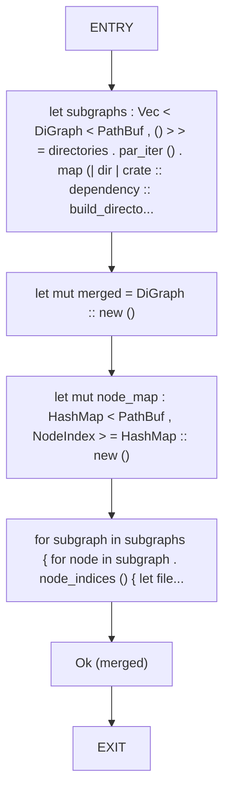

# CFG Group: src/140_file_ordering.rs

## Function: `parallel_build_file_dag`

- File: src/140_file_ordering.rs
- Branches: 0
- Loops: 0
- Nodes: 7
- Edges: 6

```mermaid
flowchart TD
    parallel_build_file_dag_0["ENTRY"]
    parallel_build_file_dag_1["let subgraphs : Vec < DiGraph < PathBuf , () > > = directories . par_iter () . map (| dir | crate :: dependency :: build_directo..."]
    parallel_build_file_dag_2["let mut merged = DiGraph :: new ()"]
    parallel_build_file_dag_3["let mut node_map : HashMap < PathBuf , NodeIndex > = HashMap :: new ()"]
    parallel_build_file_dag_4["for subgraph in subgraphs { for node in subgraph . node_indices () { let file..."]
    parallel_build_file_dag_5["Ok (merged)"]
    parallel_build_file_dag_6["EXIT"]
    parallel_build_file_dag_0 --> parallel_build_file_dag_1
    parallel_build_file_dag_1 --> parallel_build_file_dag_2
    parallel_build_file_dag_2 --> parallel_build_file_dag_3
    parallel_build_file_dag_3 --> parallel_build_file_dag_4
    parallel_build_file_dag_4 --> parallel_build_file_dag_5
    parallel_build_file_dag_5 --> parallel_build_file_dag_6
```

