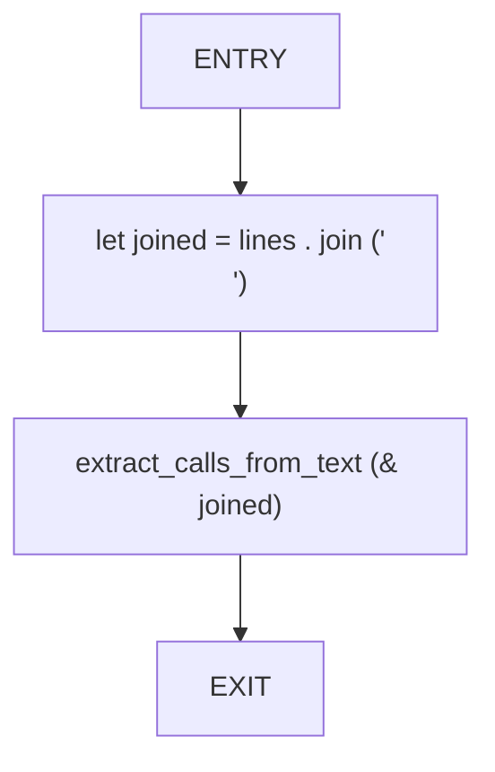
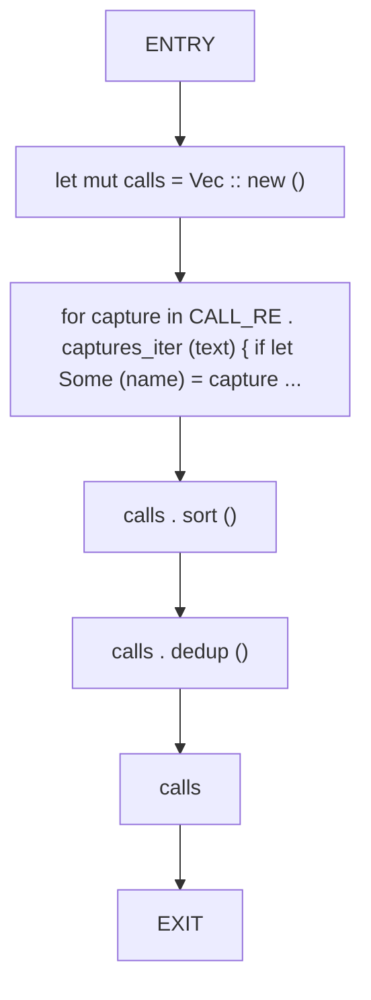
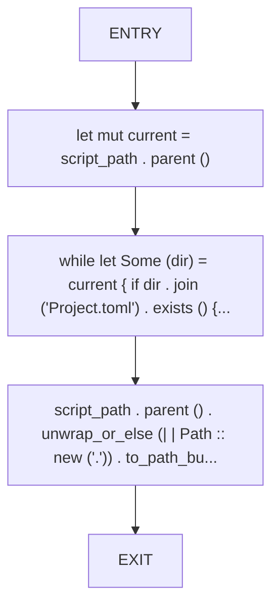
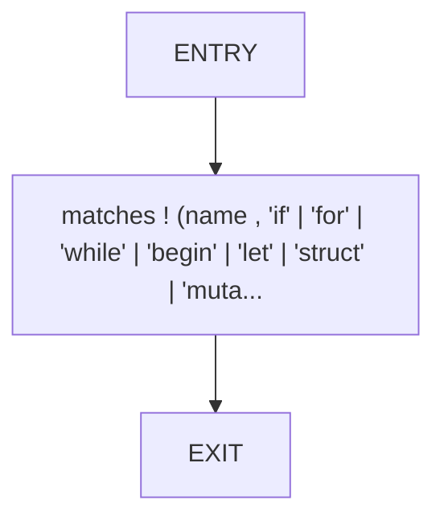
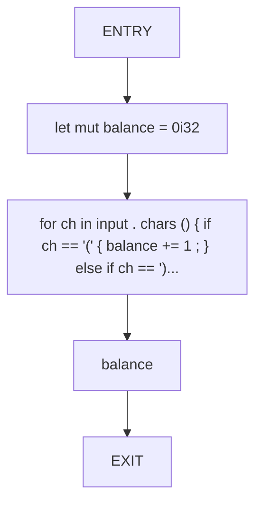
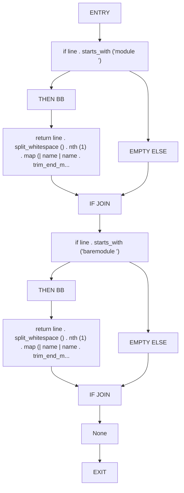
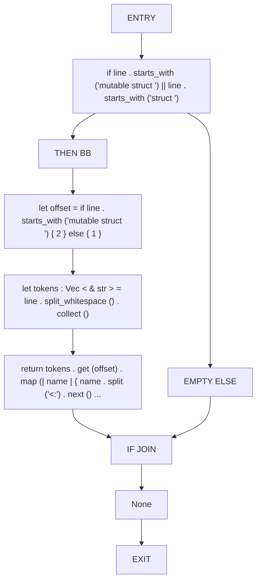
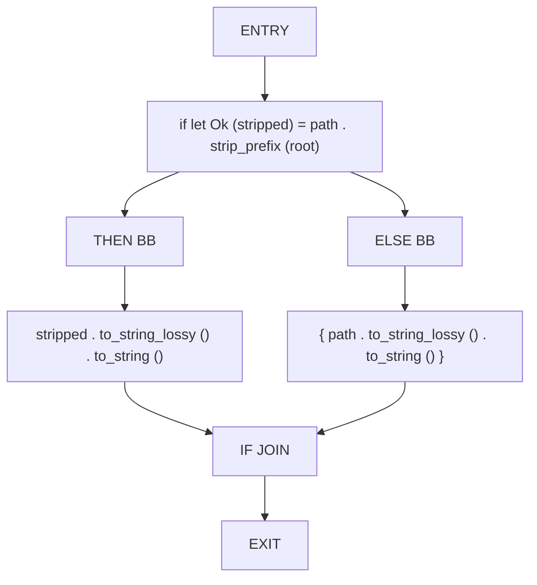
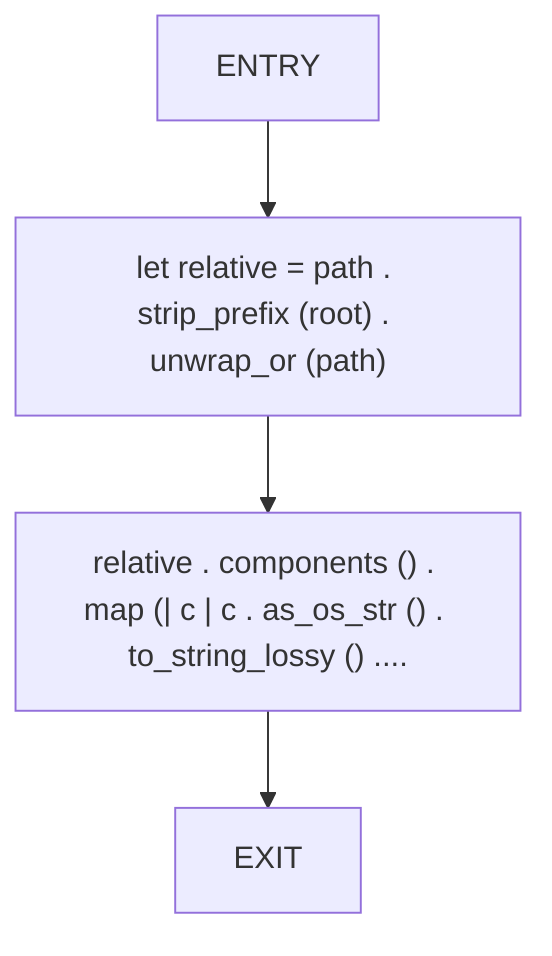

# CFG Group: src/150_julia_parser.rs

## Function: `extract_calls_from_lines`

- File: src/150_julia_parser.rs
- Branches: 0
- Loops: 0
- Nodes: 4
- Edges: 3

## Function: `extract_calls_from_text`

- File: src/150_julia_parser.rs
- Branches: 0
- Loops: 0
- Nodes: 7
- Edges: 6

## Function: `find_julia_project_dir`

- File: src/150_julia_parser.rs
- Branches: 0
- Loops: 0
- Nodes: 5
- Edges: 4

## Function: `is_reserved`

- File: src/150_julia_parser.rs
- Branches: 0
- Loops: 0
- Nodes: 3
- Edges: 2

## Function: `paren_balance`

- File: src/150_julia_parser.rs
- Branches: 0
- Loops: 0
- Nodes: 5
- Edges: 4

## Function: `parse_module_name`

- File: src/150_julia_parser.rs
- Branches: 2
- Loops: 0
- Nodes: 13
- Edges: 14

## Function: `parse_struct_name`

- File: src/150_julia_parser.rs
- Branches: 1
- Loops: 0
- Nodes: 10
- Edges: 10

## Function: `relativize_path`

- File: src/150_julia_parser.rs
- Branches: 1
- Loops: 0
- Nodes: 8
- Edges: 8

## Function: `resolve_julia_binary`

- File: src/150_julia_parser.rs
- Branches: 5
- Loops: 0
- Nodes: 29
- Edges: 33

```mermaid
flowchart TD
    resolve_julia_binary_0["ENTRY"]
    resolve_julia_binary_1["if let Ok (custom) = env :: var ('JULIA_BINARY')"]
    resolve_julia_binary_2["THEN BB"]
    resolve_julia_binary_3["let candidate = PathBuf :: from (custom)"]
    resolve_julia_binary_4["if candidate . exists ()"]
    resolve_julia_binary_5["THEN BB"]
    resolve_julia_binary_6["return candidate"]
    resolve_julia_binary_7["EMPTY ELSE"]
    resolve_julia_binary_8["IF JOIN"]
    resolve_julia_binary_9["EMPTY ELSE"]
    resolve_julia_binary_10["IF JOIN"]
    resolve_julia_binary_11["if let Ok (home) = env :: var ('HOME')"]
    resolve_julia_binary_12["THEN BB"]
    resolve_julia_binary_13["let juliaup_root = Path :: new (& home) . join ('.julia/juliaup')"]
    resolve_julia_binary_14["if let Ok (entries) = fs :: read_dir (& juliaup_root)"]
    resolve_julia_binary_15["THEN BB"]
    resolve_julia_binary_16["for entry in entries . flatten () { let path = entry . path () ; if ! path . ..."]
    resolve_julia_binary_17["EMPTY ELSE"]
    resolve_julia_binary_18["IF JOIN"]
    resolve_julia_binary_19["EMPTY ELSE"]
    resolve_julia_binary_20["IF JOIN"]
    resolve_julia_binary_21["let alt = PathBuf :: from ('/home/cicero-arch-omen/git/julia/usr/bin/julia')"]
    resolve_julia_binary_22["if alt . exists ()"]
    resolve_julia_binary_23["THEN BB"]
    resolve_julia_binary_24["return alt"]
    resolve_julia_binary_25["EMPTY ELSE"]
    resolve_julia_binary_26["IF JOIN"]
    resolve_julia_binary_27["PathBuf :: from ('julia')"]
    resolve_julia_binary_28["EXIT"]
    resolve_julia_binary_0 --> resolve_julia_binary_1
    resolve_julia_binary_1 --> resolve_julia_binary_2
    resolve_julia_binary_2 --> resolve_julia_binary_3
    resolve_julia_binary_3 --> resolve_julia_binary_4
    resolve_julia_binary_4 --> resolve_julia_binary_5
    resolve_julia_binary_5 --> resolve_julia_binary_6
    resolve_julia_binary_4 --> resolve_julia_binary_7
    resolve_julia_binary_6 --> resolve_julia_binary_8
    resolve_julia_binary_7 --> resolve_julia_binary_8
    resolve_julia_binary_1 --> resolve_julia_binary_9
    resolve_julia_binary_8 --> resolve_julia_binary_10
    resolve_julia_binary_9 --> resolve_julia_binary_10
    resolve_julia_binary_10 --> resolve_julia_binary_11
    resolve_julia_binary_11 --> resolve_julia_binary_12
    resolve_julia_binary_12 --> resolve_julia_binary_13
    resolve_julia_binary_13 --> resolve_julia_binary_14
    resolve_julia_binary_14 --> resolve_julia_binary_15
    resolve_julia_binary_15 --> resolve_julia_binary_16
    resolve_julia_binary_14 --> resolve_julia_binary_17
    resolve_julia_binary_16 --> resolve_julia_binary_18
    resolve_julia_binary_17 --> resolve_julia_binary_18
    resolve_julia_binary_11 --> resolve_julia_binary_19
    resolve_julia_binary_18 --> resolve_julia_binary_20
    resolve_julia_binary_19 --> resolve_julia_binary_20
    resolve_julia_binary_20 --> resolve_julia_binary_21
    resolve_julia_binary_21 --> resolve_julia_binary_22
    resolve_julia_binary_22 --> resolve_julia_binary_23
    resolve_julia_binary_23 --> resolve_julia_binary_24
    resolve_julia_binary_22 --> resolve_julia_binary_25
    resolve_julia_binary_24 --> resolve_julia_binary_26
    resolve_julia_binary_25 --> resolve_julia_binary_26
    resolve_julia_binary_26 --> resolve_julia_binary_27
    resolve_julia_binary_27 --> resolve_julia_binary_28
```

## Function: `slugify_relative`

- File: src/150_julia_parser.rs
- Branches: 0
- Loops: 0
- Nodes: 4
- Edges: 3

