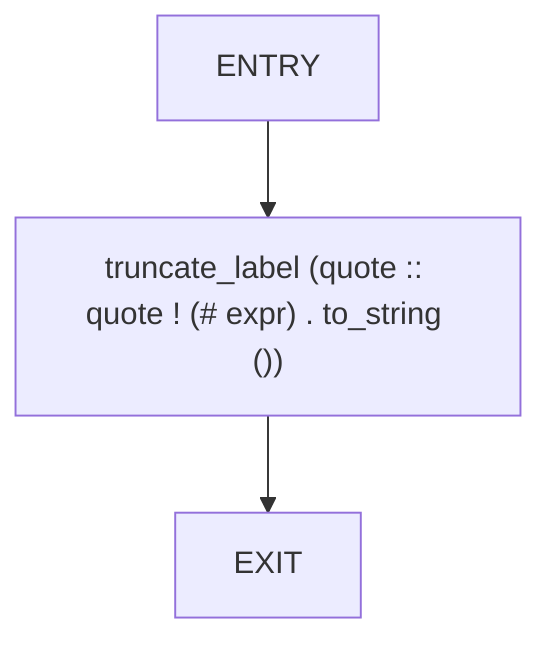
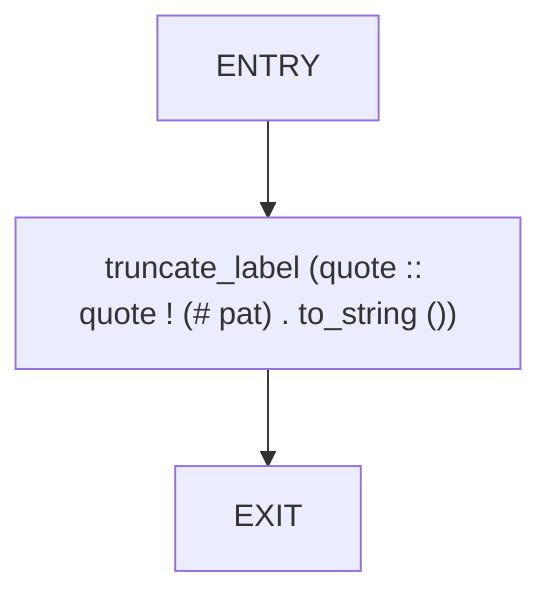
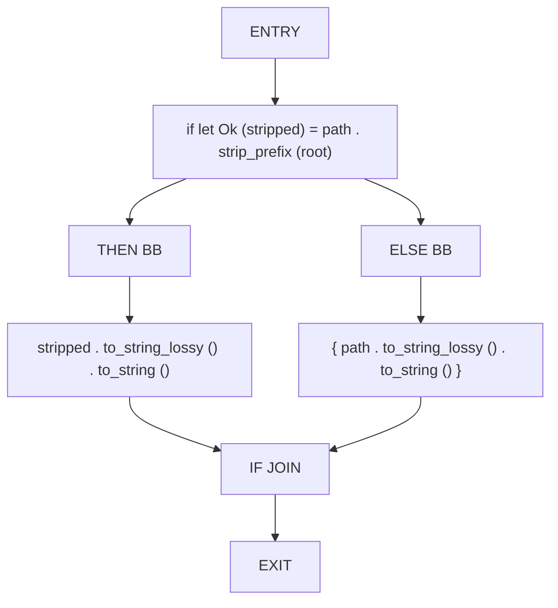
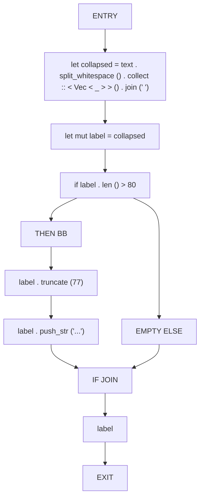

# CFG Group: src/160_rust_parser.rs

## Function: `expr_snippet`

- File: src/160_rust_parser.rs
- Branches: 0
- Loops: 0
- Nodes: 3
- Edges: 2

## Function: `pat_snippet`

- File: src/160_rust_parser.rs
- Branches: 0
- Loops: 0
- Nodes: 3
- Edges: 2

## Function: `relativize_path`

- File: src/160_rust_parser.rs
- Branches: 1
- Loops: 0
- Nodes: 8
- Edges: 8

## Function: `truncate_label`

- File: src/160_rust_parser.rs
- Branches: 1
- Loops: 0
- Nodes: 11
- Edges: 11

