# CFG Group: src/180_report.rs

## Function: `baseline_deltas`

- File: src/180_report.rs
- Branches: 5
- Loops: 0
- Nodes: 32
- Edges: 36

```mermaid
flowchart TD
    baseline_deltas_0["ENTRY"]
    baseline_deltas_1["let mut deltas = Vec :: new ()"]
    baseline_deltas_2["if let Some (prev) = baseline . get ('directory_cohesion')"]
    baseline_deltas_3["THEN BB"]
    baseline_deltas_4["deltas . push (format ! ('directory_cohesion: {:.2} -> {:.2} (delta {:+.2})' ..."]
    baseline_deltas_5["EMPTY ELSE"]
    baseline_deltas_6["IF JOIN"]
    baseline_deltas_7["if let Some (prev) = baseline . get ('ordering_correctness')"]
    baseline_deltas_8["THEN BB"]
    baseline_deltas_9["let current = ordering_correctness * 100.0"]
    baseline_deltas_10["deltas . push (format ! ('ordering_correctness: {:.1}% -> {:.1}% (delta {:+.1..."]
    baseline_deltas_11["EMPTY ELSE"]
    baseline_deltas_12["IF JOIN"]
    baseline_deltas_13["if let Some (prev) = baseline . get ('avg_function_cohesion')"]
    baseline_deltas_14["THEN BB"]
    baseline_deltas_15["deltas . push (format ! ('avg_function_cohesion: {:.2} -> {:.2} (delta {:+.2}..."]
    baseline_deltas_16["EMPTY ELSE"]
    baseline_deltas_17["IF JOIN"]
    baseline_deltas_18["if let Some (prev) = baseline . get ('rename_ops_needed')"]
    baseline_deltas_19["THEN BB"]
    baseline_deltas_20["let current = renames_len as f64"]
    baseline_deltas_21["deltas . push (format ! ('rename_ops_needed: {:.0} -> {} (delta {:+.0})' , pr..."]
    baseline_deltas_22["EMPTY ELSE"]
    baseline_deltas_23["IF JOIN"]
    baseline_deltas_24["if let Some (prev) = baseline . get ('function_relocations')"]
    baseline_deltas_25["THEN BB"]
    baseline_deltas_26["let current = relocations as f64"]
    baseline_deltas_27["deltas . push (format ! ('function_relocations: {:.0} -> {} (delta {:+.0})' ,..."]
    baseline_deltas_28["EMPTY ELSE"]
    baseline_deltas_29["IF JOIN"]
    baseline_deltas_30["deltas"]
    baseline_deltas_31["EXIT"]
    baseline_deltas_0 --> baseline_deltas_1
    baseline_deltas_1 --> baseline_deltas_2
    baseline_deltas_2 --> baseline_deltas_3
    baseline_deltas_3 --> baseline_deltas_4
    baseline_deltas_2 --> baseline_deltas_5
    baseline_deltas_4 --> baseline_deltas_6
    baseline_deltas_5 --> baseline_deltas_6
    baseline_deltas_6 --> baseline_deltas_7
    baseline_deltas_7 --> baseline_deltas_8
    baseline_deltas_8 --> baseline_deltas_9
    baseline_deltas_9 --> baseline_deltas_10
    baseline_deltas_7 --> baseline_deltas_11
    baseline_deltas_10 --> baseline_deltas_12
    baseline_deltas_11 --> baseline_deltas_12
    baseline_deltas_12 --> baseline_deltas_13
    baseline_deltas_13 --> baseline_deltas_14
    baseline_deltas_14 --> baseline_deltas_15
    baseline_deltas_13 --> baseline_deltas_16
    baseline_deltas_15 --> baseline_deltas_17
    baseline_deltas_16 --> baseline_deltas_17
    baseline_deltas_17 --> baseline_deltas_18
    baseline_deltas_18 --> baseline_deltas_19
    baseline_deltas_19 --> baseline_deltas_20
    baseline_deltas_20 --> baseline_deltas_21
    baseline_deltas_18 --> baseline_deltas_22
    baseline_deltas_21 --> baseline_deltas_23
    baseline_deltas_22 --> baseline_deltas_23
    baseline_deltas_23 --> baseline_deltas_24
    baseline_deltas_24 --> baseline_deltas_25
    baseline_deltas_25 --> baseline_deltas_26
    baseline_deltas_26 --> baseline_deltas_27
    baseline_deltas_24 --> baseline_deltas_28
    baseline_deltas_27 --> baseline_deltas_29
    baseline_deltas_28 --> baseline_deltas_29
    baseline_deltas_29 --> baseline_deltas_30
    baseline_deltas_30 --> baseline_deltas_31
```

## Function: `cluster_priority`

- File: src/180_report.rs
- Branches: 3
- Loops: 0
- Nodes: 18
- Edges: 20

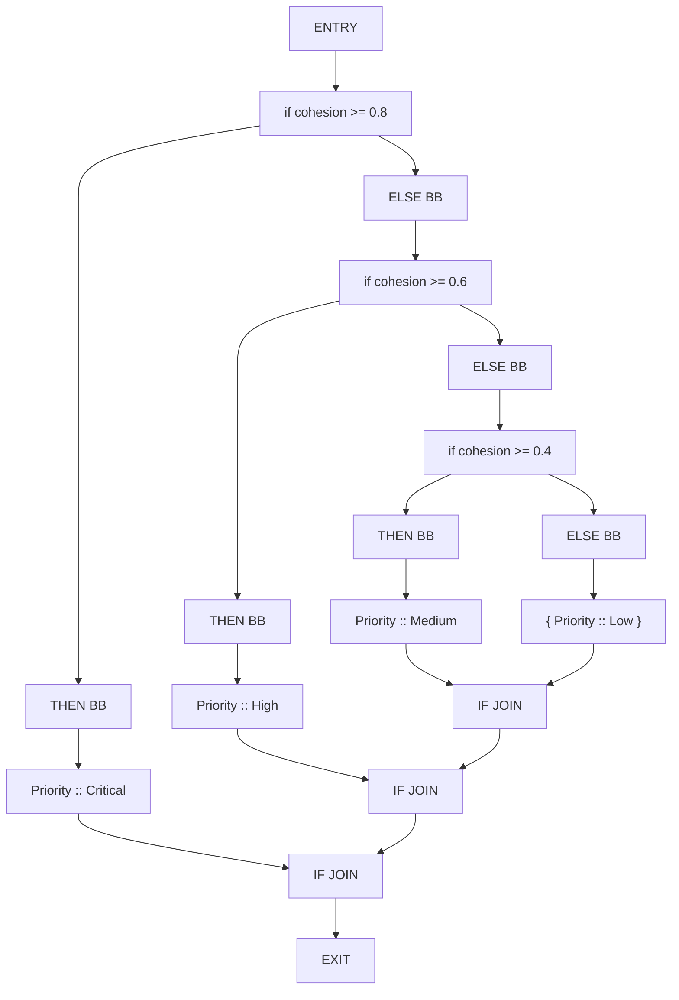

## Function: `collect_cluster_items`

- File: src/180_report.rs
- Branches: 0
- Loops: 0
- Nodes: 3
- Edges: 2

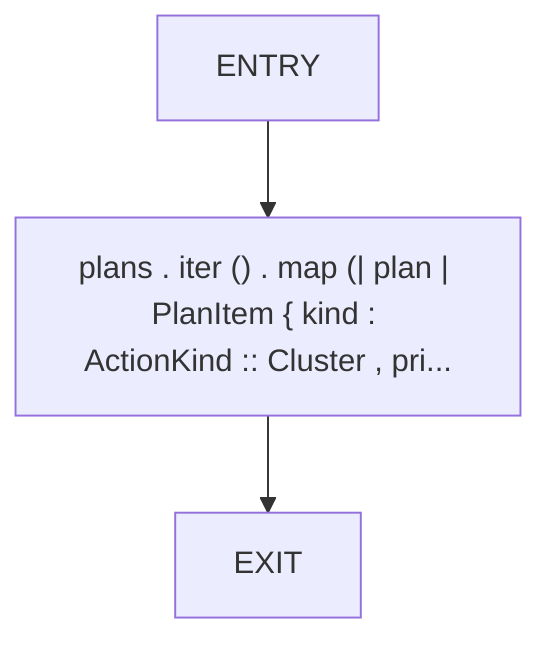

## Function: `collect_directories`

- File: src/180_report.rs
- Branches: 0
- Loops: 0
- Nodes: 4
- Edges: 3

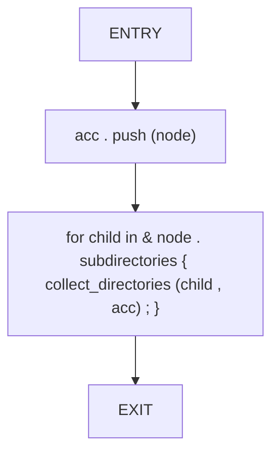

## Function: `collect_rename_items`

- File: src/180_report.rs
- Branches: 0
- Loops: 0
- Nodes: 5
- Edges: 4

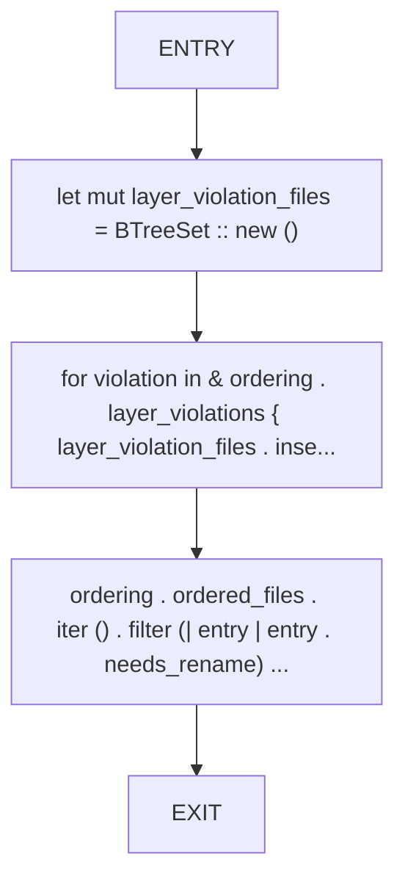

## Function: `collect_size_warnings`

- File: src/180_report.rs
- Branches: 1
- Loops: 0
- Nodes: 9
- Edges: 9

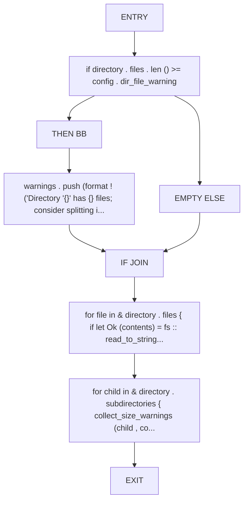

## Function: `collect_symbol_references`

- File: src/180_report.rs
- Branches: 0
- Loops: 0
- Nodes: 6
- Edges: 5

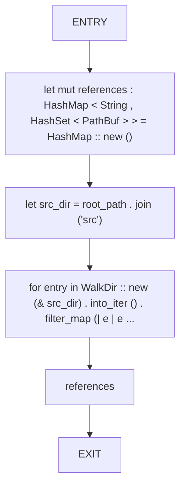

## Function: `collect_utility_candidates`

- File: src/180_report.rs
- Branches: 0
- Loops: 0
- Nodes: 5
- Edges: 4

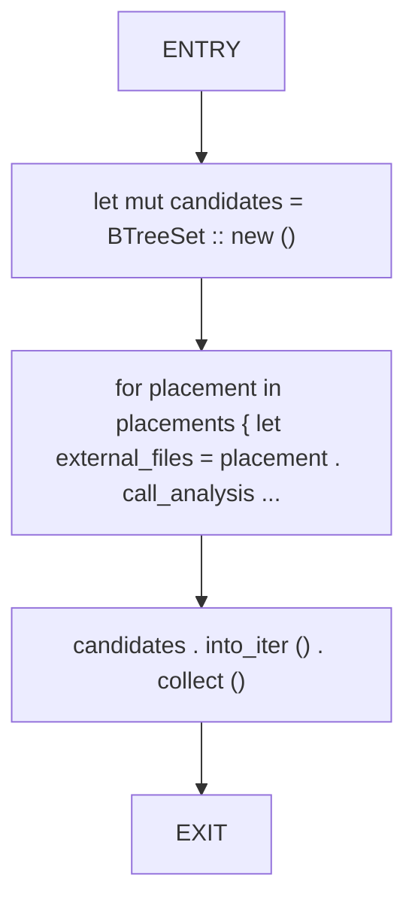

## Function: `compute_directory_cohesion`

- File: src/180_report.rs
- Branches: 1
- Loops: 0
- Nodes: 12
- Edges: 12

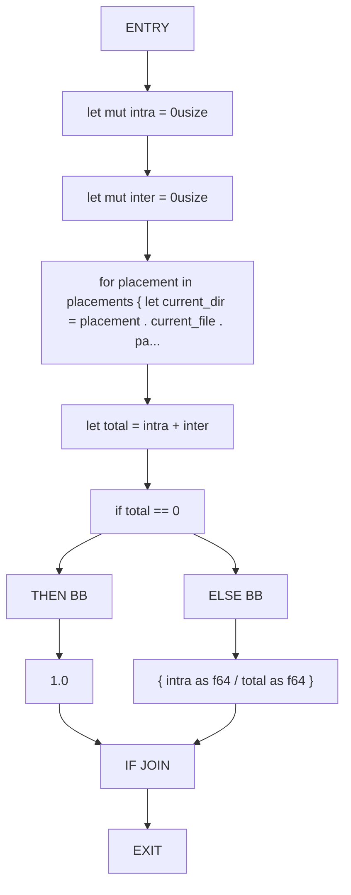

## Function: `compute_ordering_correctness`

- File: src/180_report.rs
- Branches: 1
- Loops: 0
- Nodes: 11
- Edges: 11

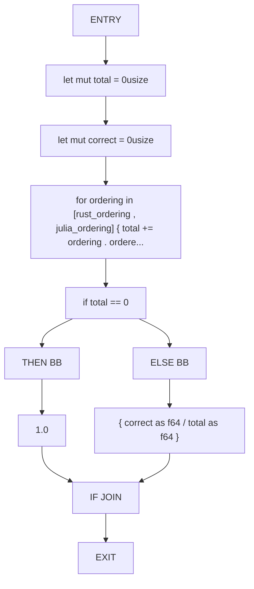

## Function: `directory_moves_to_plan`

- File: src/180_report.rs
- Branches: 0
- Loops: 0
- Nodes: 3
- Edges: 2

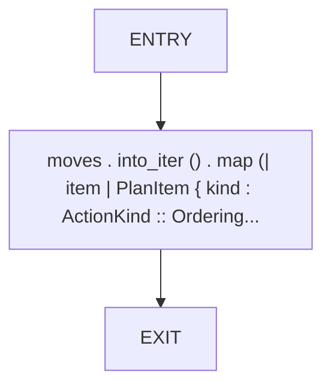

## Function: `display_path`

- File: src/180_report.rs
- Branches: 0
- Loops: 0
- Nodes: 4
- Edges: 3

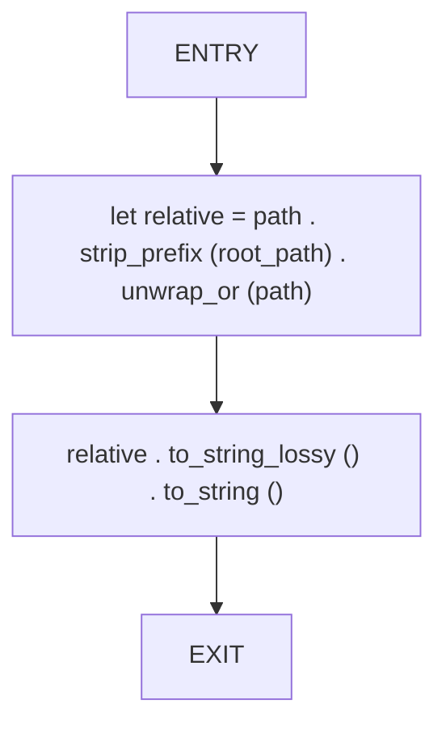

## Function: `filter_orphaned`

- File: src/180_report.rs
- Branches: 0
- Loops: 0
- Nodes: 8
- Edges: 7

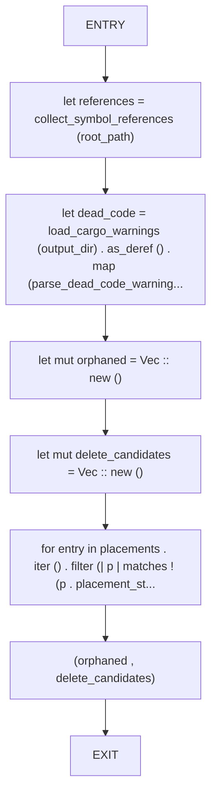

## Function: `function_bucket_label`

- File: src/180_report.rs
- Branches: 0
- Loops: 0
- Nodes: 4
- Edges: 3

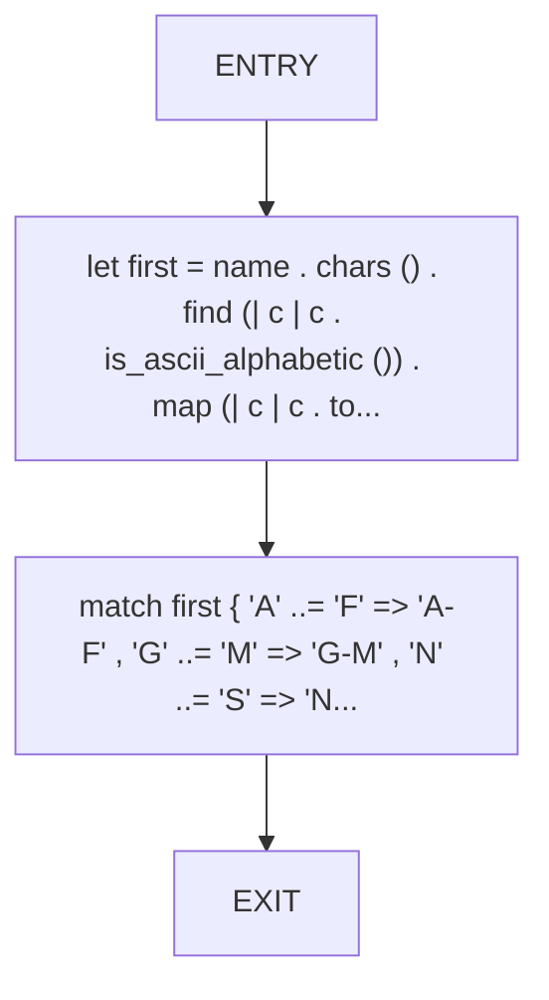

## Function: `group_key_cmp`

- File: src/180_report.rs
- Branches: 0
- Loops: 0
- Nodes: 3
- Edges: 2

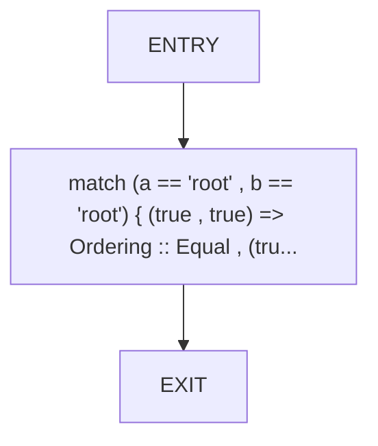

## Function: `is_dead_code_candidate`

- File: src/180_report.rs
- Branches: 1
- Loops: 0
- Nodes: 9
- Edges: 9

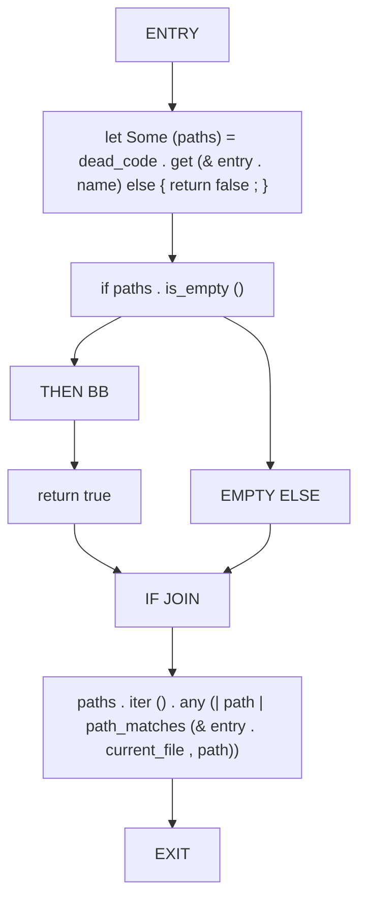

## Function: `is_entrypoint_main`

- File: src/180_report.rs
- Branches: 0
- Loops: 0
- Nodes: 3
- Edges: 2

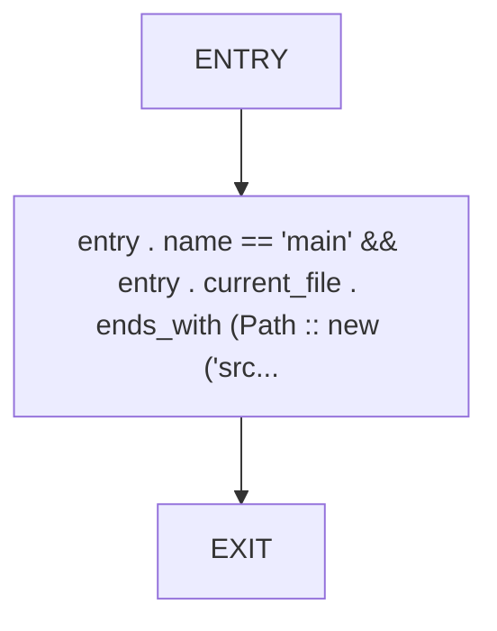

## Function: `is_public_function`

- File: src/180_report.rs
- Branches: 0
- Loops: 0
- Nodes: 6
- Edges: 5

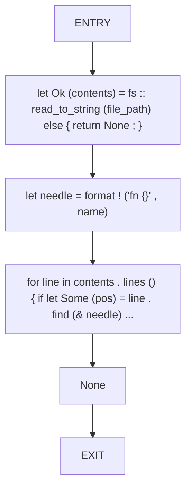

## Function: `language_label`

- File: src/180_report.rs
- Branches: 0
- Loops: 0
- Nodes: 3
- Edges: 2

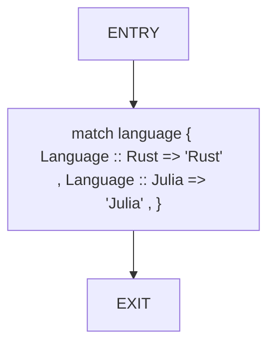

## Function: `load_baseline_metrics`

- File: src/180_report.rs
- Branches: 0
- Loops: 0
- Nodes: 7
- Edges: 6

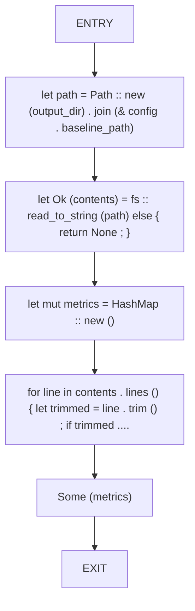

## Function: `load_cargo_warnings`

- File: src/180_report.rs
- Branches: 1
- Loops: 0
- Nodes: 9
- Edges: 9

```mermaid
flowchart TD
    load_cargo_warnings_0["ENTRY"]
    load_cargo_warnings_1["let path = Path :: new (output_dir) . join ('cargo_warnings.txt')"]
    load_cargo_warnings_2["if ! path . exists ()"]
    load_cargo_warnings_3["THEN BB"]
    load_cargo_warnings_4["return None"]
    load_cargo_warnings_5["EMPTY ELSE"]
    load_cargo_warnings_6["IF JOIN"]
    load_cargo_warnings_7["fs :: read_to_string (path) . ok ()"]
    load_cargo_warnings_8["EXIT"]
    load_cargo_warnings_0 --> load_cargo_warnings_1
    load_cargo_warnings_1 --> load_cargo_warnings_2
    load_cargo_warnings_2 --> load_cargo_warnings_3
    load_cargo_warnings_3 --> load_cargo_warnings_4
    load_cargo_warnings_2 --> load_cargo_warnings_5
    load_cargo_warnings_4 --> load_cargo_warnings_6
    load_cargo_warnings_5 --> load_cargo_warnings_6
    load_cargo_warnings_6 --> load_cargo_warnings_7
    load_cargo_warnings_7 --> load_cargo_warnings_8
```

## Function: `load_report_config`

- File: src/180_report.rs
- Branches: 0
- Loops: 0
- Nodes: 7
- Edges: 6

```mermaid
flowchart TD
    load_report_config_0["ENTRY"]
    load_report_config_1["let path = Path :: new (output_dir) . join ('analyzer_config.toml')"]
    load_report_config_2["let mut config = ReportConfig :: defaults ()"]
    load_report_config_3["let Ok (contents) = fs :: read_to_string (path) else { return config ; }"]
    load_report_config_4["for line in contents . lines () { let trimmed = line . trim () ; if trimmed ...."]
    load_report_config_5["config"]
    load_report_config_6["EXIT"]
    load_report_config_0 --> load_report_config_1
    load_report_config_1 --> load_report_config_2
    load_report_config_2 --> load_report_config_3
    load_report_config_3 --> load_report_config_4
    load_report_config_4 --> load_report_config_5
    load_report_config_5 --> load_report_config_6
```

## Function: `normalize_use_stmt`

- File: src/180_report.rs
- Branches: 4
- Loops: 0
- Nodes: 25
- Edges: 28

```mermaid
flowchart TD
    normalize_use_stmt_0["ENTRY"]
    normalize_use_stmt_1["let collapsed = stmt . replace ('\n' , ' ')"]
    normalize_use_stmt_2["let mut cleaned = collapsed . split_whitespace () . collect :: < Vec < _ > > () . join (' ')"]
    normalize_use_stmt_3["if let Some (idx) = cleaned . find (';')"]
    normalize_use_stmt_4["THEN BB"]
    normalize_use_stmt_5["cleaned . truncate (idx)"]
    normalize_use_stmt_6["EMPTY ELSE"]
    normalize_use_stmt_7["IF JOIN"]
    normalize_use_stmt_8["cleaned = cleaned . trim () . to_string ()"]
    normalize_use_stmt_9["if cleaned . starts_with ('pub')"]
    normalize_use_stmt_10["THEN BB"]
    normalize_use_stmt_11["if let Some (pos) = cleaned . find (' ')"]
    normalize_use_stmt_12["THEN BB"]
    normalize_use_stmt_13["cleaned = cleaned [pos + 1 ..] . trim () . to_string ()"]
    normalize_use_stmt_14["EMPTY ELSE"]
    normalize_use_stmt_15["IF JOIN"]
    normalize_use_stmt_16["EMPTY ELSE"]
    normalize_use_stmt_17["IF JOIN"]
    normalize_use_stmt_18["if let Some (stripped) = cleaned . strip_prefix ('use ')"]
    normalize_use_stmt_19["THEN BB"]
    normalize_use_stmt_20["cleaned = stripped . trim () . to_string ()"]
    normalize_use_stmt_21["EMPTY ELSE"]
    normalize_use_stmt_22["IF JOIN"]
    normalize_use_stmt_23["cleaned"]
    normalize_use_stmt_24["EXIT"]
    normalize_use_stmt_0 --> normalize_use_stmt_1
    normalize_use_stmt_1 --> normalize_use_stmt_2
    normalize_use_stmt_2 --> normalize_use_stmt_3
    normalize_use_stmt_3 --> normalize_use_stmt_4
    normalize_use_stmt_4 --> normalize_use_stmt_5
    normalize_use_stmt_3 --> normalize_use_stmt_6
    normalize_use_stmt_5 --> normalize_use_stmt_7
    normalize_use_stmt_6 --> normalize_use_stmt_7
    normalize_use_stmt_7 --> normalize_use_stmt_8
    normalize_use_stmt_8 --> normalize_use_stmt_9
    normalize_use_stmt_9 --> normalize_use_stmt_10
    normalize_use_stmt_10 --> normalize_use_stmt_11
    normalize_use_stmt_11 --> normalize_use_stmt_12
    normalize_use_stmt_12 --> normalize_use_stmt_13
    normalize_use_stmt_11 --> normalize_use_stmt_14
    normalize_use_stmt_13 --> normalize_use_stmt_15
    normalize_use_stmt_14 --> normalize_use_stmt_15
    normalize_use_stmt_9 --> normalize_use_stmt_16
    normalize_use_stmt_15 --> normalize_use_stmt_17
    normalize_use_stmt_16 --> normalize_use_stmt_17
    normalize_use_stmt_17 --> normalize_use_stmt_18
    normalize_use_stmt_18 --> normalize_use_stmt_19
    normalize_use_stmt_19 --> normalize_use_stmt_20
    normalize_use_stmt_18 --> normalize_use_stmt_21
    normalize_use_stmt_20 --> normalize_use_stmt_22
    normalize_use_stmt_21 --> normalize_use_stmt_22
    normalize_use_stmt_22 --> normalize_use_stmt_23
    normalize_use_stmt_23 --> normalize_use_stmt_24
```

## Function: `parse_dead_code_warnings`

- File: src/180_report.rs
- Branches: 0
- Loops: 0
- Nodes: 6
- Edges: 5

```mermaid
flowchart TD
    parse_dead_code_warnings_0["ENTRY"]
    parse_dead_code_warnings_1["let mut dead_code = HashMap :: new ()"]
    parse_dead_code_warnings_2["let mut lines = warnings . lines () . peekable ()"]
    parse_dead_code_warnings_3["while let Some (line) = lines . next () { let trimmed = line . trim () ; if !..."]
    parse_dead_code_warnings_4["dead_code"]
    parse_dead_code_warnings_5["EXIT"]
    parse_dead_code_warnings_0 --> parse_dead_code_warnings_1
    parse_dead_code_warnings_1 --> parse_dead_code_warnings_2
    parse_dead_code_warnings_2 --> parse_dead_code_warnings_3
    parse_dead_code_warnings_3 --> parse_dead_code_warnings_4
    parse_dead_code_warnings_4 --> parse_dead_code_warnings_5
```

## Function: `parse_use_symbols`

- File: src/180_report.rs
- Branches: 2
- Loops: 0
- Nodes: 21
- Edges: 22

```mermaid
flowchart TD
    parse_use_symbols_0["ENTRY"]
    parse_use_symbols_1["let mut symbols = Vec :: new ()"]
    parse_use_symbols_2["let Some (use_idx) = line . find ('use ') else { return symbols ; }"]
    parse_use_symbols_3["let mut clause = line [use_idx + 4 ..] . trim ()"]
    parse_use_symbols_4["if let Some (end_idx) = clause . find (';')"]
    parse_use_symbols_5["THEN BB"]
    parse_use_symbols_6["clause = clause [.. end_idx] . trim ()"]
    parse_use_symbols_7["EMPTY ELSE"]
    parse_use_symbols_8["IF JOIN"]
    parse_use_symbols_9["clause = clause . strip_prefix ('crate::') . unwrap_or (clause)"]
    parse_use_symbols_10["clause = clause . strip_prefix ('self::') . unwrap_or (clause)"]
    parse_use_symbols_11["if let Some (brace_start) = clause . find ('{')"]
    parse_use_symbols_12["THEN BB"]
    parse_use_symbols_13["let brace_end = clause . rfind ('}') . unwrap_or (clause . len ())"]
    parse_use_symbols_14["let inner = & clause [brace_start + 1 .. brace_end]"]
    parse_use_symbols_15["for item in inner . split (',') { let item = item . trim () ; if item . is_em..."]
    parse_use_symbols_16["ELSE BB"]
    parse_use_symbols_17["{ let last = clause . rsplit ('::') . next () . unwrap_or (clause) . trim () ..."]
    parse_use_symbols_18["IF JOIN"]
    parse_use_symbols_19["symbols"]
    parse_use_symbols_20["EXIT"]
    parse_use_symbols_0 --> parse_use_symbols_1
    parse_use_symbols_1 --> parse_use_symbols_2
    parse_use_symbols_2 --> parse_use_symbols_3
    parse_use_symbols_3 --> parse_use_symbols_4
    parse_use_symbols_4 --> parse_use_symbols_5
    parse_use_symbols_5 --> parse_use_symbols_6
    parse_use_symbols_4 --> parse_use_symbols_7
    parse_use_symbols_6 --> parse_use_symbols_8
    parse_use_symbols_7 --> parse_use_symbols_8
    parse_use_symbols_8 --> parse_use_symbols_9
    parse_use_symbols_9 --> parse_use_symbols_10
    parse_use_symbols_10 --> parse_use_symbols_11
    parse_use_symbols_11 --> parse_use_symbols_12
    parse_use_symbols_12 --> parse_use_symbols_13
    parse_use_symbols_13 --> parse_use_symbols_14
    parse_use_symbols_14 --> parse_use_symbols_15
    parse_use_symbols_11 --> parse_use_symbols_16
    parse_use_symbols_16 --> parse_use_symbols_17
    parse_use_symbols_15 --> parse_use_symbols_18
    parse_use_symbols_17 --> parse_use_symbols_18
    parse_use_symbols_18 --> parse_use_symbols_19
    parse_use_symbols_19 --> parse_use_symbols_20
```

## Function: `path_matches`

- File: src/180_report.rs
- Branches: 0
- Loops: 0
- Nodes: 3
- Edges: 2

```mermaid
flowchart TD
    path_matches_0["ENTRY"]
    path_matches_1["entry_path == candidate || entry_path . ends_with (candidate) || candidate . ..."]
    path_matches_2["EXIT"]
    path_matches_0 --> path_matches_1
    path_matches_1 --> path_matches_2
```

## Function: `placement_status_label`

- File: src/180_report.rs
- Branches: 0
- Loops: 0
- Nodes: 3
- Edges: 2

```mermaid
flowchart TD
    placement_status_label_0["ENTRY"]
    placement_status_label_1["match status { PlacementStatus :: Correct => 'ok' . to_string () , PlacementS..."]
    placement_status_label_2["EXIT"]
    placement_status_label_0 --> placement_status_label_1
    placement_status_label_1 --> placement_status_label_2
```

## Function: `placement_status_notes`

- File: src/180_report.rs
- Branches: 0
- Loops: 0
- Nodes: 3
- Edges: 2

```mermaid
flowchart TD
    placement_status_notes_0["ENTRY"]
    placement_status_notes_1["match status { PlacementStatus :: Correct => String :: new () , PlacementStat..."]
    placement_status_notes_2["EXIT"]
    placement_status_notes_0 --> placement_status_notes_1
    placement_status_notes_1 --> placement_status_notes_2
```

## Function: `prefix_key_from_path`

- File: src/180_report.rs
- Branches: 3
- Loops: 0
- Nodes: 20
- Edges: 22

```mermaid
flowchart TD
    prefix_key_from_path_0["ENTRY"]
    prefix_key_from_path_1["let relative = path . strip_prefix ('MMSB/') . unwrap_or (path)"]
    prefix_key_from_path_2["if relative . is_empty ()"]
    prefix_key_from_path_3["THEN BB"]
    prefix_key_from_path_4["return 'root' . to_string ()"]
    prefix_key_from_path_5["EMPTY ELSE"]
    prefix_key_from_path_6["IF JOIN"]
    prefix_key_from_path_7["let parts : Vec < & str > = relative . split ('/') . collect ()"]
    prefix_key_from_path_8["if parts . len () == 1"]
    prefix_key_from_path_9["THEN BB"]
    prefix_key_from_path_10["return 'root' . to_string ()"]
    prefix_key_from_path_11["EMPTY ELSE"]
    prefix_key_from_path_12["IF JOIN"]
    prefix_key_from_path_13["if parts [0] == 'src' && parts . len () >= 2"]
    prefix_key_from_path_14["THEN BB"]
    prefix_key_from_path_15["return format ! ('{}/{}' , parts [0] , parts [1])"]
    prefix_key_from_path_16["EMPTY ELSE"]
    prefix_key_from_path_17["IF JOIN"]
    prefix_key_from_path_18["parts [0] . to_string ()"]
    prefix_key_from_path_19["EXIT"]
    prefix_key_from_path_0 --> prefix_key_from_path_1
    prefix_key_from_path_1 --> prefix_key_from_path_2
    prefix_key_from_path_2 --> prefix_key_from_path_3
    prefix_key_from_path_3 --> prefix_key_from_path_4
    prefix_key_from_path_2 --> prefix_key_from_path_5
    prefix_key_from_path_4 --> prefix_key_from_path_6
    prefix_key_from_path_5 --> prefix_key_from_path_6
    prefix_key_from_path_6 --> prefix_key_from_path_7
    prefix_key_from_path_7 --> prefix_key_from_path_8
    prefix_key_from_path_8 --> prefix_key_from_path_9
    prefix_key_from_path_9 --> prefix_key_from_path_10
    prefix_key_from_path_8 --> prefix_key_from_path_11
    prefix_key_from_path_10 --> prefix_key_from_path_12
    prefix_key_from_path_11 --> prefix_key_from_path_12
    prefix_key_from_path_12 --> prefix_key_from_path_13
    prefix_key_from_path_13 --> prefix_key_from_path_14
    prefix_key_from_path_14 --> prefix_key_from_path_15
    prefix_key_from_path_13 --> prefix_key_from_path_16
    prefix_key_from_path_15 --> prefix_key_from_path_17
    prefix_key_from_path_16 --> prefix_key_from_path_17
    prefix_key_from_path_17 --> prefix_key_from_path_18
    prefix_key_from_path_18 --> prefix_key_from_path_19
```

## Function: `referenced_elsewhere`

- File: src/180_report.rs
- Branches: 0
- Loops: 0
- Nodes: 4
- Edges: 3

```mermaid
flowchart TD
    referenced_elsewhere_0["ENTRY"]
    referenced_elsewhere_1["let Some (files) = references . get (& entry . name) else { return false ; }"]
    referenced_elsewhere_2["files . iter () . any (| path | ! path_matches (& entry . current_file , path))"]
    referenced_elsewhere_3["EXIT"]
    referenced_elsewhere_0 --> referenced_elsewhere_1
    referenced_elsewhere_1 --> referenced_elsewhere_2
    referenced_elsewhere_2 --> referenced_elsewhere_3
```

## Function: `render_mermaid_graph`

- File: src/180_report.rs
- Branches: 0
- Loops: 0
- Nodes: 9
- Edges: 8

```mermaid
flowchart TD
    render_mermaid_graph_0["ENTRY"]
    render_mermaid_graph_1["let mut output = String :: from (''''mermaid\ngraph TD\n')"]
    render_mermaid_graph_2["let mut node_ids : HashMap < usize , String > = HashMap :: new ()"]
    render_mermaid_graph_3["let mut idx = 0usize"]
    render_mermaid_graph_4["for node in graph . node_indices () { let node_name = graph [node] . file_nam..."]
    render_mermaid_graph_5["for edge in graph . edge_indices () { if let Some ((src , dst)) = graph . edg..."]
    render_mermaid_graph_6["output . push_str (''''\n')"]
    render_mermaid_graph_7["output"]
    render_mermaid_graph_8["EXIT"]
    render_mermaid_graph_0 --> render_mermaid_graph_1
    render_mermaid_graph_1 --> render_mermaid_graph_2
    render_mermaid_graph_2 --> render_mermaid_graph_3
    render_mermaid_graph_3 --> render_mermaid_graph_4
    render_mermaid_graph_4 --> render_mermaid_graph_5
    render_mermaid_graph_5 --> render_mermaid_graph_6
    render_mermaid_graph_6 --> render_mermaid_graph_7
    render_mermaid_graph_7 --> render_mermaid_graph_8
```

## Function: `sanitize_mermaid_id`

- File: src/180_report.rs
- Branches: 0
- Loops: 0
- Nodes: 3
- Edges: 2

```mermaid
flowchart TD
    sanitize_mermaid_id_0["ENTRY"]
    sanitize_mermaid_id_1["input . chars () . map (| c | if c . is_ascii_alphanumeric () { c } else { '_..."]
    sanitize_mermaid_id_2["EXIT"]
    sanitize_mermaid_id_0 --> sanitize_mermaid_id_1
    sanitize_mermaid_id_1 --> sanitize_mermaid_id_2
```

## Function: `sanitize_mermaid_label`

- File: src/180_report.rs
- Branches: 0
- Loops: 0
- Nodes: 3
- Edges: 2

```mermaid
flowchart TD
    sanitize_mermaid_label_0["ENTRY"]
    sanitize_mermaid_label_1["label . replace (''' , ''') . replace (''' , ''')"]
    sanitize_mermaid_label_2["EXIT"]
    sanitize_mermaid_label_0 --> sanitize_mermaid_label_1
    sanitize_mermaid_label_1 --> sanitize_mermaid_label_2
```

## Function: `scan_crate_paths`

- File: src/180_report.rs
- Branches: 0
- Loops: 0
- Nodes: 6
- Edges: 5

```mermaid
flowchart TD
    scan_crate_paths_0["ENTRY"]
    scan_crate_paths_1["let mut symbols = Vec :: new ()"]
    scan_crate_paths_2["let mut idx = 0"]
    scan_crate_paths_3["while let Some (found) = line [idx ..] . find ('crate::') { let start = idx +..."]
    scan_crate_paths_4["symbols"]
    scan_crate_paths_5["EXIT"]
    scan_crate_paths_0 --> scan_crate_paths_1
    scan_crate_paths_1 --> scan_crate_paths_2
    scan_crate_paths_2 --> scan_crate_paths_3
    scan_crate_paths_3 --> scan_crate_paths_4
    scan_crate_paths_4 --> scan_crate_paths_5
```

## Function: `short_signature`

- File: src/180_report.rs
- Branches: 1
- Loops: 0
- Nodes: 11
- Edges: 11

```mermaid
flowchart TD
    short_signature_0["ENTRY"]
    short_signature_1["let collapsed = input . split_whitespace () . collect :: < Vec < _ > > () . join (' ')"]
    short_signature_2["if collapsed . len () > 120"]
    short_signature_3["THEN BB"]
    short_signature_4["let mut truncated = collapsed . chars () . take (117) . collect :: < String > ()"]
    short_signature_5["truncated . push_str ('...')"]
    short_signature_6["truncated"]
    short_signature_7["ELSE BB"]
    short_signature_8["{ collapsed }"]
    short_signature_9["IF JOIN"]
    short_signature_10["EXIT"]
    short_signature_0 --> short_signature_1
    short_signature_1 --> short_signature_2
    short_signature_2 --> short_signature_3
    short_signature_3 --> short_signature_4
    short_signature_4 --> short_signature_5
    short_signature_5 --> short_signature_6
    short_signature_2 --> short_signature_7
    short_signature_7 --> short_signature_8
    short_signature_6 --> short_signature_9
    short_signature_8 --> short_signature_9
    short_signature_9 --> short_signature_10
```

## Function: `slugify_file_path`

- File: src/180_report.rs
- Branches: 0
- Loops: 0
- Nodes: 3
- Edges: 2

```mermaid
flowchart TD
    slugify_file_path_0["ENTRY"]
    slugify_file_path_1["path . trim_start_matches ('MMSB/') . replace ('/' , '-') . replace ('.' , '_..."]
    slugify_file_path_2["EXIT"]
    slugify_file_path_0 --> slugify_file_path_1
    slugify_file_path_1 --> slugify_file_path_2
```

## Function: `slugify_key`

- File: src/180_report.rs
- Branches: 0
- Loops: 0
- Nodes: 3
- Edges: 2

```mermaid
flowchart TD
    slugify_key_0["ENTRY"]
    slugify_key_1["input . chars () . map (| c | match c { '/' => '-' , ' ' => '_' , _ if c . is..."]
    slugify_key_2["EXIT"]
    slugify_key_0 --> slugify_key_1
    slugify_key_1 --> slugify_key_2
```

## Function: `slugify_path`

- File: src/180_report.rs
- Branches: 1
- Loops: 0
- Nodes: 10
- Edges: 10

```mermaid
flowchart TD
    slugify_path_0["ENTRY"]
    slugify_path_1["let mut slug = String :: new ()"]
    slugify_path_2["for component in path . components () { if ! slug . is_empty () { slug . push..."]
    slugify_path_3["if slug . is_empty ()"]
    slugify_path_4["THEN BB"]
    slugify_path_5["'root' . to_string ()"]
    slugify_path_6["ELSE BB"]
    slugify_path_7["{ slug }"]
    slugify_path_8["IF JOIN"]
    slugify_path_9["EXIT"]
    slugify_path_0 --> slugify_path_1
    slugify_path_1 --> slugify_path_2
    slugify_path_2 --> slugify_path_3
    slugify_path_3 --> slugify_path_4
    slugify_path_4 --> slugify_path_5
    slugify_path_3 --> slugify_path_6
    slugify_path_6 --> slugify_path_7
    slugify_path_5 --> slugify_path_8
    slugify_path_7 --> slugify_path_8
    slugify_path_8 --> slugify_path_9
```

## Function: `sort_cluster_items`

- File: src/180_report.rs
- Branches: 0
- Loops: 0
- Nodes: 3
- Edges: 2

```mermaid
flowchart TD
    sort_cluster_items_0["ENTRY"]
    sort_cluster_items_1["items . sort_by (| a , b | { b . cluster_cohesion . partial_cmp (& a . cluste..."]
    sort_cluster_items_2["EXIT"]
    sort_cluster_items_0 --> sort_cluster_items_1
    sort_cluster_items_1 --> sort_cluster_items_2
```

## Function: `sort_plan_items`

- File: src/180_report.rs
- Branches: 0
- Loops: 0
- Nodes: 3
- Edges: 2

```mermaid
flowchart TD
    sort_plan_items_0["ENTRY"]
    sort_plan_items_1["items . sort_by (| a , b | { a . priority . cmp (& b . priority) . then_with ..."]
    sort_plan_items_2["EXIT"]
    sort_plan_items_0 --> sort_plan_items_1
    sort_plan_items_1 --> sort_plan_items_2
```

## Function: `visibility_label`

- File: src/180_report.rs
- Branches: 0
- Loops: 0
- Nodes: 3
- Edges: 2

```mermaid
flowchart TD
    visibility_label_0["ENTRY"]
    visibility_label_1["match vis { Visibility :: Public => 'pub' , Visibility :: Crate => 'pub(crate..."]
    visibility_label_2["EXIT"]
    visibility_label_0 --> visibility_label_1
    visibility_label_1 --> visibility_label_2
```

## Function: `write_baseline_metrics`

- File: src/180_report.rs
- Branches: 1
- Loops: 0
- Nodes: 10
- Edges: 10

```mermaid
flowchart TD
    write_baseline_metrics_0["ENTRY"]
    write_baseline_metrics_1["let path = Path :: new (output_dir) . join (& config . baseline_path)"]
    write_baseline_metrics_2["if path . exists ()"]
    write_baseline_metrics_3["THEN BB"]
    write_baseline_metrics_4["return"]
    write_baseline_metrics_5["EMPTY ELSE"]
    write_baseline_metrics_6["IF JOIN"]
    write_baseline_metrics_7["let content = format ! ('directory_cohesion={:.2}\nordering_correctness={:.1}\navg_function..."]
    write_baseline_metrics_8["let _ = fs :: write (path , content)"]
    write_baseline_metrics_9["EXIT"]
    write_baseline_metrics_0 --> write_baseline_metrics_1
    write_baseline_metrics_1 --> write_baseline_metrics_2
    write_baseline_metrics_2 --> write_baseline_metrics_3
    write_baseline_metrics_3 --> write_baseline_metrics_4
    write_baseline_metrics_2 --> write_baseline_metrics_5
    write_baseline_metrics_4 --> write_baseline_metrics_6
    write_baseline_metrics_5 --> write_baseline_metrics_6
    write_baseline_metrics_6 --> write_baseline_metrics_7
    write_baseline_metrics_7 --> write_baseline_metrics_8
    write_baseline_metrics_8 --> write_baseline_metrics_9
```

## Function: `write_cluster_tips`

- File: src/180_report.rs
- Branches: 1
- Loops: 0
- Nodes: 13
- Edges: 13

```mermaid
flowchart TD
    write_cluster_tips_0["ENTRY"]
    write_cluster_tips_1["if plans . is_empty ()"]
    write_cluster_tips_2["THEN BB"]
    write_cluster_tips_3["return"]
    write_cluster_tips_4["EMPTY ELSE"]
    write_cluster_tips_5["IF JOIN"]
    write_cluster_tips_6["content . push_str ('### Phase 2 Tips\n\n')"]
    write_cluster_tips_7["content . push_str ('Action: apply these guidelines while executing Phase 2 b..."]
    write_cluster_tips_8["content . push_str ('Note: these are advisory, not checklist items.\n\n')"]
    write_cluster_tips_9["content . push_str ('- Extract clusters as a unit; avoid splitting a cluster ..."]
    write_cluster_tips_10["content . push_str ('- Prefer creating new files before moving functions to k..."]
    write_cluster_tips_11["content . push_str ('- After each batch, update imports and run tests to lock..."]
    write_cluster_tips_12["EXIT"]
    write_cluster_tips_0 --> write_cluster_tips_1
    write_cluster_tips_1 --> write_cluster_tips_2
    write_cluster_tips_2 --> write_cluster_tips_3
    write_cluster_tips_1 --> write_cluster_tips_4
    write_cluster_tips_3 --> write_cluster_tips_5
    write_cluster_tips_4 --> write_cluster_tips_5
    write_cluster_tips_5 --> write_cluster_tips_6
    write_cluster_tips_6 --> write_cluster_tips_7
    write_cluster_tips_7 --> write_cluster_tips_8
    write_cluster_tips_8 --> write_cluster_tips_9
    write_cluster_tips_9 --> write_cluster_tips_10
    write_cluster_tips_10 --> write_cluster_tips_11
    write_cluster_tips_11 --> write_cluster_tips_12
```

## Function: `write_priority_section`

- File: src/180_report.rs
- Branches: 2
- Loops: 0
- Nodes: 22
- Edges: 23

```mermaid
flowchart TD
    write_priority_section_0["ENTRY"]
    write_priority_section_1["content . push_str (& format ! ('## {}\n\n' , title))"]
    write_priority_section_2["let (action , note) = match title { 'Phase 1: Correctness Blockers' => ('fix these first; they bloc..."]
    write_priority_section_3["content . push_str (& format ! ('Action: {}\n' , action))"]
    write_priority_section_4["content . push_str (& format ! ('Note: {}\n\n' , note))"]
    write_priority_section_5["if items . is_empty ()"]
    write_priority_section_6["THEN BB"]
    write_priority_section_7["content . push_str ('- None.\n\n')"]
    write_priority_section_8["return"]
    write_priority_section_9["EMPTY ELSE"]
    write_priority_section_10["IF JOIN"]
    write_priority_section_11["let mut commands = Vec :: new ()"]
    write_priority_section_12["for item in items { content . push_str (& format ! ('- {}\n' , item . descrip..."]
    write_priority_section_13["content . push ('\n')"]
    write_priority_section_14["if ! commands . is_empty ()"]
    write_priority_section_15["THEN BB"]
    write_priority_section_16["content . push_str (''''bash\n')"]
    write_priority_section_17["for cmd in commands { content . push_str (& format ! ('{}\n' , cmd)) ; }"]
    write_priority_section_18["content . push_str (''''\n\n')"]
    write_priority_section_19["EMPTY ELSE"]
    write_priority_section_20["IF JOIN"]
    write_priority_section_21["EXIT"]
    write_priority_section_0 --> write_priority_section_1
    write_priority_section_1 --> write_priority_section_2
    write_priority_section_2 --> write_priority_section_3
    write_priority_section_3 --> write_priority_section_4
    write_priority_section_4 --> write_priority_section_5
    write_priority_section_5 --> write_priority_section_6
    write_priority_section_6 --> write_priority_section_7
    write_priority_section_7 --> write_priority_section_8
    write_priority_section_5 --> write_priority_section_9
    write_priority_section_8 --> write_priority_section_10
    write_priority_section_9 --> write_priority_section_10
    write_priority_section_10 --> write_priority_section_11
    write_priority_section_11 --> write_priority_section_12
    write_priority_section_12 --> write_priority_section_13
    write_priority_section_13 --> write_priority_section_14
    write_priority_section_14 --> write_priority_section_15
    write_priority_section_15 --> write_priority_section_16
    write_priority_section_16 --> write_priority_section_17
    write_priority_section_17 --> write_priority_section_18
    write_priority_section_14 --> write_priority_section_19
    write_priority_section_18 --> write_priority_section_20
    write_priority_section_19 --> write_priority_section_20
    write_priority_section_20 --> write_priority_section_21
```

## Function: `write_structural_tips`

- File: src/180_report.rs
- Branches: 1
- Loops: 0
- Nodes: 15
- Edges: 15

```mermaid
flowchart TD
    write_structural_tips_0["ENTRY"]
    write_structural_tips_1["if items . is_empty ()"]
    write_structural_tips_2["THEN BB"]
    write_structural_tips_3["return"]
    write_structural_tips_4["EMPTY ELSE"]
    write_structural_tips_5["IF JOIN"]
    write_structural_tips_6["content . push_str ('### Phase 3 Tips\n\n')"]
    write_structural_tips_7["content . push_str ('Action: apply these guidelines while executing Phase 3 b..."]
    write_structural_tips_8["content . push_str ('Note: these are advisory, not checklist items.\n\n')"]
    write_structural_tips_9["content . push_str ('- Move lowest-layer helpers first; higher layers should ..."]
    write_structural_tips_10["content . push_str ('- Keep moves small: move one function + update imports +..."]
    write_structural_tips_11["content . push_str ('- If a target module is missing, create it before moving..."]
    write_structural_tips_12["content . push_str ('- Prefer consolidating shared utilities into their desti..."]
    write_structural_tips_13["content . push_str ('- Avoid touching '_old/' unless explicitly refactoring a..."]
    write_structural_tips_14["EXIT"]
    write_structural_tips_0 --> write_structural_tips_1
    write_structural_tips_1 --> write_structural_tips_2
    write_structural_tips_2 --> write_structural_tips_3
    write_structural_tips_1 --> write_structural_tips_4
    write_structural_tips_3 --> write_structural_tips_5
    write_structural_tips_4 --> write_structural_tips_5
    write_structural_tips_5 --> write_structural_tips_6
    write_structural_tips_6 --> write_structural_tips_7
    write_structural_tips_7 --> write_structural_tips_8
    write_structural_tips_8 --> write_structural_tips_9
    write_structural_tips_9 --> write_structural_tips_10
    write_structural_tips_10 --> write_structural_tips_11
    write_structural_tips_11 --> write_structural_tips_12
    write_structural_tips_12 --> write_structural_tips_13
    write_structural_tips_13 --> write_structural_tips_14
```

