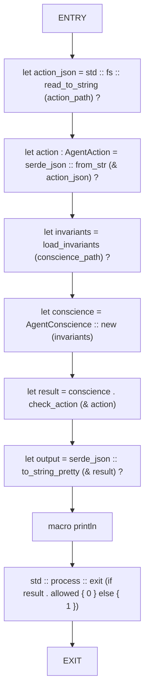
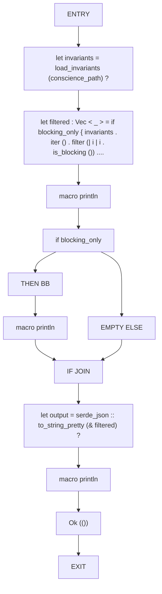
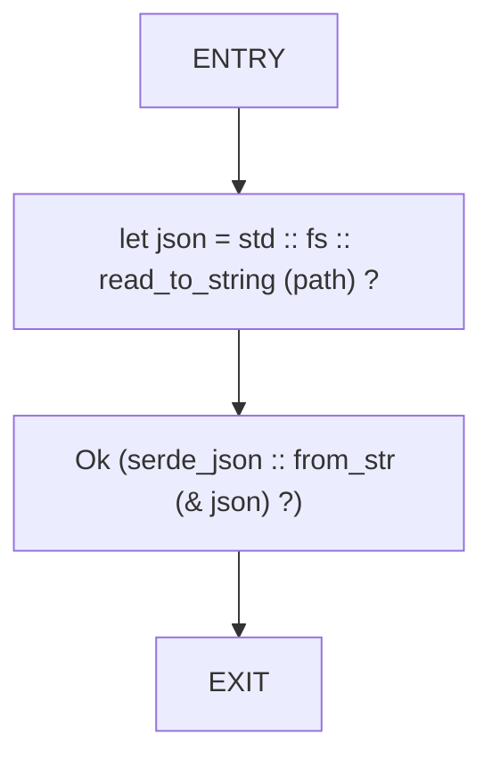
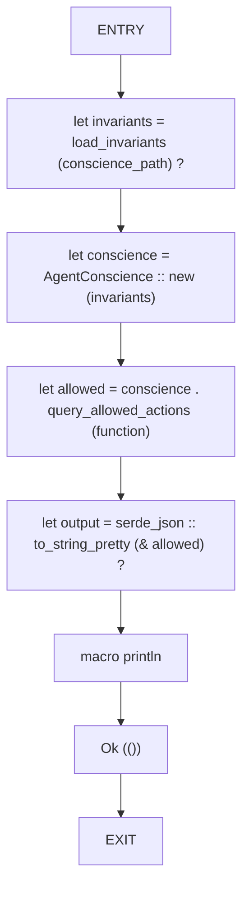
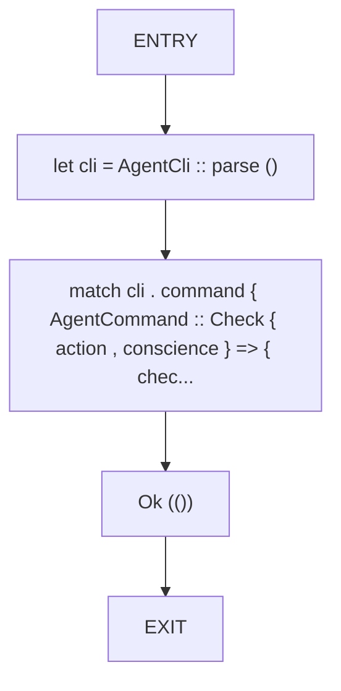
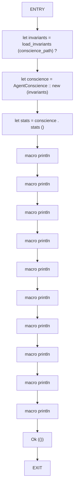
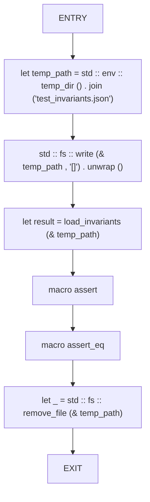

# CFG Group: src/191_agent_cli.rs

## Function: `check_action`

- File: src/191_agent_cli.rs
- Branches: 0
- Loops: 0
- Nodes: 10
- Edges: 9

## Function: `list_invariants`

- File: src/191_agent_cli.rs
- Branches: 1
- Loops: 0
- Nodes: 13
- Edges: 13

## Function: `load_invariants`

- File: src/191_agent_cli.rs
- Branches: 0
- Loops: 0
- Nodes: 4
- Edges: 3

## Function: `query_function`

- File: src/191_agent_cli.rs
- Branches: 0
- Loops: 0
- Nodes: 8
- Edges: 7

## Function: `run_agent_cli`

- File: src/191_agent_cli.rs
- Branches: 0
- Loops: 0
- Nodes: 5
- Edges: 4

## Function: `show_stats`

- File: src/191_agent_cli.rs
- Branches: 0
- Loops: 0
- Nodes: 16
- Edges: 15

## Function: `test_load_invariants_empty`

- File: src/191_agent_cli.rs
- Branches: 0
- Loops: 0
- Nodes: 8
- Edges: 7

