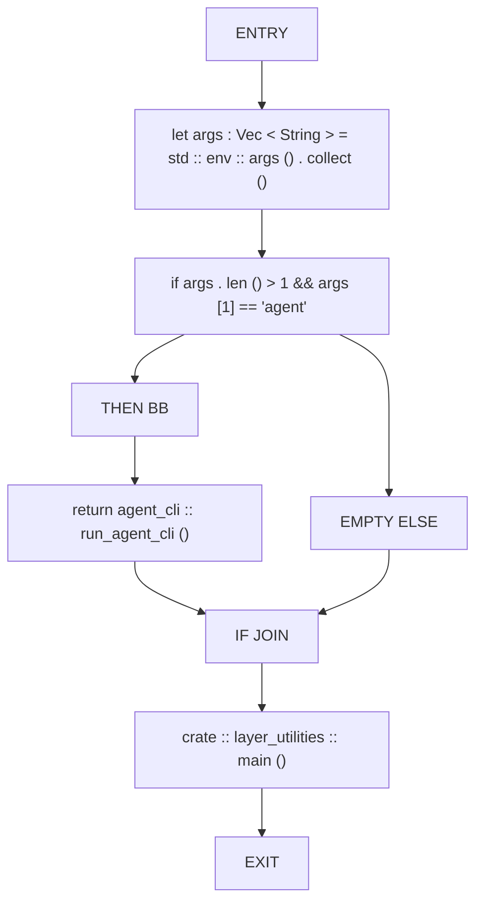

# CFG Group: src/320_main.rs

## Function: `main`

- File: src/320_main.rs
- Branches: 1
- Loops: 0
- Nodes: 9
- Edges: 9

```mermaid
flowchart TD
    main_0["ENTRY"]
    main_1["let args : Vec < String > = std :: env :: args () . collect ()"]
    main_2["if args . len () > 1 && args [1] == 'agent'"]
    main_3["THEN BB"]
    main_4["return agent_cli :: run_agent_cli ()"]
    main_5["EMPTY ELSE"]
    main_6["IF JOIN"]
    main_7["crate :: layer_utilities :: main ()"]
    main_8["EXIT"]
    main_0 --> main_1
    main_1 --> main_2
    main_2 --> main_3
    main_3 --> main_4
    main_2 --> main_5
    main_4 --> main_6
    main_5 --> main_6
    main_6 --> main_7
    main_7 --> main_8
```

