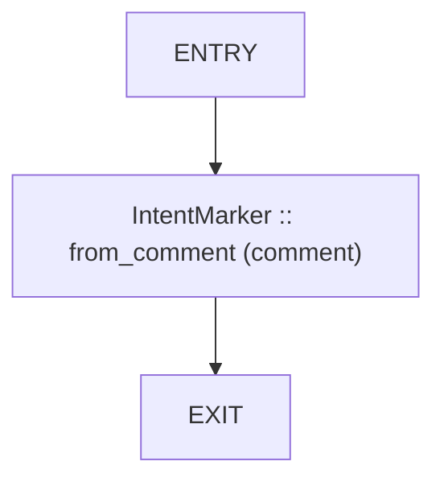
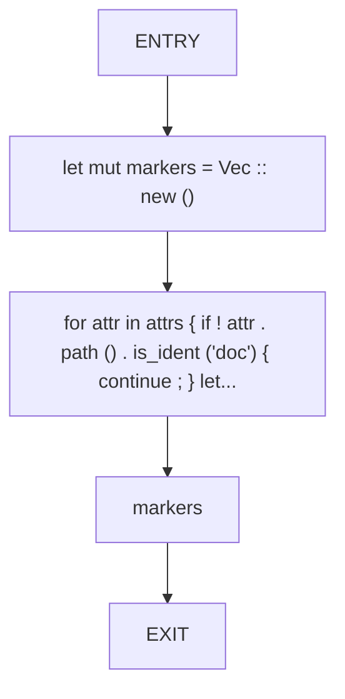
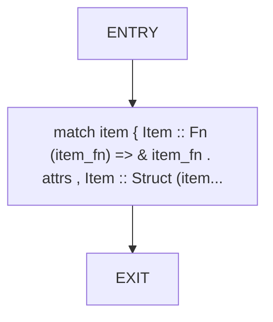
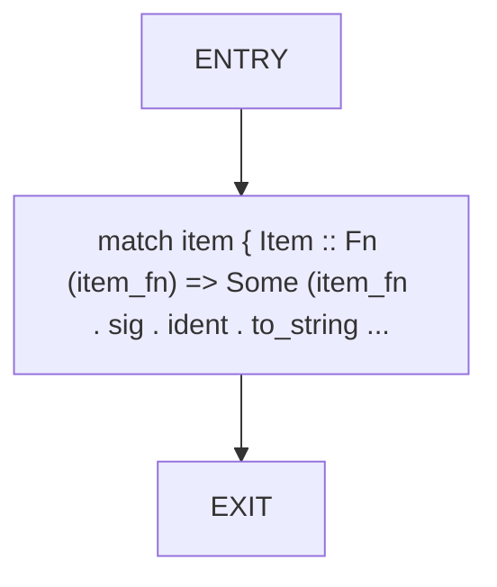
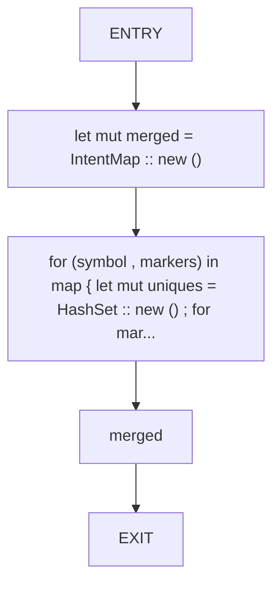

# CFG Group: src/370_dead_code_doc_comment_parser.rs

## Function: `detect_latent_markers`

- File: src/370_dead_code_doc_comment_parser.rs
- Branches: 0
- Loops: 0
- Nodes: 3
- Edges: 2

## Function: `extract_doc_markers`

- File: src/370_dead_code_doc_comment_parser.rs
- Branches: 0
- Loops: 0
- Nodes: 5
- Edges: 4

## Function: `item_attrs`

- File: src/370_dead_code_doc_comment_parser.rs
- Branches: 0
- Loops: 0
- Nodes: 3
- Edges: 2

## Function: `item_name`

- File: src/370_dead_code_doc_comment_parser.rs
- Branches: 0
- Loops: 0
- Nodes: 3
- Edges: 2

## Function: `merge_doc_intent`

- File: src/370_dead_code_doc_comment_parser.rs
- Branches: 0
- Loops: 0
- Nodes: 5
- Edges: 4

