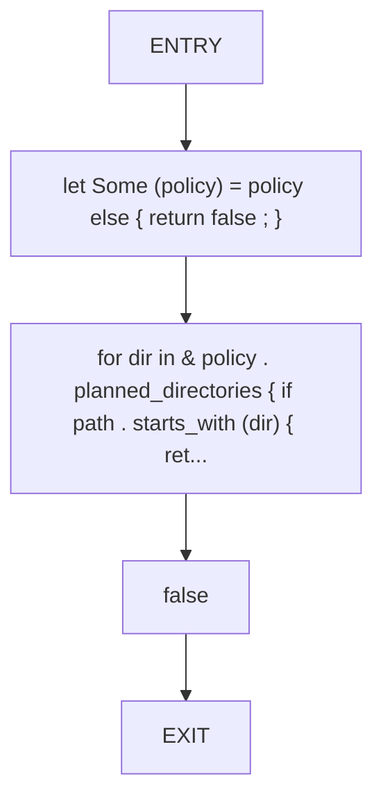
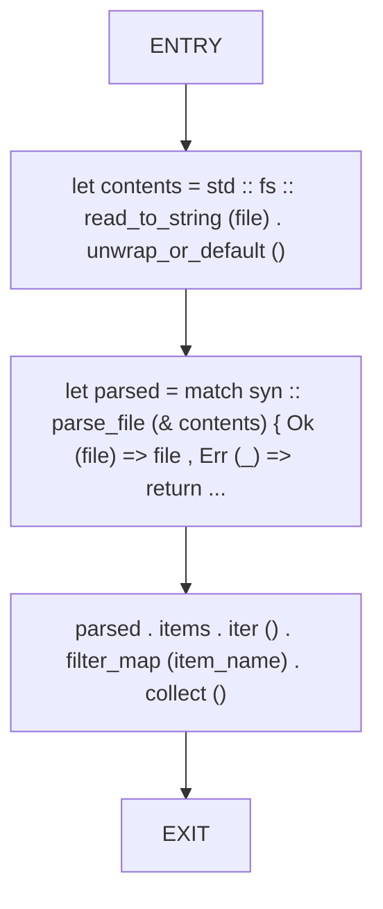
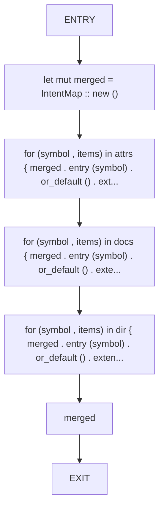
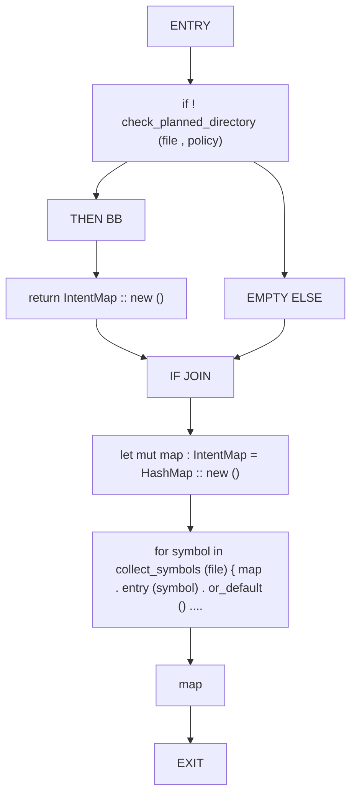

# CFG Group: src/390_dead_code_intent.rs

## Function: `check_planned_directory`

- File: src/390_dead_code_intent.rs
- Branches: 0
- Loops: 0
- Nodes: 5
- Edges: 4

## Function: `collect_symbols`

- File: src/390_dead_code_intent.rs
- Branches: 0
- Loops: 0
- Nodes: 5
- Edges: 4

## Function: `merge_intent_sources`

- File: src/390_dead_code_intent.rs
- Branches: 0
- Loops: 0
- Nodes: 7
- Edges: 6

## Function: `planned_directory_intent`

- File: src/390_dead_code_intent.rs
- Branches: 1
- Loops: 0
- Nodes: 10
- Edges: 10

