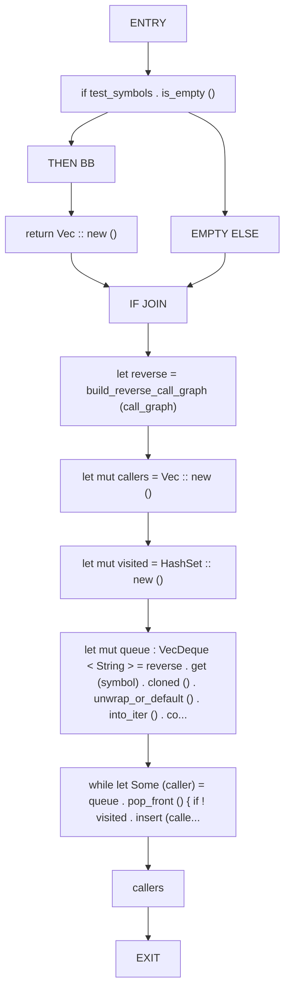
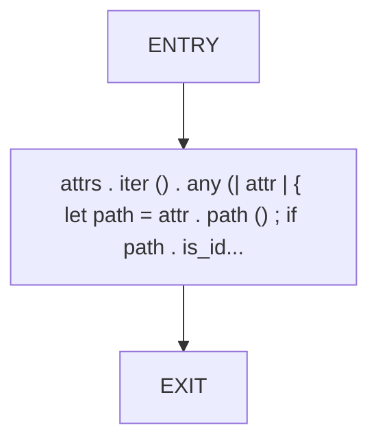
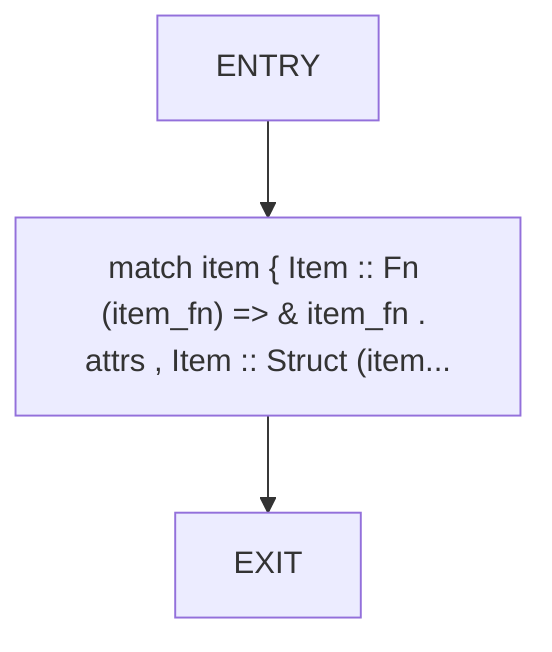

# CFG Group: src/400_dead_code_test_boundaries.rs

## Function: `find_test_callers`

- File: src/400_dead_code_test_boundaries.rs
- Branches: 1
- Loops: 0
- Nodes: 13
- Edges: 13

## Function: `has_test_attr`

- File: src/400_dead_code_test_boundaries.rs
- Branches: 0
- Loops: 0
- Nodes: 3
- Edges: 2

## Function: `item_attrs`

- File: src/400_dead_code_test_boundaries.rs
- Branches: 0
- Loops: 0
- Nodes: 3
- Edges: 2

