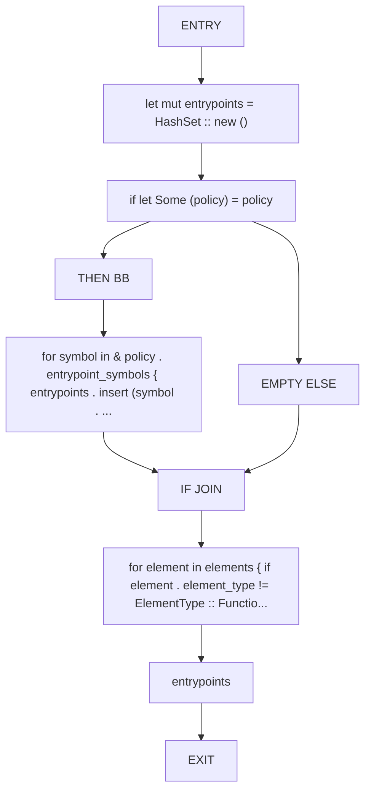
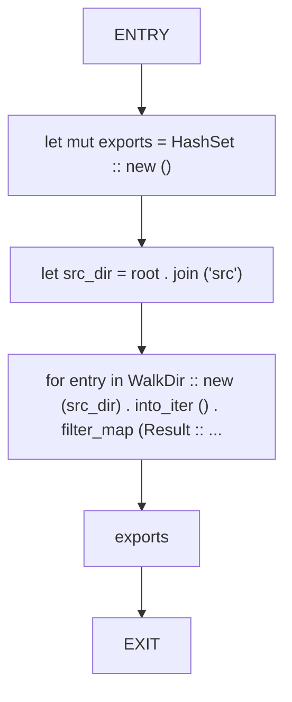
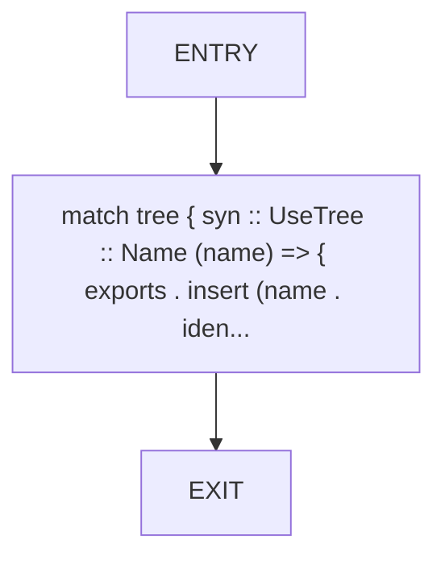
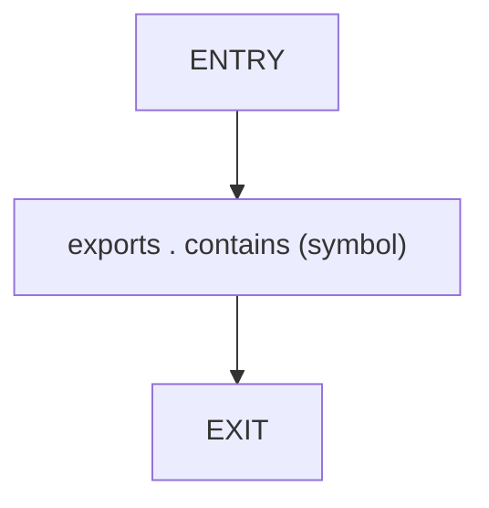
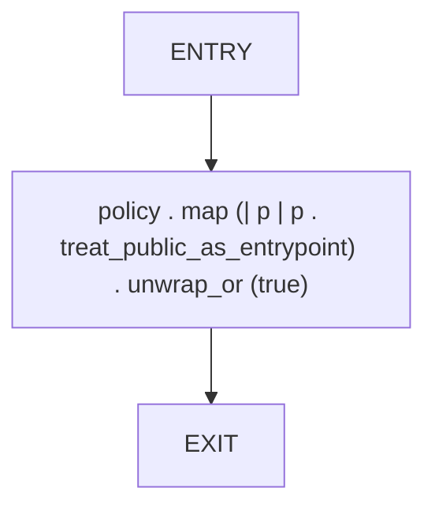

# CFG Group: src/410_dead_code_entrypoints.rs

## Function: `collect_entrypoints`

- File: src/410_dead_code_entrypoints.rs
- Branches: 1
- Loops: 0
- Nodes: 10
- Edges: 10

## Function: `collect_exports`

- File: src/410_dead_code_entrypoints.rs
- Branches: 0
- Loops: 0
- Nodes: 6
- Edges: 5

## Function: `collect_use_tree_idents`

- File: src/410_dead_code_entrypoints.rs
- Branches: 0
- Loops: 0
- Nodes: 3
- Edges: 2

## Function: `is_public_api`

- File: src/410_dead_code_entrypoints.rs
- Branches: 0
- Loops: 0
- Nodes: 3
- Edges: 2

## Function: `treat_public_as_entrypoint`

- File: src/410_dead_code_entrypoints.rs
- Branches: 0
- Loops: 0
- Nodes: 3
- Edges: 2

