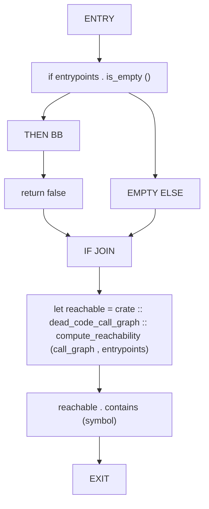

# CFG Group: src/420_dead_code_classifier.rs

## Function: `is_reachable`

- File: src/420_dead_code_classifier.rs
- Branches: 1
- Loops: 0
- Nodes: 9
- Edges: 9

```mermaid
flowchart TD
    is_reachable_0["ENTRY"]
    is_reachable_1["if entrypoints . is_empty ()"]
    is_reachable_2["THEN BB"]
    is_reachable_3["return false"]
    is_reachable_4["EMPTY ELSE"]
    is_reachable_5["IF JOIN"]
    is_reachable_6["let reachable = crate :: dead_code_call_graph :: compute_reachability (call_graph , entrypoints)"]
    is_reachable_7["reachable . contains (symbol)"]
    is_reachable_8["EXIT"]
    is_reachable_0 --> is_reachable_1
    is_reachable_1 --> is_reachable_2
    is_reachable_2 --> is_reachable_3
    is_reachable_1 --> is_reachable_4
    is_reachable_3 --> is_reachable_5
    is_reachable_4 --> is_reachable_5
    is_reachable_5 --> is_reachable_6
    is_reachable_6 --> is_reachable_7
    is_reachable_7 --> is_reachable_8
```

