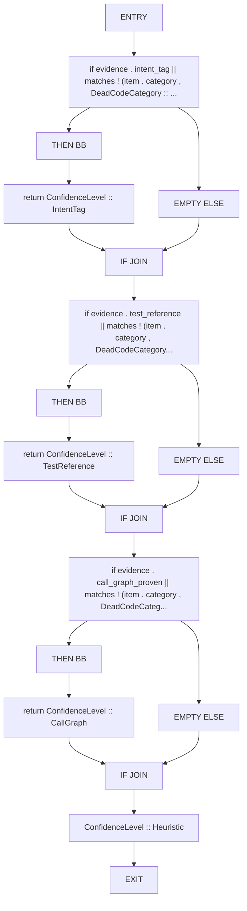

# CFG Group: src/430_dead_code_confidence.rs

## Function: `assign_confidence`

- File: src/430_dead_code_confidence.rs
- Branches: 3
- Loops: 0
- Nodes: 18
- Edges: 20

```mermaid
flowchart TD
    assign_confidence_0["ENTRY"]
    assign_confidence_1["if evidence . intent_tag || matches ! (item . category , DeadCodeCategory :: ..."]
    assign_confidence_2["THEN BB"]
    assign_confidence_3["return ConfidenceLevel :: IntentTag"]
    assign_confidence_4["EMPTY ELSE"]
    assign_confidence_5["IF JOIN"]
    assign_confidence_6["if evidence . test_reference || matches ! (item . category , DeadCodeCategory..."]
    assign_confidence_7["THEN BB"]
    assign_confidence_8["return ConfidenceLevel :: TestReference"]
    assign_confidence_9["EMPTY ELSE"]
    assign_confidence_10["IF JOIN"]
    assign_confidence_11["if evidence . call_graph_proven || matches ! (item . category , DeadCodeCateg..."]
    assign_confidence_12["THEN BB"]
    assign_confidence_13["return ConfidenceLevel :: CallGraph"]
    assign_confidence_14["EMPTY ELSE"]
    assign_confidence_15["IF JOIN"]
    assign_confidence_16["ConfidenceLevel :: Heuristic"]
    assign_confidence_17["EXIT"]
    assign_confidence_0 --> assign_confidence_1
    assign_confidence_1 --> assign_confidence_2
    assign_confidence_2 --> assign_confidence_3
    assign_confidence_1 --> assign_confidence_4
    assign_confidence_3 --> assign_confidence_5
    assign_confidence_4 --> assign_confidence_5
    assign_confidence_5 --> assign_confidence_6
    assign_confidence_6 --> assign_confidence_7
    assign_confidence_7 --> assign_confidence_8
    assign_confidence_6 --> assign_confidence_9
    assign_confidence_8 --> assign_confidence_10
    assign_confidence_9 --> assign_confidence_10
    assign_confidence_10 --> assign_confidence_11
    assign_confidence_11 --> assign_confidence_12
    assign_confidence_12 --> assign_confidence_13
    assign_confidence_11 --> assign_confidence_14
    assign_confidence_13 --> assign_confidence_15
    assign_confidence_14 --> assign_confidence_15
    assign_confidence_15 --> assign_confidence_16
    assign_confidence_16 --> assign_confidence_17
```

