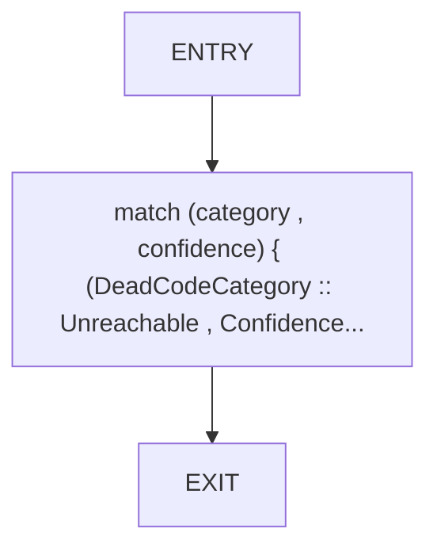

# CFG Group: src/440_dead_code_actions.rs

## Function: `recommend_action`

- File: src/440_dead_code_actions.rs
- Branches: 0
- Loops: 0
- Nodes: 3
- Edges: 2

```mermaid
flowchart TD
    recommend_action_0["ENTRY"]
    recommend_action_1["match (category , confidence) { (DeadCodeCategory :: Unreachable , Confidence..."]
    recommend_action_2["EXIT"]
    recommend_action_0 --> recommend_action_1
    recommend_action_1 --> recommend_action_2
```

