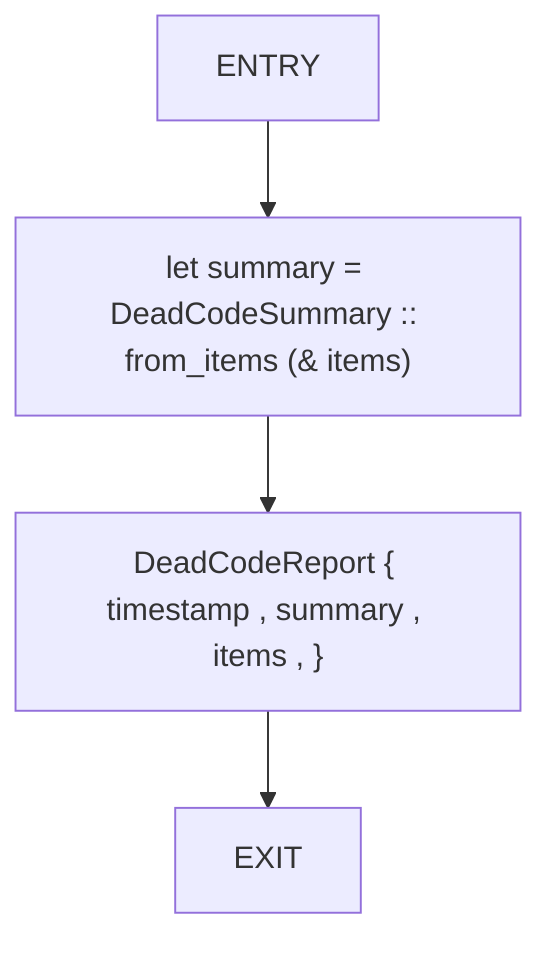
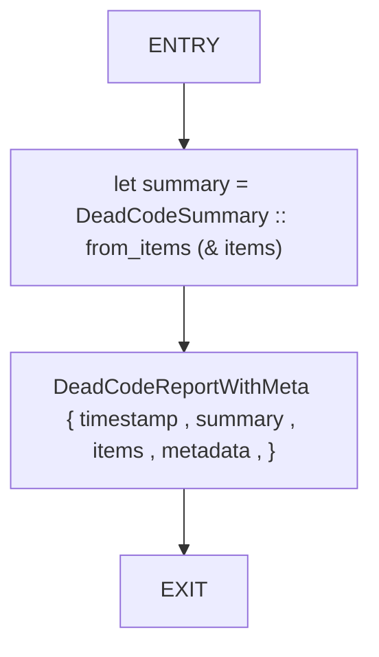
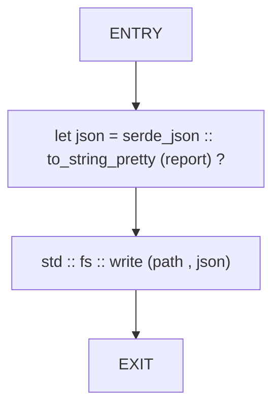

# CFG Group: src/460_dead_code_report.rs

## Function: `build_basic_report`

- File: src/460_dead_code_report.rs
- Branches: 0
- Loops: 0
- Nodes: 4
- Edges: 3

## Function: `build_report`

- File: src/460_dead_code_report.rs
- Branches: 0
- Loops: 0
- Nodes: 4
- Edges: 3

## Function: `write_outputs`

- File: src/460_dead_code_report.rs
- Branches: 2
- Loops: 0
- Nodes: 20
- Edges: 21

```mermaid
flowchart TD
    write_outputs_0["ENTRY"]
    write_outputs_1["let json_path = config . write_json . clone () . unwrap_or_else (| | config . output_dir . jo..."]
    write_outputs_2["if let Some (parent) = json_path . parent ()"]
    write_outputs_3["THEN BB"]
    write_outputs_4["std :: fs :: create_dir_all (parent) ?"]
    write_outputs_5["EMPTY ELSE"]
    write_outputs_6["IF JOIN"]
    write_outputs_7["write_report (& json_path , report) ?"]
    write_outputs_8["let summary_path = config . write_summary . clone () . unwrap_or_else (| | config . output_dir ...."]
    write_outputs_9["if let Some (parent) = summary_path . parent ()"]
    write_outputs_10["THEN BB"]
    write_outputs_11["std :: fs :: create_dir_all (parent) ?"]
    write_outputs_12["EMPTY ELSE"]
    write_outputs_13["IF JOIN"]
    write_outputs_14["write_summary_markdown (& summary_path , report , config . summary_limit) ?"]
    write_outputs_15["let plans_dir = summary_path . parent () . map (| p | p . to_path_buf ()) . unwrap_or_else (|..."]
    write_outputs_16["let plans_path = plans_dir . join ('dead_code_plans.md')"]
    write_outputs_17["write_plan_markdown (& plans_path , report , config . summary_limit) ?"]
    write_outputs_18["Ok (())"]
    write_outputs_19["EXIT"]
    write_outputs_0 --> write_outputs_1
    write_outputs_1 --> write_outputs_2
    write_outputs_2 --> write_outputs_3
    write_outputs_3 --> write_outputs_4
    write_outputs_2 --> write_outputs_5
    write_outputs_4 --> write_outputs_6
    write_outputs_5 --> write_outputs_6
    write_outputs_6 --> write_outputs_7
    write_outputs_7 --> write_outputs_8
    write_outputs_8 --> write_outputs_9
    write_outputs_9 --> write_outputs_10
    write_outputs_10 --> write_outputs_11
    write_outputs_9 --> write_outputs_12
    write_outputs_11 --> write_outputs_13
    write_outputs_12 --> write_outputs_13
    write_outputs_13 --> write_outputs_14
    write_outputs_14 --> write_outputs_15
    write_outputs_15 --> write_outputs_16
    write_outputs_16 --> write_outputs_17
    write_outputs_17 --> write_outputs_18
    write_outputs_18 --> write_outputs_19
```

## Function: `write_report`

- File: src/460_dead_code_report.rs
- Branches: 0
- Loops: 0
- Nodes: 4
- Edges: 3

