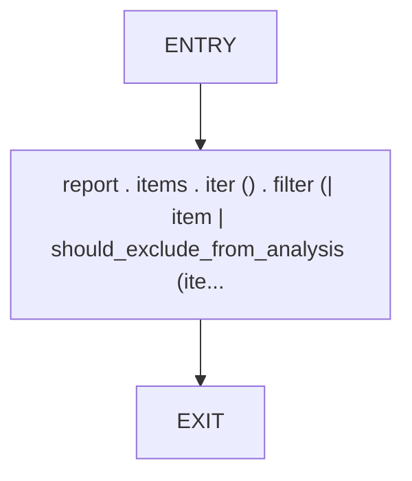
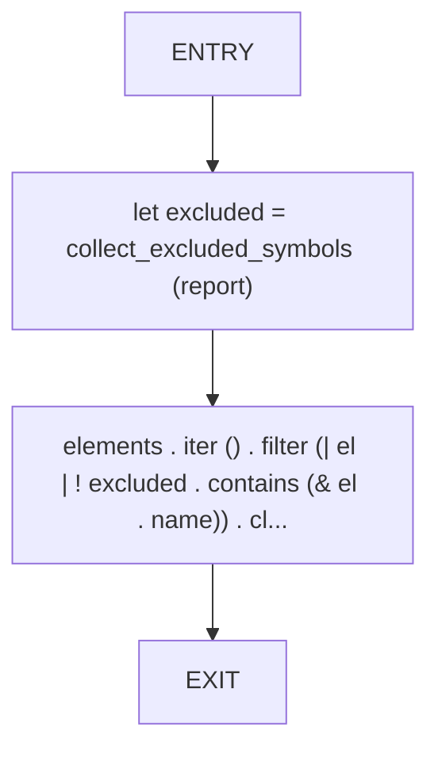
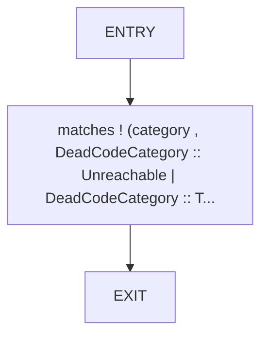

# CFG Group: src/470_dead_code_filter.rs

## Function: `collect_excluded_symbols`

- File: src/470_dead_code_filter.rs
- Branches: 0
- Loops: 0
- Nodes: 3
- Edges: 2

## Function: `filter_dead_code_elements`

- File: src/470_dead_code_filter.rs
- Branches: 0
- Loops: 0
- Nodes: 4
- Edges: 3

## Function: `should_exclude_from_analysis`

- File: src/470_dead_code_filter.rs
- Branches: 0
- Loops: 0
- Nodes: 3
- Edges: 2

