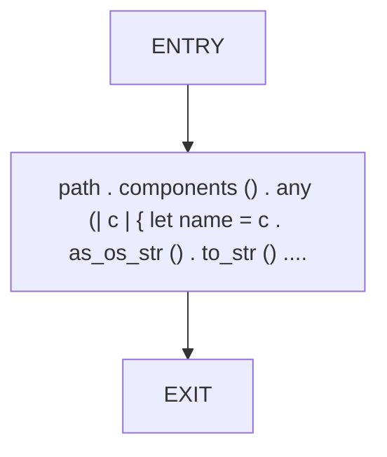
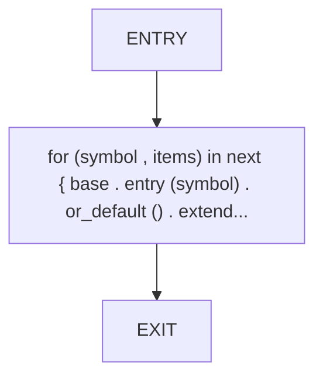
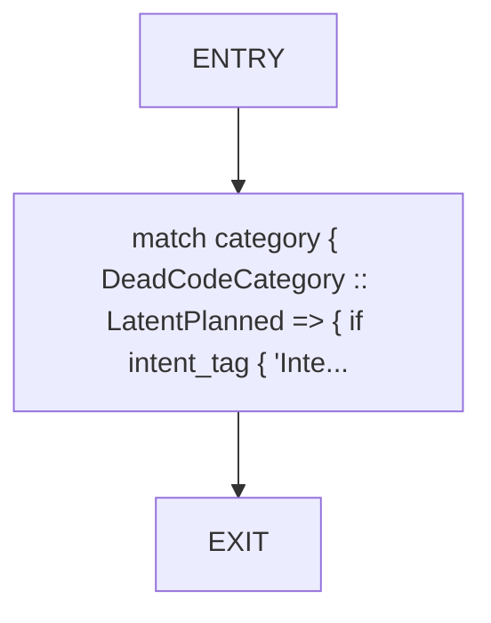

# CFG Group: src/490_dead_code_cli.rs

## Function: `is_test_path`

- File: src/490_dead_code_cli.rs
- Branches: 0
- Loops: 0
- Nodes: 3
- Edges: 2

## Function: `merge_intent_map`

- File: src/490_dead_code_cli.rs
- Branches: 0
- Loops: 0
- Nodes: 3
- Edges: 2

## Function: `reason_for_category`

- File: src/490_dead_code_cli.rs
- Branches: 0
- Loops: 0
- Nodes: 3
- Edges: 2

