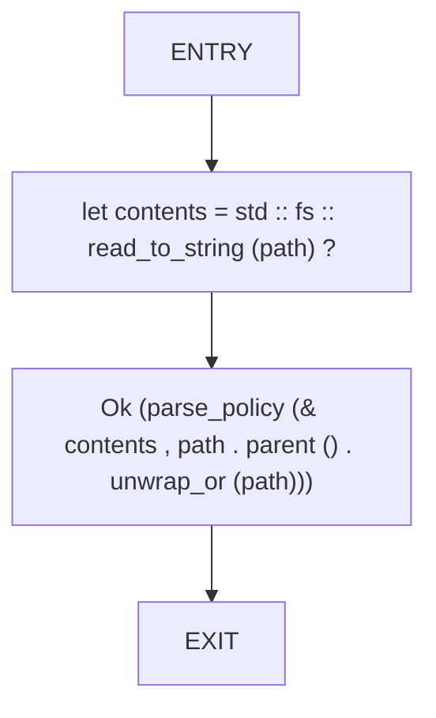
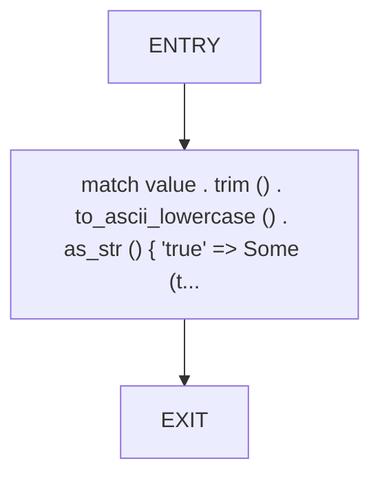
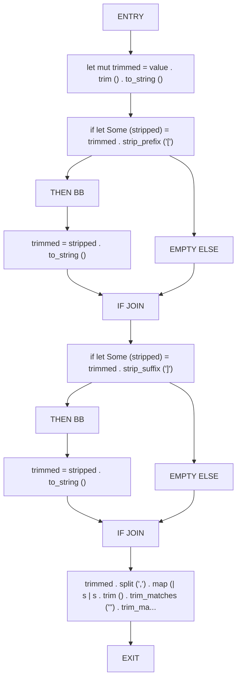
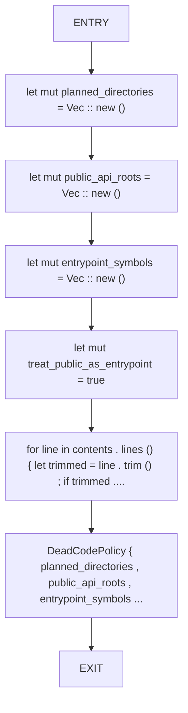

# CFG Group: src/510_dead_code_policy.rs

## Function: `load_policy`

- File: src/510_dead_code_policy.rs
- Branches: 0
- Loops: 0
- Nodes: 4
- Edges: 3

## Function: `parse_bool`

- File: src/510_dead_code_policy.rs
- Branches: 0
- Loops: 0
- Nodes: 3
- Edges: 2

## Function: `parse_list`

- File: src/510_dead_code_policy.rs
- Branches: 2
- Loops: 0
- Nodes: 14
- Edges: 15

## Function: `parse_policy`

- File: src/510_dead_code_policy.rs
- Branches: 0
- Loops: 0
- Nodes: 8
- Edges: 7

