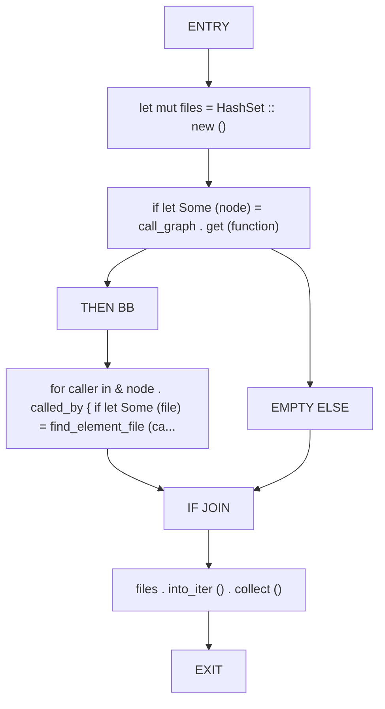
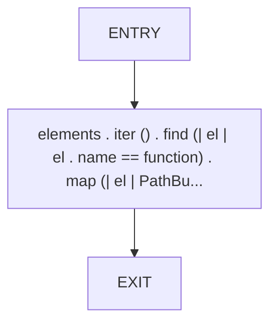
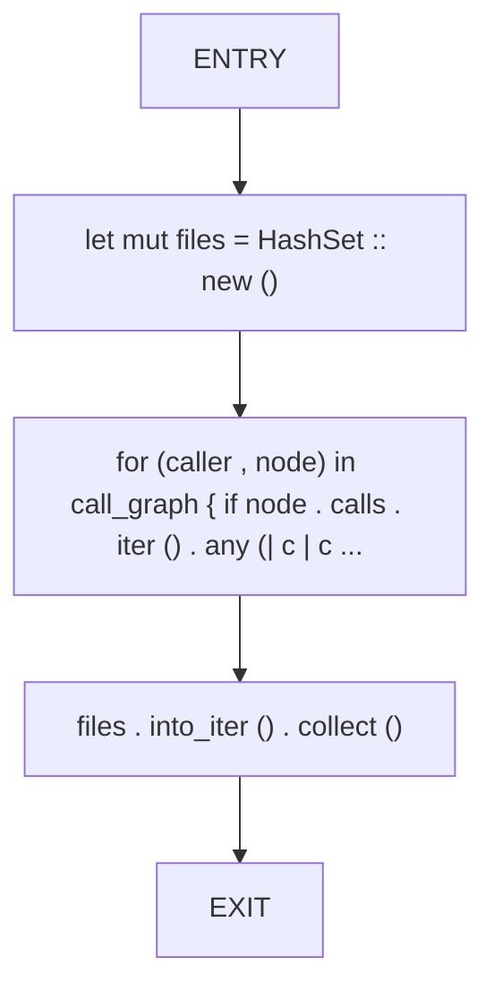
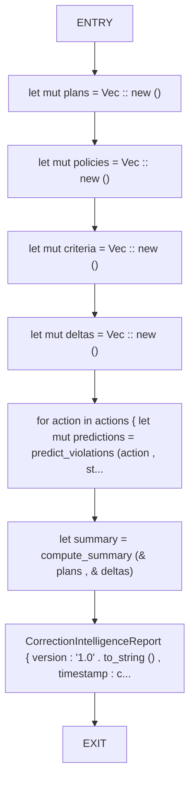
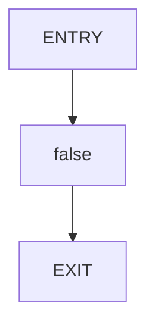
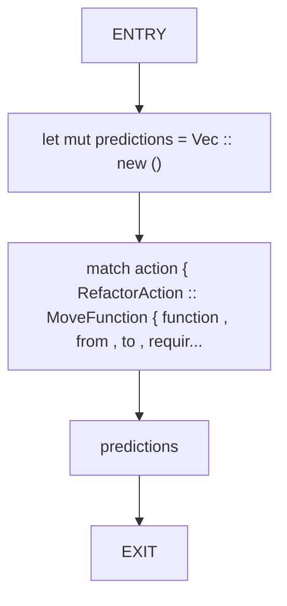
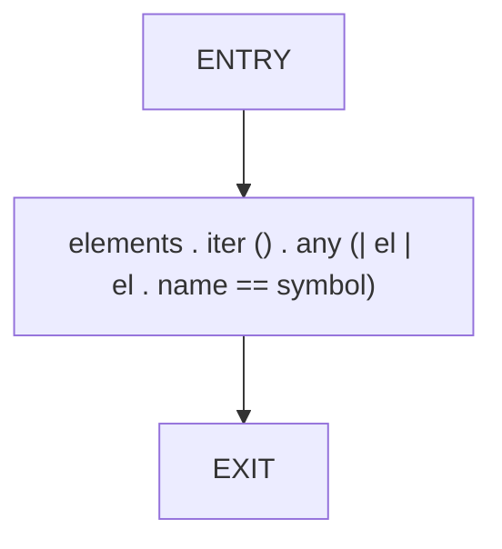

# CFG Group: src/520_violation_predictor.rs

## Function: `find_callers`

- File: src/520_violation_predictor.rs
- Branches: 1
- Loops: 0
- Nodes: 9
- Edges: 9

## Function: `find_element_file`

- File: src/520_violation_predictor.rs
- Branches: 0
- Loops: 0
- Nodes: 3
- Edges: 2

## Function: `find_reference_files`

- File: src/520_violation_predictor.rs
- Branches: 0
- Loops: 0
- Nodes: 5
- Edges: 4

## Function: `generate_intelligence_report`

- File: src/520_violation_predictor.rs
- Branches: 0
- Loops: 0
- Nodes: 9
- Edges: 8

## Function: `move_violates_invariant`

- File: src/520_violation_predictor.rs
- Branches: 0
- Loops: 0
- Nodes: 3
- Edges: 2

## Function: `predict_violations`

- File: src/520_violation_predictor.rs
- Branches: 0
- Loops: 0
- Nodes: 5
- Edges: 4

## Function: `symbol_exists`

- File: src/520_violation_predictor.rs
- Branches: 0
- Loops: 0
- Nodes: 3
- Edges: 2

