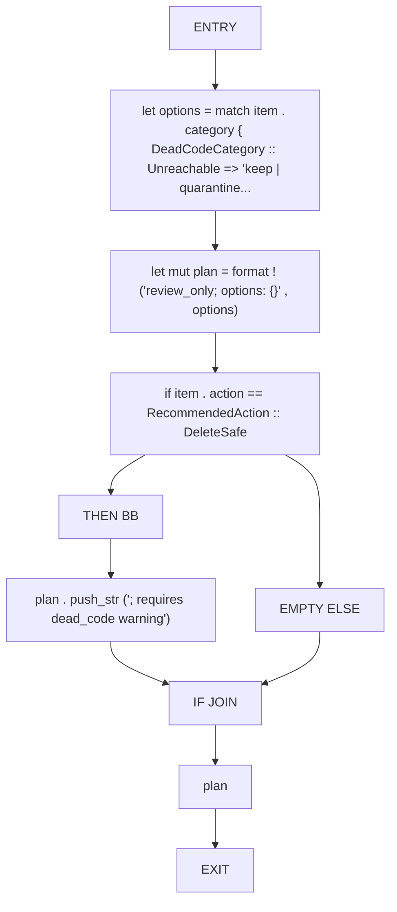
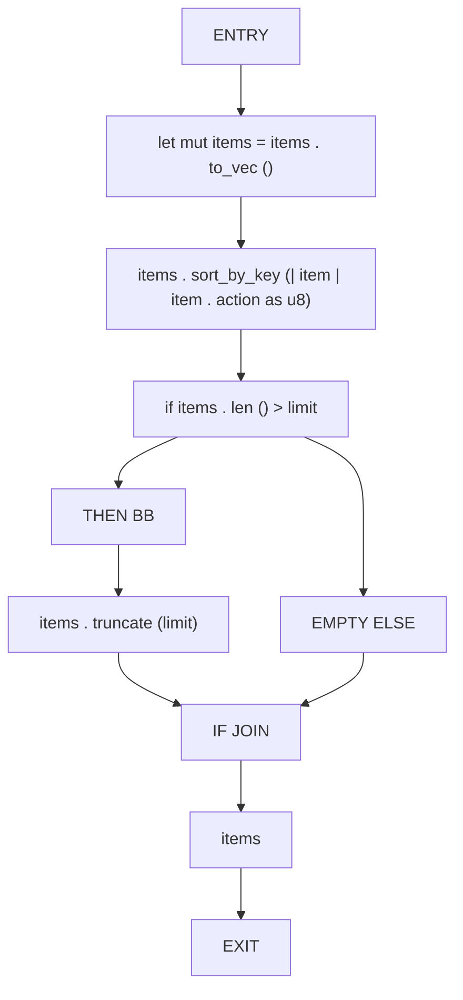
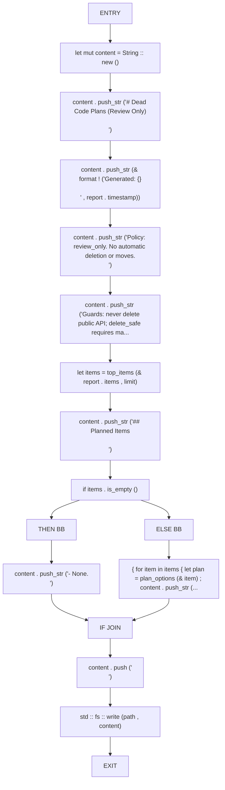
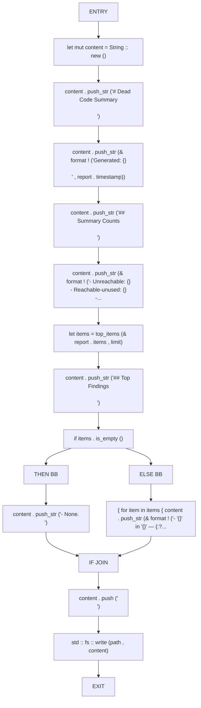

# CFG Group: src/530_dead_code_report_split.rs

## Function: `plan_options`

- File: src/530_dead_code_report_split.rs
- Branches: 1
- Loops: 0
- Nodes: 10
- Edges: 10

## Function: `top_items`

- File: src/530_dead_code_report_split.rs
- Branches: 1
- Loops: 0
- Nodes: 10
- Edges: 10

## Function: `write_plan_markdown`

- File: src/530_dead_code_report_split.rs
- Branches: 1
- Loops: 0
- Nodes: 17
- Edges: 17

## Function: `write_summary_markdown`

- File: src/530_dead_code_report_split.rs
- Branches: 1
- Loops: 0
- Nodes: 17
- Edges: 17

