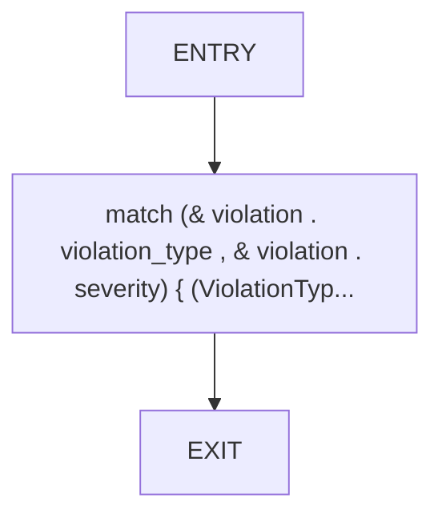

# CFG Group: src/540_tier_classifier.rs

## Function: `classify_tier`

- File: src/540_tier_classifier.rs
- Branches: 0
- Loops: 0
- Nodes: 3
- Edges: 2

```mermaid
flowchart TD
    classify_tier_0["ENTRY"]
    classify_tier_1["match (& violation . violation_type , & violation . severity) { (ViolationTyp..."]
    classify_tier_2["EXIT"]
    classify_tier_0 --> classify_tier_1
    classify_tier_1 --> classify_tier_2
```

