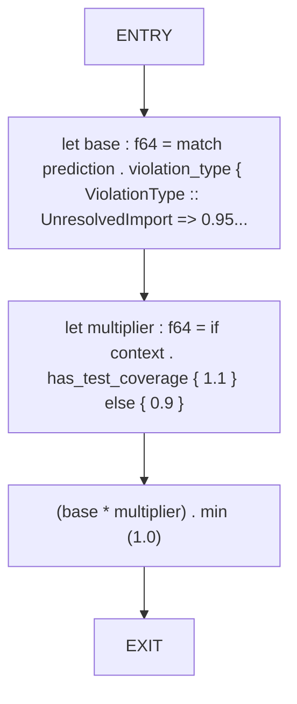

# CFG Group: src/550_confidence_scorer.rs

## Function: `compute_confidence`

- File: src/550_confidence_scorer.rs
- Branches: 0
- Loops: 0
- Nodes: 5
- Edges: 4

```mermaid
flowchart TD
    compute_confidence_0["ENTRY"]
    compute_confidence_1["let base : f64 = match prediction . violation_type { ViolationType :: UnresolvedImport => 0.95..."]
    compute_confidence_2["let multiplier : f64 = if context . has_test_coverage { 1.1 } else { 0.9 }"]
    compute_confidence_3["(base * multiplier) . min (1.0)"]
    compute_confidence_4["EXIT"]
    compute_confidence_0 --> compute_confidence_1
    compute_confidence_1 --> compute_confidence_2
    compute_confidence_2 --> compute_confidence_3
    compute_confidence_3 --> compute_confidence_4
```

