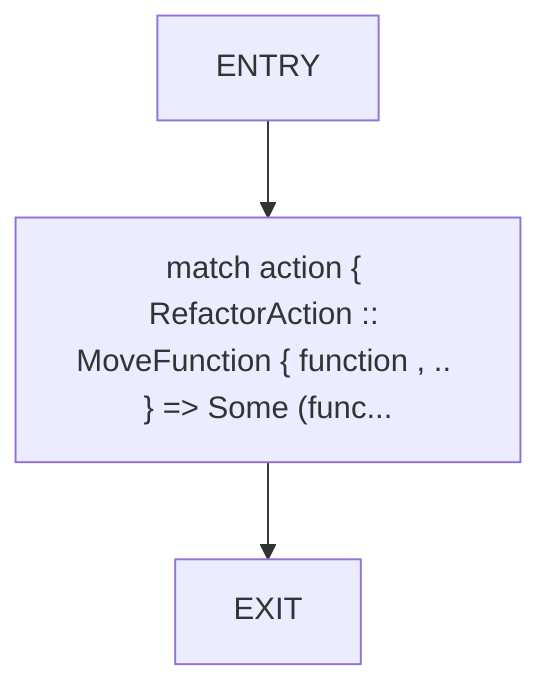
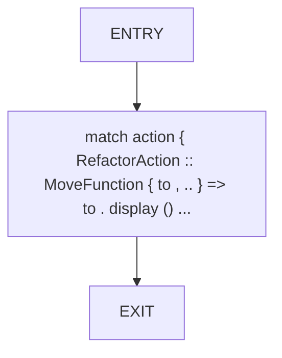
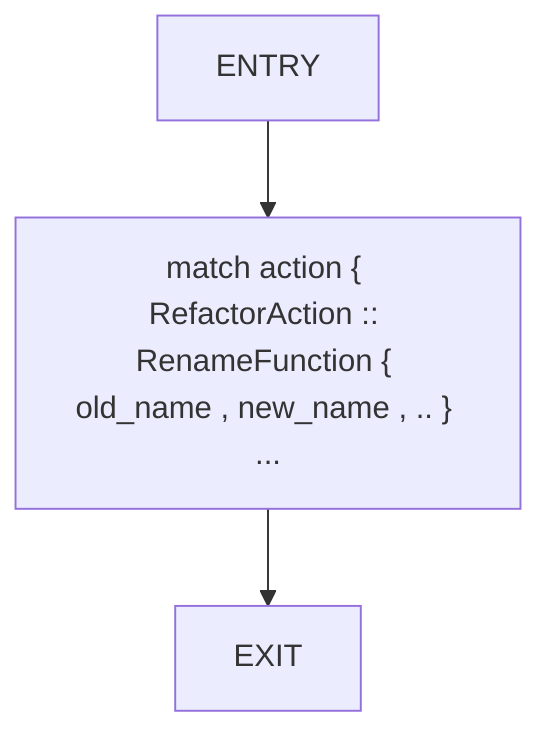
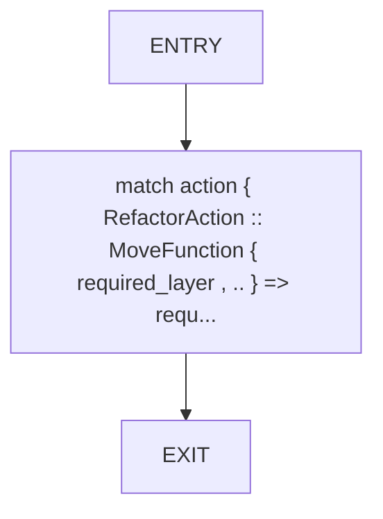
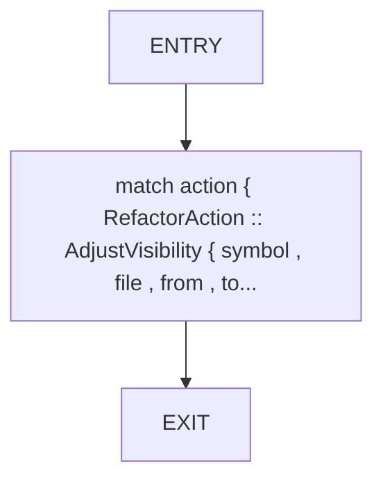
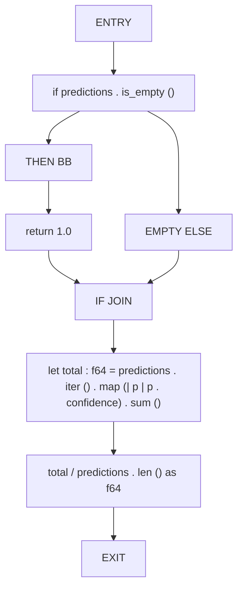
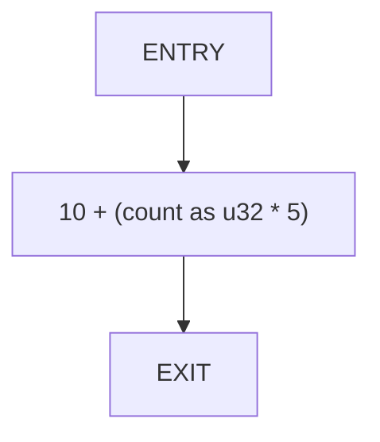
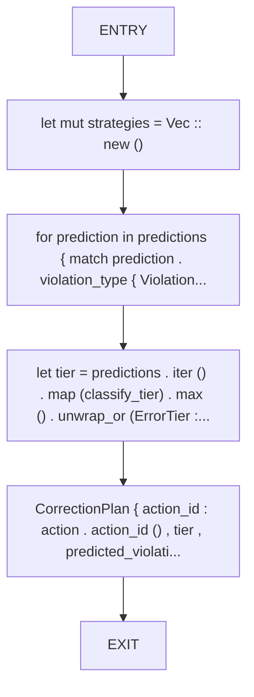

# CFG Group: src/560_correction_plan_generator.rs

## Function: `action_function`

- File: src/560_correction_plan_generator.rs
- Branches: 0
- Loops: 0
- Nodes: 3
- Edges: 2

## Function: `action_module_path`

- File: src/560_correction_plan_generator.rs
- Branches: 0
- Loops: 0
- Nodes: 3
- Edges: 2

## Function: `action_refs`

- File: src/560_correction_plan_generator.rs
- Branches: 0
- Loops: 0
- Nodes: 3
- Edges: 2

## Function: `action_symbol`

- File: src/560_correction_plan_generator.rs
- Branches: 0
- Loops: 0
- Nodes: 3
- Edges: 2

## Function: `action_target_layer`

- File: src/560_correction_plan_generator.rs
- Branches: 0
- Loops: 0
- Nodes: 3
- Edges: 2

## Function: `action_visibility`

- File: src/560_correction_plan_generator.rs
- Branches: 0
- Loops: 0
- Nodes: 3
- Edges: 2

## Function: `average_confidence`

- File: src/560_correction_plan_generator.rs
- Branches: 1
- Loops: 0
- Nodes: 9
- Edges: 9

## Function: `estimate_fix_time`

- File: src/560_correction_plan_generator.rs
- Branches: 0
- Loops: 0
- Nodes: 3
- Edges: 2

## Function: `generate_correction_plan`

- File: src/560_correction_plan_generator.rs
- Branches: 0
- Loops: 0
- Nodes: 6
- Edges: 5

